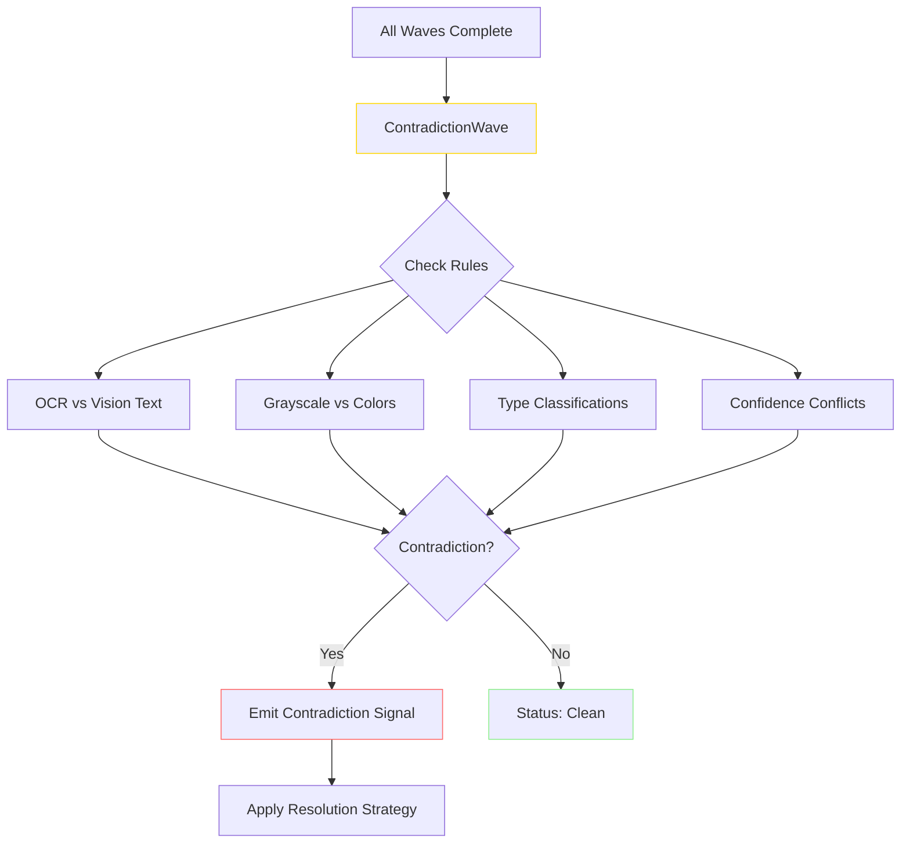

# Signal Architecture

The library uses a **signal-based storage pattern** where analysis results are stored as discrete observations (signals) with metadata. This enables flexible, extensible analysis pipelines.

## Core Concepts

### What is a Signal?

A signal is a discrete observation about an image with associated metadata:

```csharp
public class Signal
{
    public string Key { get; set; }           // "content.llm_caption"
    public object? Value { get; set; }        // Actual value
    public double Confidence { get; set; }    // 0.0-1.0 confidence score
    public string Source { get; set; }        // "ImageAnalyzer", "VisionLLM", "OCR"
    public DateTime Timestamp { get; set; }   // When signal was emitted
    public List<string>? Tags { get; set; }   // Categorization tags
    public Dictionary<string, object>? Metadata { get; set; }  // Additional context
}
```

**Benefits:**
- **Flexibility**: Add new analysis types without schema changes
- **Versioning**: Multiple sources can provide competing signals
- **Aggregation**: Combine signals using strategies (highest confidence, average)
- **Queryable**: Filter by tags, source, confidence

---

## DynamicImageProfile

Flexible profile that aggregates signals from multiple sources:

```csharp
var dynamicProfile = new DynamicImageProfile
{
    ImagePath = "photo.jpg"
};

// Add signals from deterministic analysis
dynamicProfile.AddSignal(new Signal
{
    Key = "quality.sharpness",
    Value = 2856.97,
    Confidence = 0.8,
    Source = "ImageAnalyzer",
    Tags = new List<string> { "quality", "sharpness" }
});

// Add signals from vision LLM
dynamicProfile.AddSignal(new Signal
{
    Key = "content.llm_caption",
    Value = "A serene landscape with mountains...",
    Confidence = 0.85,
    Source = "VisionLLM",
    Tags = new List<string> { "caption", "description", "llm" }
});

// Query signals
var sharpness = dynamicProfile.GetValue<double>("quality.sharpness");
var caption = dynamicProfile.GetValue<string>("content.llm_caption");
var bestSignal = dynamicProfile.GetBestSignal("quality.sharpness");
```

---

## Signal Catalog

### Identity Signals (confidence: 1.0)
- `identity.sha256` - SHA256 content hash
- `identity.format` - Image format (PNG, JPEG, GIF, WEBP)
- `identity.width`, `identity.height` - Dimensions
- `identity.aspect_ratio` - Width/height ratio
- `identity.is_animated` - Whether image is animated

### Content Signals
- `content.type` - Detected type (Photo, Diagram, Chart, etc.)
- `content.type_confidence` - Type detection confidence (0.0-1.0)
- `content.text_likeliness` - Probability of containing text (0.0-1.0)
- `content.llm_caption` - Vision LLM description (confidence: 0.85, source: VisionLLM)
- `content.extracted_text` - OCR results (confidence: 0.9, source: OCR)

### Quality Signals
- `quality.sharpness` - Laplacian variance (confidence: 0.8)
- `quality.edge_density` - Percentage of edge pixels (confidence: 0.9)
- `quality.luminance_entropy` - Information content (confidence: 0.9)

### Color Signals
- `color.dominant_color_names` - List of color names (confidence: 0.9)
- `color.dominant_color_hexes` - List of hex codes (confidence: 0.9)
- `color.dominant_color_percentages` - List of percentages (confidence: 0.9)
- `color.mean_luminance` - Average brightness 0-255 (confidence: 1.0)
- `color.mean_saturation` - Average color intensity 0-1 (confidence: 1.0)
- `color.is_mostly_grayscale` - Boolean flag (confidence: 1.0)

### Motion Signals
- `motion.has_motion` - Whether significant motion detected
- `motion.type` - Motion type (object_motion, camera_pan, oscillating, etc.)
- `motion.direction` - Dominant direction (up, down, left, right, stationary)
- `motion.magnitude` - Average pixel displacement per frame
- `motion.activity` - Fraction of image with motion (0-1)
- `motion.summary` - Human-readable summary
- `motion.moving_objects` - List of what is moving

### Florence-2 Signals
- `florence2.caption` - Enhanced caption with color context
- `florence2.ocr_text` - OCR text from Florence-2
- `florence2.should_escalate` - Whether to escalate to Vision LLM
- `florence2.duration_ms` - Inference time

### Vision LLM Signals
- `vision.llm.caption` - Rich caption from Vision LLM
- `vision.llm.scene` - Scene classification
- `vision.llm.entities` - Detected entities
- `vision.llm.text` - Text read by Vision LLM

### Validation Signals
- `validation.contradiction.count` - Number of contradictions detected
- `validation.contradiction.status` - Overall status: "clean", "info", "warning", "error", "critical"
- `validation.contradiction.<rule_id>` - Details of specific contradiction

---

## Dynamic Pipeline Selection

The library supports **signal-driven pipeline selection** - specify which signals you need, and the system automatically determines which waves to run.

### How It Works

```csharp
// 1. Specify desired signals using glob patterns
var signalPatterns = "motion.*,color.dominant*";

// 2. System determines required waves via tag mapping
var requiredTags = SignalGlobMatcher.GetRequiredWaveTags(signalPatterns);
// Returns: { "motion", "color" }

// 3. Run only those waves
var profile = await orchestrator.AnalyzeByTagsAsync(imagePath, requiredTags);

// 4. Filter to exactly the signals requested
var matchingSignals = SignalGlobMatcher.FilterSignals(profile, signalPatterns);
```

### Glob Pattern Syntax

| Pattern | Matches | Example |
|---------|---------|---------|
| `motion.*` | All motion signals | motion.direction, motion.magnitude |
| `color.dominant*` | Prefix match | color.dominant_colors, color.dominant_names |
| `vision.llm.caption` | Exact match | Only that specific signal |
| `*` | All signals | Runs full pipeline |

### Predefined Collections

Use `@name` syntax for predefined signal groups:

| Collection | Expands To | Use Case |
|------------|-----------|----------|
| `@identity` | identity.* | File metadata, hashing |
| `@motion` | motion.*, complexity.* | Animation analysis |
| `@color` | color.* | Color extraction |
| `@quality` | quality.* | Image quality metrics |
| `@text` | content.text*, ocr.*, vision.llm.text | Text extraction |
| `@vision` | vision.* | Vision LLM outputs |
| `@alttext` | vision.llm.caption, content.text*, motion.summary | Alt text generation |
| `@tool` | identity.*, color.dominant*, motion.*, vision.llm.*, ocr.voting.* | MCP tool calls |
| `@all` | * | Full pipeline |

### Wave Tag Mapping

| Signal Prefix | Wave Tags | Waves Run |
|---------------|-----------|-----------|
| `motion.*`, `complexity.*` | motion | MotionWave |
| `color.*` | color | ColorWave |
| `ocr.*`, `content.*` | ocr, content | AdvancedOcrWave, OcrWave |
| `vision.*` | vision, llm | VisionLlmWave, Florence2Wave |
| `identity.*` | identity | IdentityWave |
| `quality.*` | quality | ForensicsWave |
| `face.*` | face | FaceDetectionWave |
| `clip.*` | clip, embedding | ClipEmbeddingWave |

### MCP Tool Call Example

```json
{
  "tool": "analyze_image",
  "parameters": {
    "image_path": "photo.jpg",
    "signals": "@motion,color.dominant*"
  }
}
```

Only MotionWave and ColorWave run, returning:
```json
{
  "signals": [
    { "key": "motion.has_motion", "value": true, "confidence": 1.0 },
    { "key": "motion.type", "value": "object_motion", "confidence": 0.85 },
    { "key": "color.dominant_color_names", "value": ["Blue", "White"], "confidence": 0.9 }
  ]
}
```

**Benefits:**
- **Performance**: Skip expensive waves you don't need
- **Selective**: Request only relevant signals for your use case
- **Flexible**: Combine patterns for custom analysis pipelines
- **MCP-friendly**: Clean API for tool integrations

---

## Contradiction Detection

The library includes a **config-driven contradiction detection system** that validates signals from different analysis waves for consistency.



### Built-in Rules

| Rule ID | Description | Severity |
|---------|-------------|----------|
| `ocr_vs_vision_text` | OCR found text but Vision LLM says no text | Warning |
| `text_likeliness_vs_ocr` | High text score but OCR found nothing | Warning |
| `grayscale_vs_colors` | Marked grayscale but has colorful dominants | Info |
| `screenshot_vs_photo_noise` | Screenshot type but photo-like noise | Warning |
| `llm_vs_heuristic_type` | Vision LLM type differs from heuristics | Info |
| `face_vs_icon` | Faces detected in Icon/Diagram | Warning |
| `exif_format_mismatch` | EXIF in format that doesn't support it | Warning |
| `blur_vs_edges` | Low sharpness but high edge density | Info |

### Resolution Strategies

- `PreferHigherConfidence` - Keep signal with higher confidence
- `PreferMostRecent` - Keep most recent signal
- `MarkConflicting` - Keep both, flag for review
- `RemoveBoth` - Neither signal trusted
- `EscalateToLlm` - Escalate to Vision LLM for resolution
- `ManualReview` - Flag for human review

### Configuration

```json
{
  "Images": {
    "Contradiction": {
      "Enabled": true,
      "RejectOnCritical": false,
      "MinConfidenceThreshold": 0.5,
      "EnableLlmEscalation": true,
      "CustomRules": [
        {
          "RuleId": "my_custom_rule",
          "Description": "Custom validation rule",
          "SignalKeyA": "content.type",
          "SignalKeyB": "vision.detected_type",
          "Type": "ValueConflict",
          "Severity": "Warning",
          "Resolution": "PreferHigherConfidence"
        }
      ]
    }
  }
}
```

### Programmatic Usage

```csharp
// Get contradiction results from profile
var contradictions = profile.GetSignals("validation.contradiction")
    .Where(s => !s.Key.EndsWith(".count") && !s.Key.EndsWith(".status"));

foreach (var signal in contradictions)
{
    var metadata = signal.Metadata;
    Console.WriteLine($"Rule: {metadata["rule_id"]}");
    Console.WriteLine($"Severity: {metadata["severity"]}");
    Console.WriteLine($"Explanation: {signal.Value}");
    Console.WriteLine($"Resolution: {metadata["resolution"]}");
}

// Check if image should be rejected
var status = profile.GetValue<string>("validation.contradiction.status");
if (status == "critical" && config.Contradiction.RejectOnCritical)
{
    // Handle rejected image
}
```

---

## SignalDatabase Caching

SQLite-based persistent storage with content-based caching:

```csharp
var signalDatabase = new SignalDatabase("image-cache.db", logger);

// Store profile with signals
var dynamicProfile = ConvertToDynamicProfile(imageProfile);
dynamicProfile.AddSignal(new Signal
{
    Key = "content.llm_caption",
    Value = "A serene landscape...",
    Confidence = 0.85,
    Source = "VisionLLM"
});

await signalDatabase.StoreProfileAsync(
    dynamicProfile,
    sha256Hash,
    filePath: "photo.jpg",
    width: 1920,
    height: 1080,
    format: "JPEG");

// Load from cache
var cachedProfile = await signalDatabase.LoadProfileAsync(sha256Hash);
if (cachedProfile != null)
{
    var caption = cachedProfile.GetValue<string>("content.llm_caption");
    Console.WriteLine($"Cached caption: {caption}");
}

// Get statistics
var stats = await signalDatabase.GetStatisticsAsync();
Console.WriteLine($"Images: {stats.ImageCount}");
Console.WriteLine($"Signals: {stats.SignalCount}");
Console.WriteLine($"Unique sources: {stats.UniqueSourceCount}");
```

### Dual-Hash Strategy

- **xxhash64**: Fast (10x+ faster than SHA256) for cache lookups
- **SHA256**: Cryptographically secure primary key in database

### Performance

- **Cache hit**: ~3.2ms (231x faster than full analysis)
- **Cache miss**: ~740ms (analysis) + 2.9ms (hashing)
- **Thread-safe**: SemaphoreSlim + SQLite WAL mode

---

## Feedback Loop

Store user corrections to improve future analysis:

```csharp
await signalDatabase.StoreFeedbackAsync(
    sha256: imageHash,
    feedbackType: "type_correction",
    originalValue: "Diagram",
    correctedValue: "Chart",
    confidenceAdjustment: -0.2,
    notes: "This is clearly a bar chart, not a generic diagram");
```

---

## Related Documentation

- **[SIGNAL-ARCHITECTURE.md](SIGNAL-ARCHITECTURE.md)** - Design philosophy: Signals vs Captions
- **[GIF-MOTION.md](GIF-MOTION.md)** - Motion signal details
- **[Pipelines/PIPELINES.md](Pipelines/PIPELINES.md)** - Pipeline configurations
