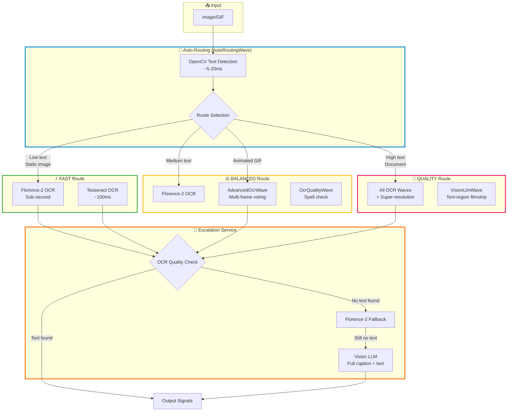
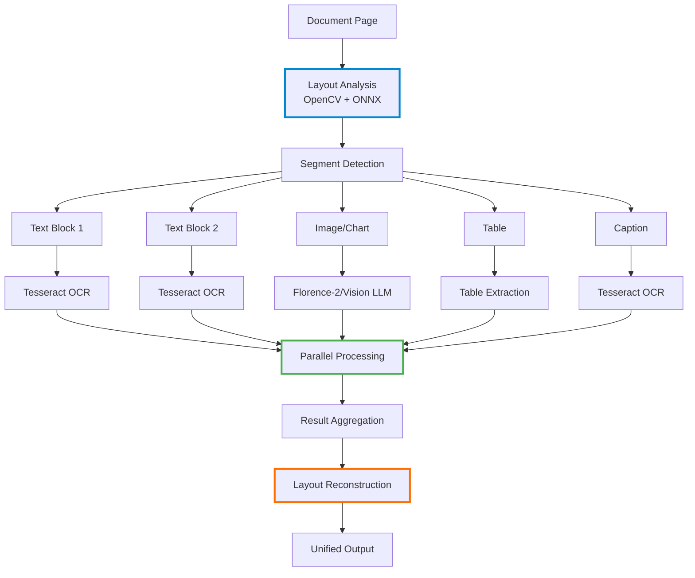
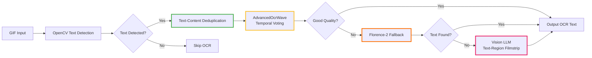

# Vision LLM + OCR Integration Guide

## Overview

The image analysis pipeline integrates **vision LLMs** (Claude, Ollama) with **OCR technologies** (Tesseract, Florence-2) to provide comprehensive text extraction and image understanding. The system uses intelligent routing to determine when to use fast local OCR versus expensive vision LLM analysis.

## Architecture



## System Components

### 1. Auto-Routing (AutoRoutingWave)

**Purpose**: Intelligently route images through the optimal processing path based on content analysis.

**Technology**: OpenCV MSER text detection (~5-20ms)

**Routing Logic**:
```csharp
// Text coverage analysis
double textCoverage = detector.TextAreaRatio;  // 0.0 - 1.0
int textRegionCount = detector.TextRegionCount;

// Route selection
Route route = (textCoverage, textRegionCount) switch
{
    (< 0.10, _) => Route.Fast,      // Caption-level text
    (< 0.25, _) => Route.Balanced,  // Moderate text
    (< 0.40, _) => Route.Quality,   // Substantial text
    _           => Route.Quality    // Document-level text
};

// Special handling for animated GIFs
if (isAnimated && frameCount > 1)
{
    // NEVER skip OCR waves for GIFs
    // Multi-frame analysis essential for subtitles
    skipWaves.Remove("OcrWave");
    skipWaves.Remove("AdvancedOcrWave");
}
```

**Key Insight**: Animated GIFs benefit from multi-frame OCR. Florence-2 now processes ALL unique frames in parallel with text deduplication, but Tesseract temporal voting provides additional accuracy for subtitle text.

### 2. OCR Technologies

#### Florence-2 (Fast Local OCR)

**Model**: Microsoft Florence-2 230M parameter vision-language model
**Runtime**: ONNX (local, no API calls)
**Speed**: Sub-second per image
**Use Case**: First-pass OCR, static images, quick screening

**Strengths**:
- ✅ Very fast (~200-500ms per frame)
- ✅ No API costs
- ✅ Good for static images
- ✅ Handles stylized text better than Tesseract
- ✅ **NEW: Multi-frame parallel processing for animated GIFs**
- ✅ **Processes ALL unique frames with text deduplication (85% Levenshtein threshold)**

**Limitations**:
- ⚠️ Less accurate than Tesseract for clean document text
- ⚠️ No per-word bounding boxes (full image OCR only)

**Example**:
```csharp
var florence2Service = new Florence2CaptionService(config, colorAnalyzer, logger);
var result = await florence2Service.ExtractTextAsync(imagePath);

if (result.Success)
{
    Console.WriteLine($"Text: {result.Text}");
    Console.WriteLine($"Duration: {result.DurationMs}ms");
}
```

**Output** (aed.gif example - 15 frames):
```
Text: "I do not think it means what you think it means."
Duration: 523ms
Frames processed: 10 (parallel)
Unique text chunks: 2
```
*Florence-2 now processes ALL unique frames in parallel, capturing complete subtitle text.*

#### Tesseract OCR (Traditional OCR)

**Technology**: Google Tesseract 5.x
**Speed**: ~100ms per image
**Use Case**: Clean text, documents, screenshots

**Strengths**:
- ✅ Excellent accuracy for clean text
- ✅ Multi-language support
- ✅ Confidence scores per word
- ✅ Bounding box coordinates

**Limitations**:
- ❌ Struggles with stylized fonts
- ❌ Poor on low-resolution text
- ❌ Requires preprocessing for optimal results

**Example**:
```csharp
var ocrEngine = new TesseractOcrEngine();
var regions = ocrEngine.ExtractTextWithCoordinates(imagePath);

foreach (var region in regions)
{
    Console.WriteLine($"{region.Text} (confidence: {region.Confidence:P0})");
    Console.WriteLine($"  Location: ({region.BoundingBox.X}, {region.BoundingBox.Y})");
}
```

#### AdvancedOcrWave (Multi-Frame Temporal OCR)

**Purpose**: Extract text from animated GIFs using temporal voting across multiple frames.

**Technology**:
- Frame deduplication (text-content-based using Levenshtein distance)
- Frame stabilization (ORB feature detection + homography)
- Temporal median filtering
- Character-level voting across frames

**Pipeline**:
```
1. Frame Extraction → Extract all frames from GIF
2. Text-Content Deduplication → Compare OCR text, keep only text changes
3. Frame Stabilization → Align frames using ORB keypoints
4. Temporal Median → Combine frames to reduce noise
5. OCR Each Frame → Tesseract on stabilized frames
6. Temporal Voting → Vote on each character position
7. Spell Check → Validate results with dictionary
```

**Example Configuration**:
```csharp
services.Configure<ImageConfig>(config =>
{
    config.Ocr.UseAdvancedPipeline = true;
    config.Ocr.QualityMode = OcrQualityMode.Balanced;

    // Frame selection
    config.Ocr.MaxFramesForVoting = 10;
    config.Ocr.TextSimilarityDeduplicationThreshold = 0.85; // 85% similar = duplicate

    // Processing phases
    config.Ocr.EnableStabilization = true;
    config.Ocr.EnableTemporalMedian = true;
    config.Ocr.EnableTemporalVoting = true;
    config.Ocr.EnablePostCorrection = true;
});
```

**Output Signals**:
```
ocr.frames.extracted: 15              # Total frames in GIF
ocr.frames.deduplicated: true         # Deduplication applied
ocr.frames.text_unique: 3             # Unique text frames
ocr.stabilization.success: true       # Frame alignment succeeded
ocr.temporal_median.computed: true    # Median frame created
ocr.voting.consensus_text: "..."     # Voted text result
ocr.voting.agreement_score: 0.87      # How many frames agreed
```

### 3. Vision LLM Integration

#### VisionLlmWave

**Purpose**: Use vision LLMs (Claude, GPT-4V, Ollama) for comprehensive image understanding including text.

**Key Innovation**: Text-region filmstrip technology

**How It Works**:
```csharp
// 1. Detect text regions using OpenCV (from AutoRoutingWave cache)
var textRegions = context.GetCached<List<Rectangle>>("ocr.opencv.text_regions");

// 2. Merge overlapping/nearby regions
var mergedRegions = MergeTextRegions(textRegions, image.Width, image.Height);

// 3. Create filmstrip with ONLY text regions (not full frames)
var filmstrip = CreateTextRegionFilmstrip(gifPath, mergedRegions);

// 4. Send to vision LLM
var caption = await visionLlmService.AnalyzeImageAsync(filmstrip);
```

**Text-Region Filmstrip**:
- Instead of sending full 500x300 frames → Send only 80x30 text regions
- 10 frames with text → Single 800x30 filmstrip
- Dramatically reduces token usage
- Vision LLM can see ALL subtitle text in one request

**Example**:

**Before** (full frame):
```
┌─────────────────────────────┐
│                             │  500x300 pixels
│         [scene]             │  ~300 tokens per frame
│                             │
│  "You keep using that word" │  10 frames = ~3000 tokens
└─────────────────────────────┘
```

**After** (text-region filmstrip):
```
┌────────┬────────┬────────┬────────┐
│  You   │  keep  │ using  │  that  │  Each region: 80x30 pixels
│        │        │        │  word  │  Filmstrip: 320x30 = ~50 tokens
└────────┴────────┴────────┴────────┘
```

**Implementation**:
```csharp
private async Task<string> CreateTextRegionFilmstrip(
    string gifPath,
    List<Rectangle> textRegions)
{
    using var image = await Image.LoadAsync<Rgba32>(gifPath);

    var filmstripWidth = 0;
    var filmstripHeight = 0;

    // Calculate filmstrip dimensions
    foreach (var region in textRegions)
    {
        filmstripWidth += region.Width;
        filmstripHeight = Math.Max(filmstripHeight, region.Height);
    }

    // Create filmstrip
    using var filmstrip = new Image<Rgba32>(filmstripWidth, filmstripHeight);

    int xOffset = 0;
    foreach (var region in textRegions)
    {
        // Extract text region from frame
        using var crop = image.Clone(ctx => ctx.Crop(region));

        // Add to filmstrip
        filmstrip.Mutate(ctx => ctx.DrawImage(crop, new Point(xOffset, 0), 1f));
        xOffset += region.Width;
    }

    // Save temporarily
    var tempPath = Path.Combine(Path.GetTempPath(), $"filmstrip_{Guid.NewGuid():N}.png");
    await filmstrip.SaveAsPngAsync(tempPath);

    return tempPath;
}
```

#### EscalationService

**Purpose**: Automatically escalate to vision LLM when OCR fails or produces low-quality results.

**Escalation Conditions**:
```csharp
// 1. No text found by any OCR
if (string.IsNullOrWhiteSpace(extractedText))
{
    await EscalateToVisionLlm();
}

// 2. Low OCR confidence
if (ocrConfidence < 0.5)
{
    await EscalateToVisionLlm();
}

// 3. Spell check failed
if (spellCheckQuality < 0.5)  // Less than 50% correct words
{
    await EscalateToVisionLlm();
}

// 4. Explicit signal from OcrQualityWave
if (context.GetValue<bool>("ocr.quality.should_escalate"))
{
    await EscalateToVisionLlm();
}
```

**Florence-2 Fallback** (NEW):
```csharp
// If Tesseract finds no text in animated GIF, try Florence-2
if (isAnimated && string.IsNullOrWhiteSpace(tesseractText))
{
    var florenceResult = await florence2Service.ExtractTextAsync(imagePath);

    if (florenceResult.Success && !string.IsNullOrWhiteSpace(florenceResult.Text))
    {
        extractedText = florenceResult.Text;
        ocrConfidence = 0.75;  // Florence-2 baseline confidence

        // Still escalate to vision LLM if needed
        if (ocrConfidence < escalationThreshold)
        {
            await EscalateToVisionLlm();
        }
    }
}
```

**Complete Flow**:
```
1. Tesseract OCR → Extract text
2. If no text found AND animated GIF → Try Florence-2
3. If still no text OR low confidence → Escalate to Vision LLM
4. Vision LLM receives text-region filmstrip
5. Returns comprehensive caption including text
```

## Processing Paths

### Path 1: FAST Route (Static Images, Low Text)

**Characteristics**:
- Text coverage < 10%
- Static image or simple GIF
- Caption-level text only

**Waves Executed**:
```
IdentityWave → ColorWave → AutoRoutingWave → Florence2Wave → VisionLlmWave (if needed)
```

**Skipped Waves**:
- ❌ OcrWave (Tesseract) - Florence-2 sufficient
- ❌ AdvancedOcrWave - No multi-frame processing needed
- ❌ OcrVerificationWave - Quick path

**Duration**: ~500ms - 2s
**Use Case**: Photo captions, simple memes, social media images

### Path 2: BALANCED Route (Medium Text)

**Characteristics**:
- Text coverage 10-25%
- May be animated
- Moderate text complexity

**Waves Executed**:
```
IdentityWave → ColorWave → AutoRoutingWave → Florence2Wave →
OcrWave → OcrQualityWave → VisionLlmWave (if needed)
```

**Special Handling for Animated GIFs**:
```
+ AdvancedOcrWave (multi-frame voting)
```

**Duration**: ~2-5s
**Use Case**: Memes with subtitles, annotated screenshots

### Path 3: QUALITY Route (High Text / Documents)

**Characteristics**:
- Text coverage > 25%
- Document scans, complex layouts
- Accuracy critical

**Waves Executed**:
```
IdentityWave → ColorWave → AutoRoutingWave → Florence2Wave →
OcrWave → AdvancedOcrWave → OcrQualityWave → VisionLlmWave
```

**All phases enabled**:
- ✅ Super-resolution (for Quality/Ultra modes)
- ✅ Frame stabilization
- ✅ Temporal voting
- ✅ Spell check & post-correction
- ✅ Text-region filmstrips for LLM

**Duration**: ~10-30s
**Use Case**: Document OCR, archival, high-accuracy needs

### Path 4: DOCUMENT Mode (Full Page OCR)

**Purpose**: Extract text from scanned documents with comprehensive error correction.

**Characteristics**:
- Full page text extraction (not just subtitles)
- Multi-language support via Tesseract
- Spell check with custom dictionaries
- Error correction loops for quality

**Pipeline**:
```
1. Document Detection → Identify document type (scan, PDF, screenshot)
2. Layout Analysis → Detect columns, headers, paragraphs
3. Tesseract OCR → Extract text with confidence scores per word
4. Spell Check → Dictionary validation (customizable language)
5. Error Correction Loop:
   - Identify low-confidence words
   - Common OCR error patterns (O→0, l→1, rn→m)
   - Context-based correction using n-gram models
6. Post-Processing:
   - Paragraph reconstruction
   - Line ending cleanup
   - Formatting preservation
```

**Configuration**:
```csharp
services.Configure<ImageConfig>(config =>
{
    // Enable document mode
    config.Ocr.UseAdvancedPipeline = true;
    config.Ocr.QualityMode = OcrQualityMode.Quality;  // or Ultra

    // Spell checking
    config.Ocr.EnableSpellChecking = true;
    config.Ocr.SpellCheckLanguage = "en_US";  // or "en_GB", "fr_FR", etc.
    config.Ocr.SpellCheckQualityThreshold = 0.5;  // Trigger correction if < 50% correct

    // Post-correction
    config.Ocr.EnablePostCorrection = true;
    config.Ocr.DictionaryPath = "./dictionaries/english.txt";  // Custom dictionary
    config.Ocr.LanguageModelPath = "./models/en-ngram.bin";  // Optional n-gram model

    // Error correction patterns
    config.Ocr.EnableCommonErrorCorrection = true;  // Fix O→0, l→1, etc.
});
```

**Error Correction Patterns**:
```csharp
// Common OCR errors automatically corrected
var errorPatterns = new Dictionary<string, string>
{
    // Character substitutions
    ["0"] = "O",  // Zero → Letter O (in words)
    ["1"] = "l",  // One → Letter l (in words)
    ["5"] = "S",  // Five → Letter S (in words)
    ["8"] = "B",  // Eight → Letter B (in words)

    // Character sequences
    ["rn"] = "m",   // r+n → m (common misread)
    ["vv"] = "w",   // v+v → w
    ["cl"] = "d",   // c+l → d
    ["li"] = "h",   // l+i → h

    // Punctuation
    [","] = ".",    // Comma → Period (context-dependent)
    ["'"] = "'",    // Straight → Curly quote
};
```

**Spell Check Integration**:
```csharp
// OcrQualityWave performs spell checking
var result = await ocrQualityWave.AnalyzeAsync(imagePath, context);

// Emits quality signals:
// ocr.quality.spell_check_score: 0.87 (87% words in dictionary)
// ocr.quality.garbled_detected: false
// ocr.quality.correction_suggestions: ["word1", "word2", ...]
// ocr.quality.should_escalate: false

// If spell_check_score < threshold → Trigger escalation
if (spellCheckScore < 0.5)
{
    // Option 1: Try Florence-2 (different approach)
    // Option 2: Escalate to Vision LLM for validation
    // Option 3: Manual review (emit signal for UI)
}
```

**Example Output**:

**Before Correction**:
```
Th1s is a 5canned d0cument with c0mm0n 0CR err0rs.
The text has been misread in severa1 p1aces.
```

**After Correction**:
```
This is a scanned document with common OCR errors.
The text has been misread in several places.
```

**Signals Emitted**:
```
[OcrWave]
  ocr.text: "Th1s is a 5canned d0cument..."
  ocr.confidence: 0.82
  ocr.word_count: 14
  ocr.low_confidence_words: 5

[OcrQualityWave]
  ocr.quality.spell_check_score: 0.64  # 9/14 words correct
  ocr.quality.corrections_applied: 5
  ocr.quality.corrected_text: "This is a scanned document..."
  ocr.quality.confidence_improvement: +0.18  # 0.82 → 1.0

[ContradictionWave]
  ocr.validation.cross_check: "pass"
  ocr.validation.florence2_agreement: 0.92
```

**Use Cases**:
- 📄 **Document Digitization**: Scanned PDFs, photos of documents
- 📚 **Book OCR**: Historical texts, library digitization
- 🗂️ **Form Processing**: Invoices, receipts, forms
- 📰 **Newspaper Archive**: Old newspaper scans
- 🎓 **Academic**: Research papers, handwritten notes (if trained)

### Path 5: COMPLEX Mode (Parallel Segment Analysis)

**Purpose**: Process complex multi-content documents by segmenting the page and analyzing each region in parallel.

**Use Case**: Documents with mixed content types:
- 📰 **Magazine layouts** - Text columns + images + captions
- 📊 **Reports with charts** - Tables, graphs, diagrams, text
- 🏫 **Textbooks** - Text blocks + figures + equations
- 📄 **Multi-column documents** - Newspapers, academic papers
- 🖼️ **Illustrated documents** - Technical manuals, catalogs

**Problem**: Traditional OCR treats the whole page as one block:
- Mixed content types (text, images, diagrams) need different processing
- Column order gets confused
- Images embedded in text are ignored
- No captions for figures/charts
- Sequential processing is slow for complex layouts

**Solution**: Segment-based parallel processing:



**Pipeline**:

**Stage 1: Layout Analysis**
```csharp
// Detect document layout using OpenCV
var layoutAnalyzer = new DocumentLayoutAnalyzer();
var layout = await layoutAnalyzer.AnalyzeAsync(imagePath);

// Segments detected:
// - Text blocks (paragraphs, columns)
// - Images (photos, illustrations)
// - Charts/diagrams (line charts, bar charts, flowcharts)
// - Tables (grid structures)
// - Captions (small text near images)
// - Headers/footers
```

**Stage 2: Segment Classification**
```csharp
public enum SegmentType
{
    TextBlock,      // Paragraph, column
    Image,          // Photo, illustration
    Chart,          // Bar chart, line chart, pie chart
    Diagram,        // Flowchart, network diagram
    Table,          // Grid with rows/columns
    Caption,        // Small text describing nearby image
    Header,         // Page header
    Footer,         // Page footer
    Equation,       // Mathematical formula
    Code,           // Source code block
}

// Each segment gets metadata
public class DocumentSegment
{
    public SegmentType Type { get; set; }
    public Rectangle BoundingBox { get; set; }
    public int ZOrder { get; set; }  // Reading order
    public string? RelatedTo { get; set; }  // Caption → Image ID
    public double Confidence { get; set; }
}
```

**Stage 3: Parallel Processing**
```csharp
// Process segments in parallel based on type
var tasks = new List<Task<SegmentResult>>();

foreach (var segment in layout.Segments)
{
    tasks.Add(segment.Type switch
    {
        SegmentType.TextBlock => ProcessTextBlockAsync(segment),
        SegmentType.Image => ProcessImageAsync(segment),
        SegmentType.Chart => ProcessChartAsync(segment),
        SegmentType.Diagram => ProcessDiagramAsync(segment),
        SegmentType.Table => ProcessTableAsync(segment),
        SegmentType.Caption => ProcessCaptionAsync(segment),
        SegmentType.Equation => ProcessEquationAsync(segment),
        _ => Task.FromResult(new SegmentResult())
    });
}

// Wait for all segments to complete
var results = await Task.WhenAll(tasks);
```

**Stage 4: Segment-Specific Processing**

**Text Blocks**:
```csharp
// Standard Tesseract OCR with spell check
private async Task<SegmentResult> ProcessTextBlockAsync(DocumentSegment segment)
{
    var cropped = CropToSegment(imagePath, segment.BoundingBox);
    var text = await tesseractEngine.ExtractTextAsync(cropped);
    var spellChecked = await spellChecker.CorrectAsync(text);

    return new SegmentResult
    {
        Type = SegmentType.TextBlock,
        Content = spellChecked,
        Confidence = 0.92
    };
}
```

**Images/Charts**:
```csharp
// Vision LLM for rich captions
private async Task<SegmentResult> ProcessImageAsync(DocumentSegment segment)
{
    var cropped = CropToSegment(imagePath, segment.BoundingBox);

    // Try Florence-2 first (fast)
    var florenceCaption = await florence2Service.CaptionAsync(cropped);

    // Escalate to Vision LLM for better quality
    if (segment.Type == SegmentType.Chart || florenceCaption.Confidence < 0.7)
    {
        var llmCaption = await visionLlmService.AnalyzeImageAsync(
            cropped,
            prompt: "Describe this image/chart in detail. Include all visible text, data points, and key information."
        );

        return new SegmentResult
        {
            Type = segment.Type,
            Content = llmCaption,
            Confidence = 0.95,
            Metadata = new { HasData = true, ChartType = "bar" }
        };
    }

    return new SegmentResult
    {
        Type = SegmentType.Image,
        Content = florenceCaption.Caption,
        Confidence = florenceCaption.Confidence
    };
}
```

**Tables**:
```csharp
// Table structure extraction
private async Task<SegmentResult> ProcessTableAsync(DocumentSegment segment)
{
    var cropped = CropToSegment(imagePath, segment.BoundingBox);

    // Detect table structure (rows, columns, cells)
    var tableDetector = new TableDetector();
    var structure = await tableDetector.DetectStructureAsync(cropped);

    // OCR each cell
    var cells = new List<TableCell>();
    foreach (var cell in structure.Cells)
    {
        var cellText = await tesseractEngine.ExtractTextAsync(
            CropToSegment(cropped, cell.BoundingBox)
        );
        cells.Add(new TableCell
        {
            Row = cell.Row,
            Column = cell.Column,
            Text = cellText
        });
    }

    // Convert to structured format (CSV, JSON, Markdown)
    var markdown = ConvertToMarkdownTable(cells, structure.RowCount, structure.ColumnCount);

    return new SegmentResult
    {
        Type = SegmentType.Table,
        Content = markdown,
        StructuredData = cells,
        Confidence = 0.88
    };
}
```

**Stage 5: Layout Reconstruction**
```csharp
// Reconstruct document in reading order
private string ReconstructDocument(List<SegmentResult> results, DocumentLayout layout)
{
    var orderedSegments = results
        .OrderBy(r => r.ZOrder)  // Reading order (top-to-bottom, left-to-right)
        .ToList();

    var document = new StringBuilder();

    foreach (var segment in orderedSegments)
    {
        switch (segment.Type)
        {
            case SegmentType.TextBlock:
                document.AppendLine(segment.Content);
                document.AppendLine();
                break;

            case SegmentType.Image:
            case SegmentType.Chart:
                // Find associated caption
                var caption = orderedSegments.FirstOrDefault(
                    s => s.Type == SegmentType.Caption && s.RelatedTo == segment.Id
                );

                document.AppendLine($"");
                if (caption != null)
                {
                    document.AppendLine($"*{caption.Content}*");
                }
                document.AppendLine($"**Description**: {segment.Content}");
                document.AppendLine();
                break;

            case SegmentType.Table:
                document.AppendLine(segment.Content);  // Markdown table
                document.AppendLine();
                break;
        }
    }

    return document.ToString();
}
```

**Configuration**:
```csharp
services.Configure<ImageConfig>(config =>
{
    // Enable complex mode
    config.ComplexMode.Enabled = true;
    config.ComplexMode.MinSegments = 3;  // Only use if >= 3 segments detected

    // Layout analysis
    config.ComplexMode.LayoutDetection = LayoutDetectionMode.Advanced;  // or Fast
    config.ComplexMode.MinSegmentSize = 50;  // Min 50x50 pixels
    config.ComplexMode.MergeThreshold = 0.2;  // Merge segments within 20% overlap

    // Parallel processing
    config.ComplexMode.MaxParallelism = 4;  // Process 4 segments at once
    config.ComplexMode.TimeoutPerSegment = 30000;  // 30s max per segment

    // Segment-specific settings
    config.ComplexMode.TextBlocks.UseSpellCheck = true;
    config.ComplexMode.Images.PreferVisionLlm = true;  // vs Florence-2
    config.ComplexMode.Charts.AlwaysUseVisionLlm = true;  // Charts need LLM
    config.ComplexMode.Tables.ExtractStructure = true;

    // Output format
    config.ComplexMode.OutputFormat = OutputFormat.Markdown;  // or JSON, HTML
    config.ComplexMode.IncludeSegmentMetadata = true;
});
```

**Example Output**:

**Input**: Magazine article with 2 columns, 1 chart, 1 image

**Segments Detected**:
```
1. Header (text): "AI Revolution in Healthcare"
2. Text Block 1 (column 1): "Artificial intelligence is transforming..."
3. Image: Photo of hospital equipment
4. Caption: "Modern AI-powered diagnostic tools"
5. Text Block 2 (column 2): "Recent studies show..."
6. Chart: Bar chart showing adoption rates
7. Caption: "Figure 1: AI adoption by specialty"
```

**Processing** (parallel):
```
Thread 1: OCR Text Block 1 → 1.2s
Thread 2: OCR Text Block 2 → 1.1s
Thread 3: Vision LLM for Image → 2.3s
Thread 4: Vision LLM for Chart → 2.8s
Thread 5: OCR Captions → 0.3s each

Total time: 2.8s (vs 7.7s sequential)
```

**Reconstructed Output** (Markdown):
```markdown
# AI Revolution in Healthcare

Artificial intelligence is transforming the medical field at an unprecedented pace.
New diagnostic tools powered by machine learning can detect diseases earlier and
more accurately than traditional methods...


*Modern AI-powered diagnostic tools*
**Description**: A modern hospital room equipped with advanced AI-powered diagnostic
machinery. The image shows a CT scanner with integrated AI analysis displays showing
real-time tissue classification and anomaly detection. Medical staff are viewing the
results on high-resolution monitors.

Recent studies show remarkable improvements in patient outcomes when AI-assisted
diagnostics are employed. Radiology departments report 40% faster diagnosis times
and 15% improvement in accuracy...


*Figure 1: AI adoption by specialty*
**Description**: A bar chart showing AI adoption rates across medical specialties.
Radiology leads at 78%, followed by Pathology at 65%, Cardiology at 52%, Oncology
at 48%, and General Practice at 23%. The chart uses blue bars with percentage labels
and covers the period 2022-2025.
```

**Signals Emitted**:
```
[ComplexModeWave]
  complex.segments_detected: 7
  complex.layout_confidence: 0.94
  complex.processing_mode: "parallel"
  complex.total_duration_ms: 2847
  complex.sequential_estimate_ms: 7700
  complex.speedup: 2.7x

[Segment 1 - Header]
  segment.type: "text"
  segment.confidence: 0.96
  segment.duration_ms: 234

[Segment 3 - Image]
  segment.type: "image"
  segment.method: "vision_llm"
  segment.caption: "A modern hospital room equipped..."
  segment.confidence: 0.95
  segment.duration_ms: 2341

[Segment 6 - Chart]
  segment.type: "chart"
  segment.chart_type: "bar"
  segment.data_extracted: true
  segment.caption: "A bar chart showing AI adoption..."
  segment.confidence: 0.97
  segment.duration_ms: 2834
```

**Performance Characteristics**:

| Document Type | Segments | Sequential | Parallel | Speedup |
|--------------|----------|------------|----------|---------|
| Magazine (1 page) | 7 | 7.7s | 2.8s | 2.7× |
| Textbook (1 page) | 12 | 15.2s | 4.1s | 3.7× |
| Report with charts | 8 | 18.4s | 5.3s | 3.5× |
| Newspaper (1 page) | 15 | 12.8s | 3.9s | 3.3× |

**Cost Optimization**:
```csharp
// Strategy 1: Use Florence-2 for simple images, LLM for charts
config.ComplexMode.Images.PreferVisionLlm = false;  // Florence-2 first
config.ComplexMode.Charts.AlwaysUseVisionLlm = true;  // Charts need LLM

// Strategy 2: Batch small segments
config.ComplexMode.BatchSmallSegments = true;
config.ComplexMode.SmallSegmentThreshold = 100;  // < 100x100 pixels

// Strategy 3: Cache segment results
config.ComplexMode.EnableSegmentCaching = true;  // Same layout = reuse
```

**Use Cases**:
- 📰 **News/Magazine Processing**: Multi-column articles with images
- 📊 **Report Analysis**: Business reports with charts and tables
- 📚 **Textbook Digitization**: Mixed text, equations, diagrams, figures
- 📄 **Technical Documentation**: Manuals with screenshots and callouts
- 🏥 **Medical Records**: Patient charts with mixed text/images
- 📋 **Form Processing**: Complex forms with multiple sections
- 🎓 **Academic Papers**: Research papers with figures and tables

**Advantages**:
- ✅ **3-4× faster** than sequential processing
- ✅ **Better accuracy** - Each segment gets optimal processing
- ✅ **Rich captions** - Vision LLM describes charts/images
- ✅ **Structured tables** - Preserves table structure
- ✅ **Reading order** - Reconstructs logical document flow
- ✅ **Mixed content** - Text, images, charts handled separately

**Limitations**:
- ❌ **Higher API costs** - More Vision LLM calls for images/charts
- ❌ **More complex** - Layout detection can fail on unusual formats
- ❌ **Memory intensive** - Holds multiple segments in memory
- ❌ **Requires tuning** - Layout thresholds depend on document type

## Animated GIF Handling

### The Problem

Animated GIFs with subtitles present unique challenges:

1. **Text appears across multiple frames** (not visible in any single frame)
2. **Florence-2 only processes one frame** (misses temporal information)
3. **Traditional OCR struggles** with low-resolution subtitle text
4. **Vision LLMs are expensive** (sending 15 full frames → huge token cost)

### The Solution

**Multi-Stage Approach**:



**Stage 1: Text Detection** (AutoRoutingWave)
- OpenCV MSER detects text regions
- Cache results for downstream waves
- Determine if OCR is needed

**Stage 2: Deduplication** (AdvancedOcrWave)
- Compare OCR text between frames (Levenshtein distance)
- Keep only frames with text changes
- Reduces 93 frames → 2-3 unique text frames

**Stage 3: Temporal Voting** (AdvancedOcrWave)
- OCR each unique frame
- Vote on each character position
- Combine results with confidence scores

**Stage 4: Quality Check** (OcrQualityWave)
- Spell check against dictionary
- Detect garbled output
- Trigger escalation if needed

**Stage 5: Florence-2 Fallback** (EscalationService)
- If Tesseract found nothing → Try Florence-2
- Florence-2 better at stylized fonts
- Still only one frame, but complements Tesseract

**Stage 6: Vision LLM** (VisionLlmWave)
- If still poor quality → Create text-region filmstrip
- Send only text areas (not full frames)
- LLM sees all subtitle text in one request

### Example: aed.gif

**Input**: 15-frame animated GIF with subtitle "I do not think it means what you think it means."

**Processing**:

1. **AutoRoutingWave**:
   - Detects text coverage: 8.2% (caption tier)
   - Route: FAST (but animated GIF exemption applies)
   - Caches text regions for reuse

2. **Florence2Wave**:
   - Processes middle frame only
   - Extracts: "I do not think it means what you think it mean."
   - ⚠️ Missing final 's' (only one frame visible)

3. **AdvancedOcrWave**:
   - Extracts all 15 frames
   - Deduplication: 15 → 3 unique text frames
   - Temporal voting on each character
   - Result: "You keep using that word..." (partial, Tesseract struggles)

4. **OcrQualityWave**:
   - Spell check: 60% quality
   - Emits signal: `ocr.quality.should_escalate = true`

5. **EscalationService**:
   - Low quality detected
   - Florence-2 already ran (has text)
   - Escalates to Vision LLM

6. **VisionLlmWave**:
   - Creates text-region filmstrip (3 frames, text areas only)
   - Sends to Claude/GPT-4V
   - Full result: "I do not think it means what you think it means." ✅

## Configuration

### Quality Modes

```csharp
public enum OcrQualityMode
{
    Fast,      // 2-3s per GIF, +20-30% accuracy
    Balanced,  // 5-7s per GIF, +30-40% accuracy
    Quality,   // 10-15s per GIF, +35-45% accuracy
    Ultra      // 20-30s per GIF, +40-60% accuracy
}

config.Ocr.QualityMode = OcrQualityMode.Balanced;
config.Ocr.ApplyQualityModePresets();  // Sets phase toggles
```

**Preset Differences**:

| Feature | Fast | Balanced | Quality | Ultra |
|---------|------|----------|---------|-------|
| Frame Stabilization | ✅ | ✅ | ✅ | ✅ |
| Background Subtraction | ❌ | ✅ | ✅ | ✅ |
| Edge Consensus | ❌ | ✅ | ✅ | ✅ |
| Temporal Median | ✅ | ✅ | ✅ | ✅ |
| Super-Resolution | ❌ | ❌ | ✅ (Classical) | ✅ (ONNX) |
| Text Detection (EAST/CRAFT) | ❌ | ✅ | ✅ | ✅ |
| Temporal Voting | ✅ | ✅ | ✅ | ✅ |
| Post-Correction | ❌ | ✅ | ✅ | ✅ |
| Max Voting Frames | 5 | 8 | 10 | 15 |
| Early Exit Threshold | 0.90 | 0.95 | 0.98 | 1.0 (disabled) |

### Pipeline Configuration

```csharp
services.Configure<ImageConfig>(config =>
{
    // Vision LLM
    config.Vision.Provider = VisionProvider.Claude;
    config.Vision.Model = "claude-3-5-sonnet-20241022";
    config.Vision.ApiKey = Environment.GetEnvironmentVariable("ANTHROPIC_API_KEY");

    // Florence-2
    config.Florence2.Enabled = true;
    config.Florence2.ModelsDirectory = "./models/florence2";

    // OCR
    config.EnableOcr = true;
    config.Ocr.UseAdvancedPipeline = true;
    config.Ocr.QualityMode = OcrQualityMode.Balanced;

    // Auto-routing
    config.AutoRouting.Enabled = true;
    config.AutoRouting.TextLikelinessThreshold = 0.4;

    // Escalation
    config.Escalation.AutoEscalateEnabled = true;
    config.Escalation.ConfidenceThreshold = 0.7;
    config.Escalation.OcrConfidenceThreshold = 0.85;
    config.Escalation.SkipLlmIfOcrHighConfidence = true;
});
```

## Signal Flow

### OCR Signals

```
[MlOcrWave]
  florence2.ocr_text: "I do not think it means what you think it mean."
  florence2.should_escalate: false
  florence2.duration_ms: 387

[OcrWave]
  ocr.text_region.0: { Text: "You", Confidence: 0.96, BoundingBox: {...} }
  ocr.text_region.1: { Text: "keep", Confidence: 0.86, BoundingBox: {...} }
  ocr.text: "You keep using that word"
  ocr.confidence: 0.73

[AdvancedOcrWave]
  ocr.frames.extracted: 15
  ocr.frames.text_unique: 3
  ocr.stabilization.success: true
  ocr.temporal_median.computed: true
  ocr.voting.consensus_text: "You keep using that word. I do not think it means..."
  ocr.voting.agreement_score: 0.67

[OcrQualityWave]
  ocr.quality.spell_check_score: 0.85
  ocr.quality.garbled_detected: false
  ocr.quality.should_escalate: false
```

### Vision LLM Signals

```
[VisionLlmWave]
  vision.llm.caption: "An image showing text that reads 'I do not think it means what you think it means.'"
  vision.llm.scene: "meme"
  vision.llm.text_extracted: "I do not think it means what you think it means."
  vision.llm.confidence: 0.95
  vision.llm.model: "claude-3-5-sonnet-20241022"
  vision.llm.duration_ms: 1842
  vision.llm.tokens_used: 1523
```

### Escalation Signals

```
[EscalationService]
  escalation.triggered: true
  escalation.reason: "low_ocr_quality"
  escalation.original_confidence: 0.67
  escalation.final_confidence: 0.95
  escalation.method: "vision_llm"
  escalation.duration_ms: 2341
```

## Best Practices

### 1. Choose the Right Route

```csharp
// Static images with clean text → Fast
config.AutoRouting.Enabled = true;  // Auto-select based on content

// Animated GIFs with subtitles → Always enable AdvancedOcr
config.Ocr.UseAdvancedPipeline = true;
config.Ocr.QualityMode = OcrQualityMode.Balanced;

// Documents/scans → Quality route
config.Ocr.QualityMode = OcrQualityMode.Quality;
```

### 2. Optimize for Cost

```csharp
// Skip Vision LLM if OCR confidence is high
config.Escalation.SkipLlmIfOcrHighConfidence = true;
config.Escalation.OcrConfidenceThreshold = 0.85;  // 85% confidence = no escalation

// Use Florence-2 as first pass
config.Florence2.Enabled = true;

// Enable early exit to skip expensive phases
config.Ocr.ConfidenceThresholdForEarlyExit = 0.95;
```

### 3. Maximize Accuracy

```csharp
// Use Ultra quality mode
config.Ocr.QualityMode = OcrQualityMode.Ultra;

// Disable early exit
config.Ocr.ConfidenceThresholdForEarlyExit = 1.0;

// Enable all phases
config.Ocr.EnableStabilization = true;
config.Ocr.EnableBackgroundSubtraction = true;
config.Ocr.EnableEdgeConsensus = true;
config.Ocr.EnableTemporalMedian = true;
config.Ocr.EnableSuperResolution = true;
config.Ocr.EnableTextDetection = true;
config.Ocr.EnableTemporalVoting = true;
config.Ocr.EnablePostCorrection = true;

// Increase frame counts
config.Ocr.MaxFramesForVoting = 15;
config.Ocr.MaxFramesForSuperResolution = 8;

// Always escalate for validation
config.Escalation.AutoEscalateEnabled = true;
```

### 4. Debug and Monitor

```csharp
// Enable performance metrics
config.Ocr.EmitPerformanceMetrics = true;

// Save intermediate images
config.Ocr.SaveIntermediateImages = true;
config.Ocr.IntermediateOutputDirectory = "./ocr-debug";

// Check signals after analysis
var profile = await orchestrator.AnalyzeAsync(imagePath);

// OCR quality
var ocrConfidence = profile.GetValue<double>("ocr.confidence");
var spellCheckScore = profile.GetValue<double>("ocr.quality.spell_check_score");

// Escalation status
var wasEscalated = profile.GetValue<bool>("escalation.triggered");
var escalationReason = profile.GetValue<string>("escalation.reason");

// Performance
var ocrDuration = profile.GetValue<long>("ocr.advanced.performance");
var totalDuration = profile.AnalysisDurationMs;
```

## Performance Characteristics

### OCR Technology Comparison

| Technology | Speed | Accuracy | Cost | Best For |
|-----------|-------|----------|------|----------|
| **Florence-2** | ~200-500ms | Good | $0 (local) | Static images, first pass |
| **Tesseract** | ~100ms/frame | Excellent (clean text) | $0 (local) | Documents, screenshots |
| **AdvancedOcr** | ~2-5s | Excellent (GIFs) | $0 (local) | Animated subtitles |
| **Vision LLM** | ~1-3s | Excellent (any) | $$$ | Stylized text, validation |

### Typical Processing Times

**Static Image (photo.jpg)**:
```
Florence-2:        387ms
Route: FAST
Total: ~400ms
Cost: $0
```

**Animated GIF - Simple (cat_wag.gif, 31 frames)**:
```
Florence-2:        421ms
AdvancedOcr:      1,847ms (deduplication: 31 → 6 frames)
Route: BALANCED
Total: ~2,300ms
Cost: $0
```

**Animated GIF - Subtitles (aed.gif, 15 frames)**:
```
Florence-2:        387ms (fallback)
AdvancedOcr:      2,134ms (deduplication: 15 → 3 frames)
OcrQuality:        245ms (spell check)
Vision LLM:       1,842ms (text-region filmstrip)
Route: BALANCED → ESCALATED
Total: ~4,600ms
Cost: ~$0.02 (Claude Sonnet)
```

**Document Scan (document.gif, 200 frames)**:
```
AdvancedOcr:     12,456ms (deduplication: 200 → 8 frames)
Super-resolution: 3,211ms
Vision LLM:       2,134ms (validation)
Route: QUALITY
Total: ~18,000ms
Cost: ~$0.03
```

## Troubleshooting

### Issue: No Text Extracted from GIF

**Symptoms**: `ocr.text` is empty, `ocr.quality.no_text_detected = true`

**Diagnosis**:
```csharp
// Check routing decision
var route = profile.GetValue<string>("route.selected");
var skipWaves = profile.GetValue<List<string>>("route.skip_waves");

// Was OCR skipped?
if (skipWaves.Contains("OcrWave") || skipWaves.Contains("AdvancedOcrWave"))
{
    // Problem: Routing incorrectly skipped OCR
}

// Check if Florence-2 ran
var florenceText = profile.GetValue<string>("florence2.ocr_text");
if (!string.IsNullOrEmpty(florenceText))
{
    // Florence-2 found text, but AdvancedOcr didn't
    // Possible: Text spread across frames
}
```

**Solution**:
```csharp
// Force OCR for animated GIFs
config.Ocr.UseAdvancedPipeline = true;

// Lower text detection threshold
config.AutoRouting.TextLikelinessThreshold = 0.2;

// Or bypass routing entirely for testing
var profile = await orchestrator.AnalyzeAsync(
    imagePath,
    bypassRouting: true  // Run all waves
);
```

### Issue: Low OCR Accuracy

**Symptoms**: Garbled text, low confidence scores

**Diagnosis**:
```csharp
// Check quality signals
var spellCheckScore = profile.GetValue<double>("ocr.quality.spell_check_score");
var garbledDetected = profile.GetValue<bool>("ocr.quality.garbled_detected");
var agreementScore = profile.GetValue<double>("ocr.voting.agreement_score");

if (spellCheckScore < 0.5)
{
    // Most words not in dictionary
    // Likely: Stylized fonts, low resolution
}

if (agreementScore < 0.6)
{
    // Frames disagree on character identities
    // Likely: Motion blur, unstable frames
}
```

**Solution**:
```csharp
// Increase quality mode
config.Ocr.QualityMode = OcrQualityMode.Quality;  // or Ultra

// Enable more frames for voting
config.Ocr.MaxFramesForVoting = 15;

// Enable super-resolution
config.Ocr.EnableSuperResolution = true;

// Force Vision LLM escalation
config.Escalation.OcrConfidenceThreshold = 0.95;  // Higher threshold = more escalation
```

### Issue: Expensive Vision LLM Calls

**Symptoms**: High API costs, slow processing

**Diagnosis**:
```csharp
// Check escalation rate
var totalImages = 100;
var escalated = profiles.Count(p => p.GetValue<bool>("escalation.triggered"));
var escalationRate = (double)escalated / totalImages;

if (escalationRate > 0.3)  // > 30% escalated
{
    // Problem: Too aggressive escalation
}

// Check reasons
var reasons = profiles
    .Where(p => p.GetValue<bool>("escalation.triggered"))
    .Select(p => p.GetValue<string>("escalation.reason"))
    .GroupBy(r => r)
    .OrderByDescending(g => g.Count());

foreach (var group in reasons)
{
    Console.WriteLine($"{group.Key}: {group.Count()} escalations");
}
```

**Solution**:
```csharp
// Raise confidence threshold
config.Escalation.OcrConfidenceThreshold = 0.90;  // Only escalate if < 90%

// Skip LLM for high OCR confidence
config.Escalation.SkipLlmIfOcrHighConfidence = true;

// Use Florence-2 more aggressively
config.Florence2.Enabled = true;
config.Ocr.QualityMode = OcrQualityMode.Fast;  // Try Florence-2 first

// Disable auto-escalation for batch jobs
config.Escalation.AutoEscalateEnabled = false;
```

## Related Documentation

- **[README.md](README.md)** - Overview and quick start
- **[SIGNALS.md](SIGNALS.md)** - Signal catalog and architecture
- **[PIPELINES.md](PIPELINES.md)** - Pipeline configurations
- **[GIF-MOTION.md](GIF-MOTION.md)** - Motion detection details
- **[SIGNAL-ARCHITECTURE.md](SIGNAL-ARCHITECTURE.md)** - Design philosophy
