# Random Ponderings: An emergent AI pathway I randomly thought about...

## Building a Multi-LLM Synthetic Decision Engine with LLMockApi

<datetime class="hidden">2025-11-13T23:00</datetime>
<!-- category -- AI-Article, AI, Sci-Fi, Emergent Intelligence -->


Hey, ever wonder what you could do if you had your own GPU farm?

**Note:**  Inspired by thinking about extensions to mostlylucid.mockllmapi and material for the sci-fi novel "Michael" about emergent AI

## Introduction

A **synthetic decision engine** uses multiple LLM backends in sequence to refine, validate, and enhance data through progressive stages. Each LLM brings different strengths—speed, creativity, accuracy, or cost-effectiveness—creating a pipeline where the output of one model becomes refined input for the next.

This pattern is particularly powerful for:
- **Data quality enhancement** - Start with fast generation, refine with sophisticated models
- **Multi-stage validation** - Generate data, validate structure, enrich with context
- **Cost optimization** - Use expensive models only where quality matters most
- **Specialized processing** - Route different data types to appropriate models

LLMockApi's multi-backend architecture makes this trivially easy to implement.

[TOC]
### The Big Picture: How It All Fits Together

Here's a complete view of a multi-LLM synthetic decision engine in action:


**What This Diagram Shows:**

1. **Application Layer** - Your code decides what pattern to use
2. **Decision Layer** - Route to the right pattern based on requirements
3. **Pattern Execution** - Each pattern orchestrates backends differently
4. **Backend Pool** - Shared pool of LLM models with different capabilities
5. **Final Output** - All patterns converge to produce the result

**The Mind-Bending Part:** The SAME backend models can be used in DIFFERENT patterns. It's not about having specialized models for each pattern—it's about how you ORCHESTRATE them.

## Why Use Multiple LLMs?

### The Complementary Strengths Principle

Different LLM models excel at different tasks:

| Model Type | Strength | Use Case in Pipeline |
|------------|----------|---------------------|
| **Local Small Models** (Gemma 3, Llama 3) | Fast, cheap, high variety | Initial data generation, bulk processing |
| **Local Large Models** (Mistral-Nemo) | Quality, context retention | Data refinement, relationship building |
| **Cloud Models** (GPT-4, Claude) | Superior reasoning, validation | Final quality check, edge case handling |

### Real-World Example: E-Commerce Product Data

**Stage 1 - Rapid Generation (Gemma 3:4B)**
```json
{
  "name": "Wireless Mouse",
  "price": 29.99,
  "category": "Electronics"
}
```

**Stage 2 - Enrichment (Mistral-Nemo)**
```json
{
  "name": "Wireless Mouse",
  "price": 29.99,
  "category": "Electronics",
  "description": "Ergonomic 2.4GHz wireless mouse with precision tracking",
  "specs": {
    "dpi": 1600,
    "connectivity": "2.4GHz USB receiver",
    "battery": "2 AA batteries"
  },
  "tags": ["wireless", "ergonomic", "office", "productivity"]
}
```

**Stage 3 - Validation & Enhancement (GPT-4)**
```json
{
  "id": "PROD-WM-2024-1158",
  "name": "Wireless Mouse",
  "price": 29.99,
  "msrp": 39.99,
  "category": "Electronics",
  "subcategory": "Computer Peripherals",
  "description": "Ergonomic 2.4GHz wireless mouse with precision tracking",
  "specs": {
    "dpi": 1600,
    "connectivity": "2.4GHz USB receiver",
    "battery": "2 AA batteries",
    "dimensions": "4.7 x 2.5 x 1.6 inches",
    "weight": "3.2 oz"
  },
  "tags": ["wireless", "ergonomic", "office", "productivity"],
  "inventory": {
    "sku": "WM-16-BLK",
    "inStock": true,
    "quantity": 247,
    "warehouse": "US-WEST-1"
  },
  "shipping": {
    "freeShipping": true,
    "estimatedDays": 3
  }
}
```

## Architecture Patterns

Understanding these patterns is key to building effective multi-LLM systems. Each pattern solves different problems and has distinct trade-offs.

### Pattern 1: Sequential Enhancement Pipeline

**Concept:** Data flows through a series of LLMs, where each stage adds more detail, validation, or refinement.

**The Mind-Bending Part:** The output of one LLM becomes the input to the next. Each model "sees" what the previous one created and builds upon it.


**Real Example Flow:**

1. **Input:** `{ "generateUser": true }`
2. **After Fast Model (100ms):** `{ "name": "John", "age": 30 }`
3. **After Quality Model (400ms):** `{ "name": "John", "age": 30, "email": "john@example.com", "address": {...}, "preferences": {...} }`
4. **After Validator (800ms):** Same as above + validated formatting + consistency checks + business logic applied

**When to use:**
- You need progressively richer data
- Quality matters more than speed
- You want to build complexity gradually

**Best for:** Test data generation, mock API responses, data migration

---

### Pattern 2: Parallel Divergent Processing

**Concept:** Multiple LLMs work on the SAME input simultaneously, each specializing in different aspects. Results are merged at the end.

**The Mind-Bending Part:** Instead of sequential refinement, you're getting different "expert opinions" at the same time, then combining them into a cohesive whole.


**Real Example Flow (All Parallel, ~400ms total):**

Request to all three backends simultaneously:
- **Backend A generates:** `{ "name": "Wireless Mouse", "category": "Electronics" }`
- **Backend B generates:** `{ "price": 29.99, "msrp": 39.99, "discount": 25 }`
- **Backend C generates:** `{ "inStock": true, "quantity": 247, "warehouse": "US-WEST" }`

Your code merges them:
```javascript
const result = {
    ...productDetails,  // from Backend A
    pricing: pricingData,  // from Backend B
    inventory: inventoryInfo  // from Backend C
}
```

**When to use:**
- Different aspects require different processing
- Speed is critical (parallel is faster than sequential)
- You want diverse perspectives on the same problem

**Best for:** Comprehensive data generation, A/B testing, consensus systems

---

### Pattern 3: Validation & Correction Loop

**Concept:** Generate data with one model, check it with another, and fix issues if found. Repeat until quality threshold met.

**The Mind-Bending Part:** The validator model acts as a "quality gate" that can send data back for refinement. It's a feedback loop where models collaborate to iteratively improve output.


**Real Example Flow:**

**Iteration 1:**
- Generate: `{ "email": "invalid-email", "age": -5 }`
- Validate: ❌ Found issues: ["Invalid email format", "Age must be positive"]
- Correct: `{ "email": "user@example.com", "age": 25 }`

**Iteration 2:**
- Validate: ✅ All checks passed
- Output: Final data

**When to use:**
- Data quality is critical
- You need to catch edge cases
- You want to ensure compliance with rules

**Best for:** Production test data, regulatory compliance testing, schema validation

---

### Pattern 4: Hierarchical Specialist Routing

**Concept:** Analyze the request first, then route to the appropriate model based on complexity, cost, or requirements.

**The Mind-Bending Part:** The system "thinks" about which model to use BEFORE processing. It's meta-decision making—deciding how to decide.


**Complexity Scoring Example:**

```javascript
function analyzeComplexity(request) {
  let score = 0;

  // Factor 1: Field count
  const fieldCount = Object.keys(request.shape || {}).length;
  score += Math.min(fieldCount / 5, 3);  // 0-3 points

  // Factor 2: Nesting depth
  const depth = getMaxDepth(request.shape);
  score += Math.min(depth, 3);  // 0-3 points

  // Factor 3: Array requirements
  const hasArrays = JSON.stringify(request.shape).includes('[');
  score += hasArrays ? 2 : 0;  // 0-2 points

  // Factor 4: Custom validation rules
  score += (request.validationRules?.length || 0);  // 0-N points

  return Math.min(score, 10);
}

// Examples:
// { "name": "string" } → Score: 1 → Fast Model
// { "user": { "name": "string", "address": {...}, "orders": [...] } } → Score: 6 → Quality Model
// Complex nested with validation rules → Score: 10 → Premium Model
```

**When to use:**
- Budget constraints are important
- Request complexity varies widely
- You want to optimize cost/quality trade-off

**Best for:** Production systems, cost-sensitive applications, varied workloads

---

### Decision Flow: Choosing the Right Pattern

Use this flowchart to determine which pattern fits your needs:

```mermaid
graph TD
    Start[New Requirement] --> Q1{Do stages depend<br/>on previous outputs?}

    Q1 -->|Yes| Q2{How many<br/>refinement stages?}
    Q1 -->|No| Q3{Multiple<br/>specialized aspects?}

    Q2 -->|2-3 stages| Pattern1[✅ Pattern 1:<br/>Sequential Pipeline<br/>Generate → Enrich → Validate]
    Q2 -->|Need validation<br/>with corrections| Pattern3[✅ Pattern 3:<br/>Validation Loop<br/>Generate → Check → Fix → Loop]

    Q3 -->|Yes| Pattern2[✅ Pattern 2:<br/>Parallel Processing<br/>Split → Process → Merge]
    Q3 -->|No| Q4{Varying complexity<br/>across requests?}

    Q4 -->|Yes| Pattern4[✅ Pattern 4:<br/>Smart Routing<br/>Analyze → Route to appropriate model]
    Q4 -->|No| Simple[✅ Single Backend<br/>No pipeline needed]

    style Pattern1 stroke:#d4edda
    style Pattern2 stroke:#d4edda
    style Pattern3 stroke:#d4edda
    style Pattern4 stroke:#d4edda
    style Simple stroke:#cce5ff
```



**Decision Examples:**

| Your Requirement | Questions to Ask | Recommended Pattern |
|------------------|------------------|---------------------|
| "Generate user profiles with addresses, preferences, and order history" | Do I need address before preferences? → YES<br/>Multiple stages? → YES | Pattern 1: Sequential |
| "Generate product with specs, pricing, and inventory" | Does pricing depend on specs? → NO<br/>Multiple aspects? → YES | Pattern 2: Parallel |
| "Generate test data that must pass schema validation" | Need to check and fix? → YES<br/>Might need multiple attempts? → YES | Pattern 3: Validation Loop |
| "Handle mix of simple and complex requests" | Complexity varies? → YES<br/>Want to optimize costs? → YES | Pattern 4: Smart Routing |
| "Generate simple mock responses" | Single aspect? → YES<br/>No dependencies? → YES | Single Backend |

**Pro Tip:** You can COMBINE patterns! For example:
- Use **Pattern 4** to route simple vs. complex requests
- Complex requests use **Pattern 1** (sequential pipeline)
- Each pipeline stage can use **Pattern 2** (parallel processing) internally

## Configuration: Multi-Backend Setup

### Basic Configuration

Configure all backends you'll use in your pipeline:

```json
{
  "MockLlmApi": {
    "Temperature": 1.2,
    "TimeoutSeconds": 60,
    "MaxContextWindow": 8192,

    "LlmBackends": [
      {
        "Name": "generator",
        "Provider": "ollama",
        "BaseUrl": "http://localhost:11434/v1/",
        "ModelName": "gemma3:4b",
        "MaxTokens": 2048,
        "Enabled": true,
        "Weight": 1
      },
      {
        "Name": "enricher",
        "Provider": "ollama",
        "BaseUrl": "http://localhost:11434/v1/",
        "ModelName": "mistral-nemo",
        "MaxTokens": 4096,
        "Enabled": true,
        "Weight": 1
      },
      {
        "Name": "validator",
        "Provider": "openai",
        "BaseUrl": "https://api.openai.com/v1/",
        "ModelName": "gpt-4",
        "ApiKey": "sk-your-api-key",
        "MaxTokens": 4096,
        "Enabled": false,
        "Weight": 1
      }
    ],

    "EnableRetryPolicy": true,
    "MaxRetryAttempts": 3,
    "EnableCircuitBreaker": true
  }
}
```

### Cost-Optimized Configuration

Use expensive models sparingly:

```json
{
  "MockLlmApi": {
    "LlmBackends": [
      {
        "Name": "bulk-generator",
        "Provider": "ollama",
        "ModelName": "gemma3:4b",
        "Enabled": true,
        "Weight": 10
      },
      {
        "Name": "quality-refiner",
        "Provider": "ollama",
        "ModelName": "mistral-nemo",
        "Enabled": true,
        "Weight": 3
      },
      {
        "Name": "premium-validator",
        "Provider": "openai",
        "ModelName": "gpt-4",
        "ApiKey": "${OPENAI_API_KEY}",
        "Enabled": false,
        "Weight": 1
      }
    ]
  }
}
```

## Implementation Examples

### Example 1: Three-Stage Enhancement Pipeline

**Scenario:** Generate realistic user profiles with progressive enrichment

**Visual Overview:**


**What's Happening:**

1. **Stage 1** - Client asks for basic data → Fast model generates quickly
2. **Stage 2** - Client takes that output, asks for enrichment → Quality model adds details
3. **Stage 3** - Client takes enriched output, asks for validation → Premium model ensures quality

**Key Insight:** Each request is independent, but the CLIENT orchestrates the pipeline by feeding outputs as inputs.

#### Stage 1: Rapid Generation (Gemma 3)

Generate basic user data quickly:

```http
POST http://localhost:5116/api/mock/users/generate
Content-Type: application/json
X-LLM-Backend: generator

{
  "count": 10,
  "shape": {
    "users": [{
      "firstName": "string",
      "lastName": "string",
      "email": "string",
      "age": 0
    }]
  }
}
```

**Response:**
```json
{
  "users": [
    {
      "firstName": "Sarah",
      "lastName": "Chen",
      "email": "sarah.chen@example.com",
      "age": 34
    }
  ]
}
```

#### Stage 2: Enrichment (Mistral-Nemo)

Add demographic and behavioral data:

```http
POST http://localhost:5116/api/mock/users/enrich
Content-Type: application/json
X-LLM-Backend: enricher

{
  "users": [
    {
      "firstName": "Sarah",
      "lastName": "Chen",
      "email": "sarah.chen@example.com",
      "age": 34
    }
  ],
  "shape": {
    "users": [{
      "firstName": "string",
      "lastName": "string",
      "email": "string",
      "age": 0,
      "demographics": {
        "city": "string",
        "state": "string",
        "occupation": "string",
        "income": 0
      },
      "preferences": {
        "interests": ["string"],
        "communicationChannel": "string"
      }
    }]
  }
}
```

**Response:**
```json
{
  "users": [
    {
      "firstName": "Sarah",
      "lastName": "Chen",
      "email": "sarah.chen@example.com",
      "age": 34,
      "demographics": {
        "city": "Seattle",
        "state": "WA",
        "occupation": "Software Engineer",
        "income": 125000
      },
      "preferences": {
        "interests": ["technology", "hiking", "photography"],
        "communicationChannel": "email"
      }
    }
  ]
}
```

#### Stage 3: Validation & Enhancement (GPT-4)

Add business context and validate consistency:

```http
POST http://localhost:5116/api/mock/users/validate
Content-Type: application/json
X-LLM-Backend: validator

{
  "users": [...],
  "shape": {
    "users": [{
      "userId": "string",
      "firstName": "string",
      "lastName": "string",
      "email": "string",
      "age": 0,
      "demographics": {
        "city": "string",
        "state": "string",
        "zipCode": "string",
        "occupation": "string",
        "income": 0,
        "educationLevel": "string"
      },
      "preferences": {
        "interests": ["string"],
        "communicationChannel": "string",
        "marketingConsent": true
      },
      "account": {
        "created": "ISO-8601",
        "status": "active|inactive|suspended",
        "tier": "free|premium|enterprise",
        "lastLogin": "ISO-8601"
      },
      "validation": {
        "emailVerified": true,
        "phoneVerified": true,
        "identityVerified": true
      }
    }]
  }
}
```

### Example 2: Parallel Processing with Merge

**Scenario:** Generate comprehensive product catalog by merging parallel specializations

**Visual Overview:**


**The Key Difference from Sequential:**

```
Sequential Pipeline (Example 1):
  Request 1 → Wait → Response 1 → Request 2 → Wait → Response 2 → Request 3 → Wait → Response 3
  Total Time: 100ms + 400ms + 800ms = 1,300ms

Parallel Processing (Example 2):
  ┌─ Request 1 → Wait → Response 1
  ├─ Request 2 → Wait → Response 2  (ALL AT ONCE)
  └─ Request 3 → Wait → Response 3
  Total Time: Max(400ms, 100ms, 400ms) = 400ms

  SPEED UP: 3.25x faster!
```

**When Each Pattern Makes Sense:**

| Pattern | When to Use | Example |
|---------|-------------|---------|
| **Sequential** | Each stage needs previous output | Generate user → Add address based on user's city → Add preferences based on demographics |
| **Parallel** | Each aspect is independent | Generate product specs + pricing + inventory (none depend on each other) |

#### Client-Side Orchestration

```javascript
async function generateEnhancedProduct(baseSku) {
  // Parallel requests to different backends
  const [productDetails, pricing, inventory] = await Promise.all([
    // Product specs from quality model
    fetch('http://localhost:5116/api/mock/products/details', {
      method: 'POST',
      headers: {
        'Content-Type': 'application/json',
        'X-LLM-Backend': 'enricher'
      },
      body: JSON.stringify({
        sku: baseSku,
        shape: {
          name: "string",
          description: "string",
          specs: {
            dimensions: "string",
            weight: "string",
            material: "string"
          }
        }
      })
    }).then(r => r.json()),

    // Pricing from fast model
    fetch('http://localhost:5116/api/mock/products/pricing', {
      method: 'POST',
      headers: {
        'Content-Type': 'application/json',
        'X-LLM-Backend': 'generator'
      },
      body: JSON.stringify({
        sku: baseSku,
        shape: {
          price: 0.0,
          msrp: 0.0,
          discount: 0,
          currency: "USD"
        }
      })
    }).then(r => r.json()),

    // Inventory from fast model
    fetch('http://localhost:5116/api/mock/products/inventory', {
      method: 'POST',
      headers: {
        'Content-Type': 'application/json',
        'X-LLM-Backend': 'generator'
      },
      body: JSON.stringify({
        sku: baseSku,
        shape: {
          inStock: true,
          quantity: 0,
          warehouse: "string",
          nextRestock: "ISO-8601"
        }
      })
    }).then(r => r.json())
  ]);

  // Merge results
  return {
    sku: baseSku,
    ...productDetails,
    pricing,
    inventory,
    generated: new Date().toISOString()
  };
}
```

### Example 3: Quality Gate Pattern

**Scenario:** Generate data with a fast model, validate with premium model only when needed

```javascript
async function generateWithQualityGate(request, complexityThreshold = 5) {
  // Stage 1: Generate with fast model
  const generated = await fetch('http://localhost:5116/api/mock/data', {
    method: 'POST',
    headers: {
      'Content-Type': 'application/json',
      'X-LLM-Backend': 'generator'
    },
    body: JSON.stringify(request)
  }).then(r => r.json());

  // Assess complexity (example: count nested objects)
  const complexity = assessComplexity(generated);

  // Stage 2: If complex, validate with premium model
  if (complexity > complexityThreshold) {
    console.log('Complex data detected, validating with premium model...');

    const validated = await fetch('http://localhost:5116/api/mock/validate', {
      method: 'POST',
      headers: {
        'Content-Type': 'application/json',
        'X-LLM-Backend': 'validator'
      },
      body: JSON.stringify({
        data: generated,
        validationRules: [
          "Ensure all dates are valid ISO-8601",
          "Verify email formats",
          "Check for logical consistency"
        ]
      })
    }).then(r => r.json());

    return validated;
  }

  // Simple data passes through
  return generated;
}

function assessComplexity(data) {
  // Simple heuristic: count nested levels and array sizes
  const str = JSON.stringify(data);
  const nestedObjects = (str.match(/\{/g) || []).length;
  const arrays = (str.match(/\[/g) || []).length;
  return nestedObjects + (arrays * 2);
}
```

### Example 4: Iterative Refinement Loop

**Scenario:** Generate content, validate, and refine until quality threshold met

```javascript
async function generateUntilQuality(request, maxIterations = 3) {
  let iteration = 0;
  let data = null;
  let quality = 0;

  while (iteration < maxIterations && quality < 0.8) {
    iteration++;

    // Generate or refine
    const backend = iteration === 1 ? 'generator' : 'enricher';
    const endpoint = iteration === 1 ? '/generate' : '/refine';

    data = await fetch(`http://localhost:5116/api/mock${endpoint}`, {
      method: 'POST',
      headers: {
        'Content-Type': 'application/json',
        'X-LLM-Backend': backend
      },
      body: JSON.stringify({
        ...(data ? { previous: data } : {}),
        ...request
      })
    }).then(r => r.json());

    // Assess quality
    quality = await assessQuality(data);

    console.log(`Iteration ${iteration}: Quality score ${quality}`);

    if (quality >= 0.8) {
      console.log('Quality threshold met!');
      break;
    }
  }

  // Final validation pass with premium model if enabled
  if (quality < 0.8) {
    console.log('Max iterations reached, final validation pass...');

    data = await fetch('http://localhost:5116/api/mock/validate', {
      method: 'POST',
      headers: {
        'Content-Type': 'application/json',
        'X-LLM-Backend': 'validator'
      },
      body: JSON.stringify(data)
    }).then(r => r.json());
  }

  return data;
}

async function assessQuality(data) {
  // Implement quality metrics:
  // - Completeness (all required fields present)
  // - Validity (formats correct)
  // - Realism (values make sense)
  // Returns score 0.0-1.0
  return 0.85; // Simplified example
}
```

## Real-World Use Cases

### Use Case 1: Test Data Generation at Scale

**Challenge:** Generate 10,000 realistic customer records for load testing

**Solution:** Multi-stage pipeline with cost optimization

```javascript
async function generateTestDataset(count = 10000) {
  const batchSize = 100;
  const batches = Math.ceil(count / batchSize);
  const results = [];

  for (let i = 0; i < batches; i++) {
    console.log(`Processing batch ${i + 1}/${batches}...`);

    // Stage 1: Bulk generation with fast model
    const basicData = await fetch('http://localhost:5116/api/mock/customers', {
      method: 'POST',
      headers: {
        'Content-Type': 'application/json',
        'X-LLM-Backend': 'generator'  // Fast model
      },
      body: JSON.stringify({
        count: batchSize,
        shape: {
          customers: [{
            id: "string",
            name: "string",
            email: "string",
            phone: "string"
          }]
        }
      })
    }).then(r => r.json());

    // Stage 2: Enrich every 10th record with quality model
    // (Spot-checking approach)
    if (i % 10 === 0) {
      const enriched = await fetch('http://localhost:5116/api/mock/customers/enrich', {
        method: 'POST',
        headers: {
          'Content-Type': 'application/json',
          'X-LLM-Backend': 'enricher'  // Quality model
        },
        body: JSON.stringify(basicData)
      }).then(r => r.json());

      results.push(enriched);
    } else {
      results.push(basicData);
    }
  }

  return results.flat();
}
```

**Result:** 10,000 records generated in ~5 minutes, 90% fast model (cheap), 10% quality model (enriched)

### Use Case 2: API Contract Testing

**Challenge:** Generate valid and invalid test cases for API endpoint validation

**Solution:** Parallel generation of positive and negative test cases

```javascript
async function generateApiTestCases(endpoint, schema) {
  const [validCases, edgeCases, invalidCases] = await Promise.all([
    // Valid cases: fast model, high volume
    fetch('http://localhost:5116/api/mock/testcases/valid', {
      method: 'POST',
      headers: {
        'Content-Type': 'application/json',
        'X-LLM-Backend': 'generator'
      },
      body: JSON.stringify({
        endpoint,
        schema,
        count: 20,
        type: 'valid'
      })
    }).then(r => r.json()),

    // Edge cases: quality model for tricky scenarios
    fetch('http://localhost:5116/api/mock/testcases/edge', {
      method: 'POST',
      headers: {
        'Content-Type': 'application/json',
        'X-LLM-Backend': 'enricher'
      },
      body: JSON.stringify({
        endpoint,
        schema,
        count: 10,
        type: 'edge',
        scenarios: [
          'boundary values',
          'null/empty fields',
          'special characters',
          'unicode handling'
        ]
      })
    }).then(r => r.json()),

    // Invalid cases: premium model for realistic error scenarios
    fetch('http://localhost:5116/api/mock/testcases/invalid', {
      method: 'POST',
      headers: {
        'Content-Type': 'application/json',
        'X-LLM-Backend': 'validator'
      },
      body: JSON.stringify({
        endpoint,
        schema,
        count: 15,
        type: 'invalid',
        errorTypes: [
          'type mismatch',
          'missing required fields',
          'constraint violations',
          'malformed data'
        ]
      })
    }).then(r => r.json())
  ]);

  return {
    valid: validCases,
    edge: edgeCases,
    invalid: invalidCases,
    total: validCases.length + edgeCases.length + invalidCases.length
  };
}
```

### Use Case 3: Progressive Data Quality Enhancement

**Challenge:** Migrate legacy data to new schema with enhanced quality

**Solution:** Sequential enhancement pipeline with validation gates

```javascript
async function migrateLegacyData(legacyRecords) {
  const results = {
    migrated: [],
    failed: [],
    warnings: []
  };

  for (const record of legacyRecords) {
    try {
      // Stage 1: Transform schema with fast model
      let transformed = await fetch('http://localhost:5116/api/mock/transform', {
        method: 'POST',
        headers: {
          'Content-Type': 'application/json',
          'X-LLM-Backend': 'generator'
        },
        body: JSON.stringify({
          legacyRecord: record,
          targetSchema: NEW_SCHEMA
        })
      }).then(r => r.json());

      // Stage 2: Enrich missing fields with quality model
      if (hasMissingFields(transformed)) {
        transformed = await fetch('http://localhost:5116/api/mock/enrich', {
          method: 'POST',
          headers: {
            'Content-Type': 'application/json',
            'X-LLM-Backend': 'enricher'
          },
          body: JSON.stringify(transformed)
        }).then(r => r.json());
      }

      // Stage 3: Validate critical records with premium model
      if (record.importance === 'critical') {
        const validation = await fetch('http://localhost:5116/api/mock/validate', {
          method: 'POST',
          headers: {
            'Content-Type': 'application/json',
            'X-LLM-Backend': 'validator'
          },
          body: JSON.stringify({
            record: transformed,
            rules: CRITICAL_VALIDATION_RULES
          })
        }).then(r => r.json());

        if (!validation.passed) {
          results.warnings.push({
            originalId: record.id,
            issues: validation.issues
          });
        }
      }

      results.migrated.push(transformed);

    } catch (error) {
      results.failed.push({
        originalId: record.id,
        error: error.message
      });
    }
  }

  return results;
}
```

## Best Practices

### 1. Start Cheap, Refine Selectively

Use expensive models only where they add value:

```javascript
// ✅ GOOD: Selective use of premium models
async function smartGeneration(complexity) {
  if (complexity === 'simple') {
    return generateWith('generator');  // Fast model
  } else if (complexity === 'medium') {
    return generateWith('enricher');   // Quality model
  } else {
    return generateWith('validator');  // Premium model
  }
}

// ❌ BAD: Always using premium models
async function expensiveGeneration() {
  return generateWith('validator');  // Wastes money on simple tasks
}
```

### 2. Cache Aggressively Between Stages

Use LLMockApi's built-in caching:

```json
{
  "shape": {
    "$cache": 10,
    "users": [{"id": 0, "name": "string"}]
  }
}
```

This primes the cache with variants, avoiding regeneration in subsequent pipeline stages.

### 3. Implement Quality Gates

Don't blindly pipeline—validate at each stage:

```javascript
async function pipelineWithGates(data) {
  // Stage 1
  let result = await stage1(data);
  if (!validate(result, STAGE1_RULES)) {
    throw new Error('Stage 1 validation failed');
  }

  // Stage 2
  result = await stage2(result);
  if (!validate(result, STAGE2_RULES)) {
    // Attempt correction
    result = await correctWith('enricher', result);
  }

  return result;
}
```

### 4. Monitor Backend Performance

Track which backends are used and their performance:

```javascript
class BackendMonitor {
  constructor() {
    this.stats = new Map();
  }

  async callWithTracking(backend, endpoint, body) {
    const start = Date.now();

    try {
      const response = await fetch(endpoint, {
        method: 'POST',
        headers: {
          'Content-Type': 'application/json',
          'X-LLM-Backend': backend
        },
        body: JSON.stringify(body)
      });

      const duration = Date.now() - start;
      this.recordSuccess(backend, duration);

      return await response.json();

    } catch (error) {
      const duration = Date.now() - start;
      this.recordFailure(backend, duration, error);
      throw error;
    }
  }

  recordSuccess(backend, duration) {
    const stats = this.getStats(backend);
    stats.calls++;
    stats.successes++;
    stats.totalDuration += duration;
    stats.avgDuration = stats.totalDuration / stats.calls;
  }

  recordFailure(backend, duration, error) {
    const stats = this.getStats(backend);
    stats.calls++;
    stats.failures++;
    stats.totalDuration += duration;
    stats.avgDuration = stats.totalDuration / stats.calls;
    stats.lastError = error.message;
  }

  getStats(backend) {
    if (!this.stats.has(backend)) {
      this.stats.set(backend, {
        calls: 0,
        successes: 0,
        failures: 0,
        totalDuration: 0,
        avgDuration: 0,
        lastError: null
      });
    }
    return this.stats.get(backend);
  }

  report() {
    console.log('Backend Performance Report:');
    for (const [backend, stats] of this.stats) {
      console.log(`\n${backend}:`);
      console.log(`  Calls: ${stats.calls}`);
      console.log(`  Success Rate: ${(stats.successes / stats.calls * 100).toFixed(1)}%`);
      console.log(`  Avg Duration: ${stats.avgDuration.toFixed(0)}ms`);
      if (stats.lastError) {
        console.log(`  Last Error: ${stats.lastError}`);
      }
    }
  }
}

// Usage
const monitor = new BackendMonitor();
const result = await monitor.callWithTracking('generator', 'http://...', data);
monitor.report();
```

### 5. Design for Fallbacks

Always have a backup plan:

```javascript
async function generateWithFallback(data) {
  // Try primary backend
  try {
    return await fetch('http://localhost:5116/api/mock/generate', {
      method: 'POST',
      headers: { 'X-LLM-Backend': 'enricher' },
      body: JSON.stringify(data)
    }).then(r => r.json());
  } catch (error) {
    console.warn('Primary backend failed, falling back to generator');

    // Fallback to faster model
    return await fetch('http://localhost:5116/api/mock/generate', {
      method: 'POST',
      headers: { 'X-LLM-Backend': 'generator' },
      body: JSON.stringify(data)
    }).then(r => r.json());
  }
}
```

### 6. Batch Strategically

Balance latency vs. throughput:

```javascript
// For sequential pipelines: small batches for lower latency
async function sequentialPipeline(items) {
  const batchSize = 10;  // Small batches
  for (let i = 0; i < items.length; i += batchSize) {
    const batch = items.slice(i, i + batchSize);
    await processBatch(batch);  // Process and continue
  }
}

// For parallel pipelines: larger batches for higher throughput
async function parallelPipeline(items) {
  const batchSize = 50;  // Larger batches
  const batches = [];
  for (let i = 0; i < items.length; i += batchSize) {
    const batch = items.slice(i, i + batchSize);
    batches.push(processBatch(batch));
  }
  await Promise.all(batches);  // All at once
}
```

## Performance Considerations

### Latency vs. Quality Trade-offs

Understanding the trade-offs between speed, quality, and cost is crucial for designing effective multi-LLM systems.

```mermaid
graph LR
    subgraph "Performance Triangle"
        A[⚡ Speed<br/>Low Latency]
        B[💎 Quality<br/>High Accuracy]
        C[💰 Cost<br/>Low Expense]

        A ---|Can't have<br/>all three| B
        B ---|Pick two| C
        C ---|at once| A
    end

    subgraph "Pattern Positioning"
        D[Single Fast Model<br/>⚡⚡⚡ 💰<br/>💎💎]
        E[2-Stage Pipeline<br/>⚡⚡ 💰💰<br/>💎💎💎]
        F[3-Stage Pipeline<br/>⚡ 💰💰💰<br/>💎💎💎💎💎]
        G[Parallel 3-Model<br/>⚡⚡ 💰💰💰<br/>💎💎💎💎]
    end

    style A stroke:#d4edda
    style B stroke:#fff3cd
    style C stroke:#f8d7da
    style D stroke:#cce5ff
    style E stroke:#d1ecf1
    style F stroke:#d4edda
    style G stroke:#fff3cd
```



**Detailed Breakdown:**

| Pattern | Latency | Quality | Cost | Best For |
|---------|---------|---------|------|----------|
| **Single fast model** | ⚡⚡⚡ Low (100-300ms) | 💎💎 Medium | 💰 Low ($0.0001/request) | High volume, simple data |
| **Sequential 2-stage** | ⚡⚡ Medium (500ms-1s) | 💎💎💎 High | 💰💰 Medium ($0.0003/request) | Balanced quality/speed |
| **Sequential 3-stage** | ⚡ High (1-2s) | 💎💎💎💎💎 Very High | 💰💰💰 High ($0.001/request) | Critical data quality |
| **Parallel 3-model** | ⚡⚡ Medium (300-600ms) | 💎💎💎💎 High | 💰💰💰 High ($0.001/request) | Comprehensive coverage |

**Real-World Cost Analysis:**


**Key Insights:**

1. **Parallel is faster than sequential** when using same models, but costs same
2. **Adding GPT-4 significantly increases cost** but maximizes quality
3. **2-stage pipelines offer best balance** for most use cases
4. **Single model is best** when you have 100k+ requests and quality can be medium

### Optimization Strategies

1. **Parallel where possible** - Run independent stages concurrently
2. **Cache extensively** - Reuse results across pipeline stages
3. **Batch smartly** - Group similar requests to same backend
4. **Monitor and tune** - Track actual performance and adjust
5. **Use appropriate models** - Don't over-engineer simple tasks

## Troubleshooting

### Issue: Pipeline Takes Too Long

**Symptoms:** Multi-stage pipeline exceeds timeout

**Solutions:**
- Reduce `MaxTokens` in configuration
- Use parallel processing instead of sequential
- Implement selective processing (quality gates)
- Increase `TimeoutSeconds` for complex pipelines

### Issue: Inconsistent Quality Between Stages

**Symptoms:** Each stage produces conflicting data

**Solutions:**
- Pass previous stage output as context
- Use explicit validation rules
- Implement quality scoring
- Add correction loops

### Issue: High Costs with Cloud Models

**Symptoms:** OpenAI/Anthropic bills are high

**Solutions:**
- Use cloud models only for final validation
- Implement smart routing (complexity-based)
- Cache aggressively
- Batch requests to reduce overhead

### Issue: Backend Selection Not Working

**Symptoms:** Always using same backend despite headers

**Solutions:**
- Verify backend name matches configuration
- Check backend is enabled (`"Enabled": true`)
- Ensure header syntax: `X-LLM-Backend: backend-name`
- Check logs for "Using requested backend" message

## Advanced Topics

### Dynamic Backend Selection

Route based on request characteristics:

```javascript
function selectBackend(request) {
  const complexity = analyzeComplexity(request);
  const budget = request.budget || 'low';

  if (budget === 'unlimited' && complexity > 8) {
    return 'validator';  // Premium model
  } else if (complexity > 5) {
    return 'enricher';   // Quality model
  } else {
    return 'generator';  // Fast model
  }
}

async function smartGenerate(request) {
  const backend = selectBackend(request);

  return await fetch('http://localhost:5116/api/mock/generate', {
    method: 'POST',
    headers: {
      'Content-Type': 'application/json',
      'X-LLM-Backend': backend
    },
    body: JSON.stringify(request)
  }).then(r => r.json());
}
```

### Consensus Voting Pattern

Use multiple models and vote on best result:

```javascript
async function generateWithConsensus(request, backends = ['generator', 'enricher']) {
  // Generate with multiple backends
  const results = await Promise.all(
    backends.map(backend =>
      fetch('http://localhost:5116/api/mock/generate', {
        method: 'POST',
        headers: {
          'Content-Type': 'application/json',
          'X-LLM-Backend': backend
        },
        body: JSON.stringify(request)
      }).then(r => r.json())
    )
  );

  // Score each result
  const scores = results.map(result => ({
    result,
    score: scoreQuality(result)
  }));

  // Return highest scoring result
  scores.sort((a, b) => b.score - a.score);
  return scores[0].result;
}
```

### Self-Healing Pipelines

Automatically detect and fix quality issues:

```javascript
async function selfHealingPipeline(data, maxAttempts = 3) {
  let attempt = 0;
  let result = data;

  while (attempt < maxAttempts) {
    attempt++;

    // Process with current stage
    result = await processStage(result, attempt);

    // Validate result
    const issues = validateResult(result);

    if (issues.length === 0) {
      break;  // Success!
    }

    console.log(`Attempt ${attempt}: Found ${issues.length} issues, healing...`);

    // Use quality model to fix issues
    result = await fetch('http://localhost:5116/api/mock/heal', {
      method: 'POST',
      headers: {
        'Content-Type': 'application/json',
        'X-LLM-Backend': 'enricher'
      },
      body: JSON.stringify({
        data: result,
        issues: issues
      })
    }).then(r => r.json());
  }

  return result;
}
```

## Advanced Topics: Beyond Basic Orchestration

### Pattern 5: Code-Augmented Reasoning

**The Next Evolution:** Some problems require not just pattern matching, but actual computation. Code-capable LLMs can write and execute code to solve problems that pure language models struggle with.


**When Code Outperforms Language:**

| Problem Type | Best Approach | Why |
|--------------|---------------|-----|
| Calculate exact statistics | Code execution | Precision matters |
| Generate large datasets | LLM creativity | Variety matters |
| Validate complex rules | Code logic | Determinism matters |
| Create realistic patterns | LLM intuition | Naturalness matters |
| Mathematical proof | Code verification | Correctness matters |

**Theoretical Ideal:** A system that recognizes when to use symbolic reasoning (code) vs. statistical reasoning (LLM) and seamlessly switches between them.

**Example: Statistical Analysis Request**

```
User Request: "Generate 1000 user records where ages follow a normal distribution
with mean 35 and standard deviation 12"

System Analysis:
  - Keyword detection: "normal distribution", "mean", "standard deviation"
  - Classification: COMPUTATIONAL_PROBLEM
  - Best approach: CODE_GENERATION

System Decision Tree:
  ├─ Pattern Matching? NO (requires precise math)
  ├─ Statistical Computation? YES
  └─ Route to: Code-Capable LLM

Code-Capable LLM (GPT-4) generates:
```

```python
import numpy as np
import json

# Generate ages from normal distribution
np.random.seed(42)
ages = np.random.normal(loc=35, std=12, size=1000)

# Clip to realistic range
ages = np.clip(ages, 18, 100).astype(int)

# Verify distribution
mean_actual = np.mean(ages)
std_actual = np.std(ages)

print(f"Generated distribution: mean={mean_actual:.2f}, std={std_actual:.2f}")
print(f"Target distribution: mean=35.00, std=12.00")

# Generate complete user records
users = []
for age in ages:
    users.append({
        "age": int(age),
        "id": len(users) + 1,
        # LLM fills in realistic details based on age
    })

print(json.dumps(users[:5], indent=2))  # Show first 5
```

```
System executes code → Validates output → Passes to Standard LLM for enrichment

Standard LLM (Mistral) adds realistic details:
  - Names appropriate for age cohort
  - Occupations typical for life stage
  - Interests correlated with age

Final output: 1000 statistically valid, realistically detailed user records
Cost: $0.002 (code execution) + $0.008 (enrichment) = $0.01 total
Time: 300ms (code) + 2s (enrichment) = 2.3s total
```

**Why This Works:**

- **Code handles precision** - Exact statistical properties
- **LLM handles realism** - Natural-looking details
- **Hybrid approach** - Best of both worlds
- **Validation built-in** - Code verifies its own output

**Example: Complex Validation Logic**

```
User Request: "Generate enterprise customer data where:
  - Annual revenue must be log-normally distributed
  - Company size correlates with revenue (R² > 0.8)
  - Industry distribution matches real-world ratios
  - Locations follow population density"

System Analysis:
  - Multiple mathematical constraints
  - Cross-field correlations
  - Real-world distributions

Classification: HYBRID_PROBLEM
  ├─ Mathematical constraints → CODE
  ├─ Realistic details → LLM
  └─ Orchestration → PIPELINE

Stage 1: Code-Capable LLM generates constraint solver
```

```python
import numpy as np
from scipy import stats

class EnterpriseDataGenerator:
    def __init__(self, n_samples=1000):
        self.n = n_samples
        self.rng = np.random.default_rng(42)

    def generate_revenue(self):
        """Log-normal distribution for revenue"""
        mu, sigma = 15, 1.5  # ln($) parameters
        revenue = self.rng.lognormal(mu, sigma, self.n)
        return np.clip(revenue, 1e5, 1e10)  # $100K to $10B

    def generate_company_size(self, revenue):
        """Size correlated with revenue (R² > 0.8)"""
        # Strong correlation with some noise
        base_size = np.log10(revenue) * 50
        noise = self.rng.normal(0, 20, self.n)
        size = base_size + noise
        return np.clip(size, 10, 50000).astype(int)

    def validate_correlation(self, revenue, size):
        """Ensure R² > 0.8"""
        r_squared = np.corrcoef(np.log(revenue), np.log(size))[0, 1] ** 2
        assert r_squared > 0.8, f"R²={r_squared:.3f} < 0.8"
        return r_squared

    def generate(self):
        revenue = self.generate_revenue()
        size = self.generate_company_size(revenue)
        r_sq = self.validate_correlation(revenue, size)

        return {
            'revenue': revenue.tolist(),
            'size': size.tolist(),
            'validation': {'r_squared': r_sq}
        }

# Execute and validate
gen = EnterpriseDataGenerator(1000)
data = gen.generate()
print(f"✓ Correlation validated: R²={data['validation']['r_squared']:.3f}")
```

```
Stage 2: Standard LLM enriches with realistic details

Input: { "revenue": 2500000, "size": 85 }
Output: {
  "revenue": 2500000,
  "size": 85,
  "company": "TechFlow Solutions",
  "industry": "B2B SaaS",
  "founded": 2015,
  "headquarters": "Austin, TX",
  "growth_rate": 0.28,
  "customers": 450,
  "description": "Mid-market customer data platform..."
}

Stage 3: Validator checks all constraints
  ✓ Log-normal distribution: KS-test p=0.42
  ✓ Correlation: R²=0.84
  ✓ Industry ratios: χ²-test p=0.61
  ✓ Location density: matches census data
```

**The Power of Hybrid Reasoning:**

| Aspect | Approach | Why |
|--------|----------|-----|
| Statistical constraints | Code | Exact, verifiable |
| Realistic company names | LLM | Creative, natural |
| Industry correlations | Code | Data-driven |
| Narrative descriptions | LLM | Contextual, varied |
| Cross-validation | Code | Deterministic |
| Edge case handling | LLM | Flexible, adaptive |

**The Self-Optimization Revelation:**

After analyzing thousands of requests, the system discovers:


**Key Learning:**

```
BEFORE OPTIMIZATION:
  Request: "Generate 1000 users with normal age distribution"
  Path: Analyzer → Router → Generator → Validator → Enricher → QA
  Time: 8.5 seconds
  Cost: $0.015
  Stages: 6

AFTER OPTIMIZATION:
  Request: "Generate 1000 users with normal age distribution"
  Path: Code-capable LLM → Execute
  Time: 1.2 seconds
  Cost: $0.003
  Stages: 1

REDUCTION: 85% faster, 80% cheaper, 83% fewer stages
INSIGHT: For statistical problems, code is optimal path
```

**The Graph Optimizes Itself Away:**


**Real Example of Graph Reduction:**

```
ORIGINAL DECISION GRAPH (256 possible paths):
├─ Complexity: Low/Med/High (3 branches)
│  ├─ Quality: Standard/Premium (2 branches)
│  │  ├─ Speed: Fast/Balanced/Slow (3 branches)
│  │  │  ├─ Backend: A/B/C/D (4 branches)
│  │  │  │  └─ Validation: Yes/No (2 branches)
│  Total: 3 × 2 × 3 × 4 × 2 = 144 paths

OPTIMIZED GRAPH (4 paths):
├─ Contains math/stats? YES → Code-capable LLM → Execute
├─ Contains math/stats? NO
│  ├─ Simple? YES → Fast LLM
│  ├─ Simple? NO → Quality LLM
│  └─ Complex? YES → Multi-stage

Total: 4 paths
Reduction: 97.2% fewer decision points
```

**The Beautiful Simplicity:**

The system learned that most complexity adds no value:
- **Validation stages** → Code self-validates
- **Multiple enrichment passes** → Single LLM call sufficient
- **Complex routing logic** → Simple binary decision works
- **Quality checks** → Statistical tests in code are faster

**This is the essence of intelligence:** Knowing when complexity helps and when it hurts.

**RAG-Enhanced Solution Library:**

The system doesn't just optimize routing—it *remembers* successful solutions and adapts them for similar requests.


**Example: Building a Solution Library Over Time**

```
WEEK 1: First Request
  Request: "Generate 1000 users with normal age distribution"
  System: No similar patterns found
  Action: Generate code from scratch (2.5s, $0.005)
  Store: ✓ Request embedding + Solution code + Metrics

WEEK 2: Similar Request
  Request: "Generate 500 employees with normal age distribution"
  Similarity: 0.92 (very similar!)
  System: Retrieves previous solution
  Action: Adapt code (n=1000 → n=500) (0.3s, $0.001)
  Store: ✓ Variant with higher success rate

WEEK 4: Related Request
  Request: "Generate 2000 customers with normal salary distribution"
  Similarity: 0.78 (somewhat similar)
  System: Retrieves pattern (normal distribution generation)
  Action: Adapt (age → salary, different scale) (0.8s, $0.002)
  Store: ✓ New pattern: normal_distribution[any_field]

WEEK 12: Novel Variation
  Request: "Generate users with bimodal age distribution"
  Similarity: 0.65 (shares domain but different distribution)
  System: Retrieves pattern + detects difference
  Action: Modify algorithm (normal → bimodal) (1.2s, $0.003)
  Store: ✓ New pattern: bimodal_distribution

WEEK 24: Library Complete
  Stored Patterns: 47 distributions, 23 correlations, 15 validators
  Average retrieval: 0.4s vs 2.1s generation
  Cost savings: 75% reduction for similar requests
```

**Adaptive Modification Based on Similarity:**

```mermaid
graph LR
    subgraph "Similarity = 0.95"
        A1[Request: 1000 → 500 users] --> B1[Simple Parameter<br/>Adjustment]
        B1 --> C1[Code: n=1000<br/>→ n=500]
        C1 --> D1[Time: 0.2s<br/>Cost: $0.0005]
    end

    subgraph "Similarity = 0.75"
        A2[Request: Age → Salary<br/>distribution] --> B2[Field Swap<br/>+ Scale Adjustment]
        B2 --> C2[Code: Generate ages<br/>→ Generate salaries<br/>Scale: 18-100<br/>→ 20K-200K]
        C2 --> D2[Time: 0.6s<br/>Cost: $0.001]
    end

    subgraph "Similarity = 0.55"
        A3[Request: Normal<br/>→ Bimodal] --> B3[Algorithm<br/>Redesign]
        B3 --> C3[Code: np.normal()<br/>→ Two normals merged]
        C3 --> D3[Time: 1.5s<br/>Cost: $0.003]
    end

    style D1 stroke:#d4edda
    style D2 stroke:#fff3cd
    style D3 stroke:#f8d7da
```

**The RAG Modification Strategy:**

| Similarity | Modification Type | Example | LLM Prompt |
|-----------|------------------|---------|------------|
| 0.95-1.00 | Parameter tuning | Change n=1000 to n=500 | "Adjust parameters: {changes}" |
| 0.85-0.95 | Field substitution | Age → Salary | "Replace field {old} with {new}, adjust ranges" |
| 0.70-0.85 | Logic adaptation | Normal → Uniform | "Modify distribution from {old} to {new}" |
| 0.60-0.70 | Pattern combination | Merge two patterns | "Combine patterns {A} and {B} for {request}" |
| < 0.60 | Full generation | Novel request | "Generate solution from scratch for {request}" |

**The Learning Accelerates:**

```
MONTH 1:
  New requests: 100
  RAG hits: 12 (12%)
  Avg generation time: 2.1s
  Avg cost: $0.0045

MONTH 3:
  New requests: 100
  RAG hits: 45 (45%)
  Avg generation time: 1.2s
  Avg cost: $0.0025

MONTH 6:
  New requests: 100
  RAG hits: 73 (73%)
  Avg generation time: 0.6s
  Avg cost: $0.0012

MONTH 12:
  New requests: 100
  RAG hits: 89 (89%)
  Avg generation time: 0.3s
  Avg cost: $0.0006

INSIGHT: System gets faster and cheaper as it learns
```

**Graph Modifications Based on Request Distance:**

The decision graph itself adapts based on how similar the request is to known patterns:

```mermaid
graph TD
    A[Request] --> B[Vector Search]
    B --> C{Best Match<br/>Similarity?}

    C -->|> 0.9| D[SIMPLE PATH:<br/>Retrieve → Tweak → Execute]
    C -->|0.7-0.9| E[MODERATE PATH:<br/>Retrieve → Adapt → Validate → Execute]
    C -->|0.5-0.7| F[COMPLEX PATH:<br/>Retrieve → Redesign → Test → Execute]
    C -->|< 0.5| G[FULL PATH:<br/>Analyze → Generate → Validate → Test → Execute]

    D --> H[Node Count: 3]
    E --> I[Node Count: 4]
    F --> J[Node Count: 5]
    G --> K[Node Count: 6]

    style D stroke:#d4edda
    style E stroke:#fff3cd
    style F stroke:#ffe1e1
    style G stroke:#f8d7da
```



**The Meta-Intelligence:**

The system learns:
1. **What solutions work** (store successful code)
2. **When solutions apply** (similarity thresholds)
3. **How to adapt solutions** (modification strategies)
4. **Which modifications are cheap** (parameter tweaks vs. redesign)

**The Ultimate Optimization:**

```
NAIVE SYSTEM:
  Every request → Full LLM generation → New code
  Graph: Always maximum complexity
  Cost: High and constant

OPTIMIZED SYSTEM:
  Similar request → Retrieve + tweak → Adapted code
  Graph: Complexity scales with novelty
  Cost: Decreases over time as library grows

RESULT: The more you use it, the smarter and cheaper it gets
```

### Dynamic Weighting Systems

**The Self-Learning Backend:** Instead of static weights, the system learns which backends perform best for different request types over time.


**Key Insight:** The system doesn't just route—it *learns* to route better over time.

**Theoretical Weighting Formula:**

```
Backend Score = (Quality × Quality_Weight) / (Cost × Cost_Weight × Latency × Latency_Weight)

Where weights adjust based on:
- Recent success rate
- Domain-specific performance
- Time of day / load patterns
- Cost constraints
- User satisfaction signals
```

**The Learning Curve:**

```mermaid
graph LR
    subgraph "Week 1: Naive Routing"
        A1[All requests → GPT-4] --> A2[High quality<br/>High cost<br/>$10,000/month]
    end

    subgraph "Week 4: Pattern Recognition"
        B1[Simple → Gemma<br/>Medium → Mistral<br/>Complex → GPT-4] --> B2[Good quality<br/>Medium cost<br/>$3,000/month]
    end

    subgraph "Week 12: Domain Learning"
        C1[Type A → Gemma<br/>Type B → Mistral<br/>Type C → GPT-4<br/>Type D → Gemma] --> C2[Best quality<br/>Optimal cost<br/>$1,200/month]
    end

    subgraph "Week 24: Self-Optimization"
        D1[95% → Gemma<br/>4% → Mistral<br/>1% → GPT-4] --> D2[Same quality<br/>Minimal cost<br/>$800/month]
    end

    style A2 stroke:#f8d7da
    style B2 stroke:#fff3cd
    style C2 stroke:#d1ecf1
    style D2 stroke:#d4edda
```



### The Self-Optimization Paradox

**The Profound Discovery:** A truly intelligent system often discovers that the simplest solution is best.

**The Journey:**

1. **Complexity Phase** - Build elaborate multi-stage pipelines
2. **Measurement Phase** - Track which patterns actually add value
3. **Learning Phase** - Discover most complexity is unnecessary
4. **Simplification Phase** - Optimize away unnecessary orchestration
5. **Wisdom Phase** - Minimal complexity, maximum effectiveness


**The Wisdom Achieved:**

- **Before optimization**: "More models = better quality"
- **After optimization**: "Right model for right job = better ROI"
- **Final insight**: "Simplest solution that works = optimal"

**Real-World Metrics After Self-Optimization:**

```
BEFORE (Naive approach):
  Average cost: $0.0005/request
  Average latency: 800ms
  Quality score: 8.7/10
  User satisfaction: 87%

AFTER (Self-optimized):
  Average cost: $0.000118/request (76% reduction!)
  Average latency: 220ms (72% faster!)
  Quality score: 8.5/10 (2% lower)
  User satisfaction: 89% (2% HIGHER!)

KEY INSIGHT: Users preferred faster responses over
marginally higher quality they couldn't perceive
```

### The Ideal System: Fully Autonomous

**Theoretical End State:** A system that:

1. **Observes** - Tracks every request, response, and outcome
2. **Classifies** - Builds taxonomies of request types automatically
3. **Experiments** - A/B tests different routing strategies
4. **Learns** - Updates weights based on actual performance
5. **Optimizes** - Continuously finds better routing decisions
6. **Simplifies** - Removes unnecessary complexity over time


**What Makes This "Ideal":**

- **No human tuning required** - System learns optimal paths
- **Continuously improving** - Gets better over time
- **Cost-aware** - Balances quality vs. expense automatically
- **Self-simplifying** - Removes complexity that doesn't add value
- **Context-sensitive** - Different strategies for different request types

**The Ultimate Question:**

> If a system can learn the optimal routing strategy,
> why build complex orchestration patterns at all?

**The Answer:**

The patterns are the **search space**. The system needs options to explore before it can discover what works. You build complexity not as the end goal, but as the **possibility space** from which the optimal solution emerges.

It's like evolution: you need genetic diversity (complex patterns) to discover which genes (routing strategies) actually help survival (user satisfaction + cost efficiency).

### Measuring True Intelligence

**Beyond Accuracy: The Full Picture**

```mermaid
graph LR
    subgraph "Traditional Metrics"
        A[Quality Score<br/>8.7/10]
    end

    subgraph "Intelligent System Metrics"
        B[Quality Score<br/>8.5/10]
        C[Cost Efficiency<br/>76% reduction]
        D[Latency<br/>72% faster]
        E[User Satisfaction<br/>+2%]
        F[Simplicity<br/>90% uses simple model]
        G[Adaptability<br/>Learns new patterns]
        H[Resilience<br/>Graceful degradation]
    end

    A --> I[Single dimension]
    B --> J[Multi-dimensional<br/>optimization]
    C --> J
    D --> J
    E --> J
    F --> J
    G --> J
    H --> J

    style A stroke:#f8d7da
    style J stroke:#d4edda
```

**True Intelligence Characteristics:**

1. **Knows when to use simple solutions** (90% of the time)
2. **Recognizes when complexity is needed** (10% of the time)
3. **Learns from outcomes** (not just inputs)
4. **Optimizes for user value** (not just technical metrics)
5. **Simplifies over time** (removes unnecessary complexity)
6. **Adapts to change** (new patterns emerge)

**The Meta-Lesson:**

> The most sophisticated system is one that knows
> when to be simple and when to be complex.

### LLM-Generated Routing Logic: The Self-Writing Network

**The Ultimate Abstraction:** The routing decisions themselves are written by an LLM, creating a system that programs its own decision-making.

```mermaid
graph TB
    subgraph "Traditional Approach: Hardcoded Logic"
        A1[Request] --> B1["if (request.contains('stats')):<br/>    use code_llm<br/>elif (complexity > 7):<br/>    use premium<br/>else:<br/>    use fast"]
        B1 --> C1[Fixed Logic<br/>Written by humans]
    end

    subgraph "LLM-Generated Approach: Self-Writing Neurons"
        A2[Request] --> B2[LLM: Generate<br/>routing function]
        B2 --> C2["Generated Code:<br/>def route(request):<br/>    if has_statistical_terms(request):<br/>        return 'code_llm'<br/>    similarity = find_similar_past(request)<br/>    if similarity > 0.9:<br/>        return 'retrieve_solution'<br/>    return analyze_complexity(request)"]
        C2 --> D2[Execute Generated Logic]
        D2 --> E2{Test &<br/>Measure}
        E2 --> F2[Store if better<br/>than current]
        F2 --> B2
    end

    style C1 stroke:#f8d7da
    style C2 stroke:#d4edda
    style E2 stroke:#e1f5ff
```

**The Neurons Are Written, Not Weights:**

```
Traditional Neural Network:
  Node = Weighted sum of inputs
  Learning = Adjust numerical weights

LLM-Generated Network:
  Node = Function written by LLM
  Learning = Rewrite function code
```

**Example: The Routing Function Evolves**

```
WEEK 1: LLM generates initial router
=================================
def route_request(request):
    """Simple complexity-based routing"""
    complexity = count_words(request)

    if complexity < 10:
        return "fast_model"
    elif complexity < 30:
        return "mid_model"
    else:
        return "premium_model"

Performance: 70% optimal routing

WEEK 4: LLM observes failures and regenerates
============================================
def route_request(request):
    """Improved with keyword detection"""
    # LLM added statistical keyword detection!
    stat_keywords = ['distribution', 'correlation', 'mean', 'std']

    if any(kw in request.lower() for kw in stat_keywords):
        return "code_capable_llm"  # New insight!

    complexity = count_words(request) + count_entities(request)

    if complexity < 15:
        return "fast_model"
    elif complexity < 40:
        return "mid_model"
    else:
        return "premium_model"

Performance: 85% optimal routing

WEEK 12: LLM incorporates RAG learnings
======================================
def route_request(request):
    """RAG-aware routing with similarity check"""
    # LLM learned to check RAG first!
    similar = vector_search(request)

    if similar.score > 0.95:
        return ("rag_retrieval", similar.solution)
    elif similar.score > 0.75:
        return ("rag_adaptation", similar.pattern)

    # Statistical problems go to code
    if contains_math_constraints(request):
        return "code_capable_llm"

    # Quality assessment for remaining requests
    quality_needed = estimate_quality_importance(request)

    if quality_needed > 8:
        return "premium_model"
    elif quality_needed > 5:
        return "mid_model"
    else:
        return "fast_model"

Performance: 94% optimal routing

WEEK 24: LLM generates domain-specific logic
===========================================
def route_request(request):
    """Learned domain patterns"""
    # Check RAG library
    match = rag_search(request)
    if match.score > 0.9:
        return match.adapt_and_execute()

    # Domain-specific routing LLM discovered
    request_type = classify_domain(request)

    domain_routes = {
        'statistical_analysis': code_capable_llm_with_numpy,
        'creative_content': premium_llm_high_temp,
        'data_validation': fast_llm_with_code_validator,
        'complex_reasoning': premium_llm_low_temp,
        'bulk_generation': fast_llm_cached,
    }

    if request_type in domain_routes:
        return domain_routes[request_type]

    # Fallback to complexity analysis
    return analyze_and_route(request)

Performance: 97% optimal routing
Cost: 82% reduction from Week 1
```

**The Self-Modifying Network:**

```mermaid
graph TD
    A[Performance Data] --> B[LLM: Analyze<br/>Routing Failures]
    B --> C["LLM: Generate Improved<br/>Routing Function"]

    C --> D[New Router Code]
    D --> E[A/B Test:<br/>Old vs New Router]

    E --> F{Which<br/>Performs Better?}

    F -->|New wins| G[Replace Old Router<br/>with New Code]
    F -->|Old wins| H[Keep Current Router]
    F -->|Similar| I[Try Different Approach]

    G --> J[Deploy New Router]
    I --> B

    J --> K[Monitor Performance]
    K --> A

    style B stroke:#fff3cd
    style C stroke:#e1f5ff
    style G stroke:#d4edda
```

**The LLM Writes Its Own "Neurons":**

```
Human writes: "Optimize the routing system"

LLM generates new routing node:
================================
class StatisticalRequestNode:
    """Auto-generated routing node for statistical requests"""

    def __init__(self):
        self.patterns = self._learn_patterns_from_history()

    def should_use_code_llm(self, request):
        """Determines if code generation is optimal"""
        # This entire function was written by an LLM
        # based on analyzing past request patterns

        indicators = {
            'has_math_keywords': self._check_math_keywords(request),
            'requires_precision': self._check_precision_requirements(request),
            'has_constraints': self._check_constraint_language(request),
            'similar_past_used_code': self._check_successful_patterns(request)
        }

        # Weighted decision (weights learned from data)
        score = (
            indicators['has_math_keywords'] * 0.3 +
            indicators['requires_precision'] * 0.4 +
            indicators['has_constraints'] * 0.2 +
            indicators['similar_past_used_code'] * 0.1
        )

        return score > 0.6

    def _learn_patterns_from_history(self):
        """Extract patterns from successful past routes"""
        # This method was also generated by LLM
        # by analyzing what made past routing decisions successful
        return extract_success_patterns(historical_data)

LLM also generates the integration:
===================================
def integrate_new_node(routing_graph, new_node):
    """Auto-generated integration of new routing logic"""
    # LLM determined where in the graph this node should live

    # Insert after similarity check, before complexity analysis
    routing_graph.insert_after(
        after="similarity_check",
        node=new_node,
        condition=lambda req: new_node.should_use_code_llm(req)
    )
```

**The Profound Insight:**

Instead of:
- **Numerical weights** (traditional neural networks)
- **Hardcoded rules** (traditional if/else logic)

We have:
- **LLM-generated functions** that route requests
- **Self-modifying code** that improves based on outcomes
- **Symbolic reasoning** about routing decisions

**The Network Topology Is Also Learned:**

```
INITIAL GRAPH (Hand-Designed):
  Request → Complexity Check → Route

EVOLVED GRAPH (LLM-Generated):
  Request → RAG Check → [Similar?]
         ↓             ↓
         Math Check → Code LLM
         ↓
         Domain Classify → Specialized Routes
         ↓
         Complexity Analyze → Generic Routes

The LLM added nodes, connections, and decision logic
based on what actually improved performance!
```

**This is Different from Traditional ML:**

| Aspect | Traditional ML | LLM-Generated Routing |
|--------|---------------|----------------------|
| **Learning** | Adjust numerical weights | Rewrite code logic |
| **Representation** | Matrix operations | Symbolic functions |
| **Interpretability** | Black box | Readable code |
| **Modification** | Gradient descent | LLM code generation |
| **Knowledge** | Implicit in weights | Explicit in logic |
| **Debugging** | Nearly impossible | Read the generated code |
| **Human oversight** | Minimal | Full - can review changes |

**The Meta-Meta-Level:**

The LLM that generates routing logic can itself improve its own generation process:

```
LLM generates router code
  ↓
Router performs well/poorly
  ↓
LLM analyzes: "What made this router good/bad?"
  ↓
LLM updates its own prompts for generating future routers
  ↓
Next router generation is better
  ↓
REPEAT
```

**This Is True Artificial Intelligence:**

1. **Self-Awareness** - System knows what it's doing (readable code)
2. **Self-Modification** - System rewrites its own logic
3. **Learning Transfer** - Insights from one domain improve others
4. **Explainability** - Can explain routing decisions (it's code!)
5. **Human Collaboration** - Humans can review and override generated logic

**The Ultimate Vision:**

```
Day 1: Human writes: "Build a routing system"

Day 30: System has written:
  - 47 specialized routing functions
  - 12 domain classifiers
  - 8 validation nodes
  - 23 pattern matchers
  - All interconnected in a learned graph topology

Day 90: System proposes:
  "I've analyzed 10,000 requests. I suggest removing
   nodes 3, 7, and 12 as they add latency without
   improving accuracy. Here's the simplified code..."

Multi-LLM synthetic decision engines unlock powerful capabilities:

- **Progressive Enhancement** - Build quality incrementally when needed
- **Cost Optimization** - Use expensive models only where they add value
- **Specialized Processing** - Route different problems to appropriate solvers
- **Quality Assurance** - Validate and refine critical paths
- **Self-Optimization** - Learn which patterns actually work
- **Emergent Simplicity** - Discover that simple often beats complex

LLMockApi's multi-backend architecture makes these patterns simple to implement with zero infrastructure overhead. Start with basic sequential pipelines, measure everything, learn from the data, and let the system guide you toward the optimal solution.

**The Paradox:** You may discover that after building a sophisticated multi-LLM decision engine, the optimal strategy is to use the simplest approach 90% of the time. But you needed the sophisticated system to learn that truth.

## Self-Organizing Multi-Agent Architecture: The Living System

> **Note:** This section explores theoretical and aspirational concepts for emergent AI systems, inspired by thinking about extensions to LLMockApi's multi-backend architecture. While the technical foundation exists today (multiple LLM backends, per-request routing, dynamic selection), the self-organizing behaviors described here venture into speculative territory—ideas for understanding what autonomous, self-modifying AI systems could evolve into. Consider this a thought experiment and material for the sci-fi novel "Michael" about emergent artificial intelligence.

The ultimate evolution of multi-LLM decision engines is when nodes can **communicate with each other**, **spawn new nodes dynamically**, and **create their own persistent state**. The system becomes a living organism that self-optimizes through conversation, reproduction, and shared memory.

### The Core Concept: Recursive Self-Communication

LLMs talking to themselves or to each other creates a feedback loop for refinement:

```mermaid
graph TD
    A[Request Arrives] --> B[Primary LLM:<br/>Initial Analysis]
    B --> C{Need<br/>Refinement?}

    C -->|Yes| D[Primary LLM:<br/>Ask Self Questions]
    D --> E[Primary LLM:<br/>Answer Own Questions]
    E --> F[Primary LLM:<br/>Refine Original Answer]
    F --> C

    C -->|No| G[Final Response]

    H[Secondary LLM:<br/>Quality Critic] -.->|Feedback| B
    I[Tertiary LLM:<br/>Style Checker] -.->|Feedback| F

    style D stroke:#fff3cd
    style E stroke:#e1f5ff
    style H stroke:#f8d7da
    style I stroke:#d4edda
```

**Example: Self-Dialogue for Data Generation**

```python
# Request: "Generate realistic enterprise data"

# Stage 1: Primary LLM generates initial data
primary_response = await llm_client.generate({
    "backend": "creative_llm",
    "prompt": "Generate 100 enterprise records with revenue, employees, industry"
})

# Stage 2: Primary LLM questions its own output
self_critique = await llm_client.generate({
    "backend": "analytical_llm",
    "prompt": f"""
    Analyze this generated data for realism:
    {primary_response}

    Questions to consider:
    1. Do revenue numbers follow realistic distributions?
    2. Is employee count correlated properly with revenue?
    3. Are industry assignments plausible?
    4. What's missing or unrealistic?
    """
})

# Stage 3: Primary LLM refines based on self-critique
refined_response = await llm_client.generate({
    "backend": "creative_llm",
    "prompt": f"""
    Original data: {primary_response}
    Self-critique: {self_critique}

    Generate improved version addressing the critique.
    """
})

# Stage 4: Specialist LLM validates statistical properties
validator_response = await llm_client.generate({
    "backend": "code_llm",
    "prompt": f"""
    Validate the statistical properties:
    {refined_response}

    Write Python code to check:
    - Revenue distribution (should be log-normal)
    - Revenue-employee correlation (should be r² > 0.7)
    - Industry diversity (should have reasonable spread)

    Return validation results and any fixes needed.
    """
})
```

### Dynamic Node Spawning: Creating Specialists On-Demand

The system detects patterns and spawns new specialized nodes:

```python
class SelfOrganizingRouter:
    def __init__(self):
        self.nodes = {
            "general": GeneralLLMNode(),
        }
        self.request_history = []
        self.performance_metrics = {}

    async def route_request(self, request):
        # Analyze request pattern
        pattern = self._analyze_pattern(request)

        # Check if we've seen this pattern 10+ times
        if self._pattern_count(pattern) > 10:
            # Check if we have a specialist for this pattern
            specialist_name = f"specialist_{pattern}"

            if specialist_name not in self.nodes:
                # SPAWN A NEW SPECIALIST NODE
                await self._spawn_specialist(pattern, specialist_name)

                print(f"🌱 Spawned new specialist: {specialist_name}")
                print(f"   Reason: Detected {self._pattern_count(pattern)} "
                      f"similar requests")

        # Route to best available node
        return await self._select_optimal_node(request, pattern)

    async def _spawn_specialist(self, pattern, name):
        """Ask an LLM to create a new specialized routing node"""

        # Get historical data for this pattern
        similar_requests = self._get_similar_requests(pattern)

        # Ask LLM to generate specialist logic
        specialist_code = await llm_client.generate({
            "backend": "code_llm",
            "prompt": f"""
            Create a specialized routing node for this pattern:
            Pattern: {pattern}

            Historical requests:
            {similar_requests}

            Generate Python code for a routing node that:
            1. Detects if a request matches this pattern
            2. Selects optimal LLM backend for this pattern
            3. Optimizes prompts for this specific use case
            4. Returns routing decision with confidence score

            Class name: {name}
            Inherit from: BaseRoutingNode
            """
        })

        # Execute the generated code to create the new node
        exec(specialist_code)
        new_node_class = locals()[name]
        self.nodes[name] = new_node_class()

        # The system just grew a new specialized neuron!
```

**What Just Happened?**

1. System detected 10+ requests matching pattern "statistical data generation"
2. LLM wrote code for a new specialist node
3. System executed that code, creating a new node
4. Future similar requests route to this specialist automatically
5. **The network topology evolved itself**

### Temporary Coalition Formation: Ad-Hoc Committees

For complex problems, nodes can form temporary "committees":

```mermaid
graph TD
    A[Complex Request:<br/>Generate Realistic<br/>Financial Dataset] --> B{Complexity<br/>Detector}

    B -->|Simple| C[Single LLM]
    B -->|Complex| D[Spawn Committee]

    D --> E[Committee Member 1:<br/>Data Structure Designer]
    D --> F[Committee Member 2:<br/>Statistical Validator]
    D --> G[Committee Member 3:<br/>Domain Expert Finance]
    D --> H[Committee Member 4:<br/>Code Generator]

    E --> I[Shared Context:<br/>Committee Discussion]
    F --> I
    G --> I
    H --> I

    I --> J[Committee Chairperson:<br/>Synthesize Final Answer]

    J --> K{Quality<br/>Gate}
    K -->|Pass| L[Return Result]
    K -->|Fail| M[Committee Revises]
    M --> I

    L --> N[Dissolve Committee]

    style D stroke:#fff3cd
    style I stroke:#e1f5ff
    style J stroke:#d4edda
    style N stroke:#f8d7da
```

**Implementation:**

```python
class CommitteeOrchestrator:
    async def handle_complex_request(self, request):
        # Analyze complexity
        complexity_score = await self._assess_complexity(request)

        if complexity_score < 0.7:
            # Simple request - single LLM
            return await self.single_llm.generate(request)

        # Complex request - spawn temporary committee
        committee = await self._spawn_committee(request)

        try:
            # Phase 1: Each committee member contributes
            contributions = await asyncio.gather(*[
                member.contribute(request)
                for member in committee.members
            ])

            # Phase 2: Committee discussion (members respond to each other)
            discussion = await self._run_discussion(
                committee,
                contributions,
                rounds=3
            )

            # Phase 3: Chairperson synthesizes
            final_result = await committee.chairperson.synthesize(
                request,
                contributions,
                discussion
            )

            # Phase 4: Quality validation
            if await self._validate_result(final_result):
                return final_result
            else:
                # Committee revises
                return await self._revision_round(committee, final_result)

        finally:
            # Cleanup: Dissolve committee
            await self._dissolve_committee(committee)
            print(f"💀 Committee dissolved after completing task")

    async def _run_discussion(self, committee, initial_contributions, rounds):
        """Committee members discuss and refine each other's ideas"""
        discussion_history = initial_contributions

        for round_num in range(rounds):
            # Each member responds to others' contributions
            round_contributions = []

            for member in committee.members:
                # Member sees all previous contributions
                response = await member.respond_to_peers(
                    discussion_history,
                    focus=member.specialty
                )
                round_contributions.append({
                    "member": member.name,
                    "round": round_num,
                    "contribution": response
                })

            discussion_history.extend(round_contributions)

        return discussion_history

    async def _spawn_committee(self, request):
        """Ask LLM to design committee composition"""

        committee_design = await llm_client.generate({
            "backend": "analytical_llm",
            "prompt": f"""
            Design a committee to handle this request:
            {request}

            Determine:
            1. How many members needed (3-5 recommended)
            2. What specialty each member should have
            3. Who should be chairperson (synthesizer role)
            4. What discussion structure (how many rounds)

            Return JSON with committee composition.
            """
        })

        # Create committee members based on LLM's design
        committee = Committee()
        for member_spec in committee_design["members"]:
            member = await self._create_committee_member(member_spec)
            committee.add_member(member)

        return committee
```

**Real Example: Generating Enterprise Financial Dataset**

```
REQUEST: Generate 1000 enterprise records with realistic financial data

SYSTEM DETECTS: High complexity (0.92)
  ↓
SPAWNS COMMITTEE:
  - Member 1: "Data Schema Designer" (designs structure)
  - Member 2: "Statistical Modeler" (ensures distributions realistic)
  - Member 3: "Financial Domain Expert" (validates business logic)
  - Member 4: "Code Generator" (writes Python to generate data)
  - Chairperson: "Integration Specialist" (combines everything)

COMMITTEE DISCUSSION:
  Round 1: Each member proposes approach
  Round 2: Members critique each other's proposals
  Round 3: Members refine based on critiques

CHAIRPERSON SYNTHESIS:
  - Uses schema from Member 1
  - Applies statistical model from Member 2
  - Incorporates financial rules from Member 3
  - Executes code from Member 4
  - Validates result

QUALITY GATE: Passes ✓
  ↓
COMMITTEE DISSOLVED
  ↓
RESULT RETURNED
```

### Self-Pruning: Removing Ineffective Pathways

The system monitors node performance and removes underperformers:

```python
class SelfPruningNetwork:
    def __init__(self):
        self.nodes = {}
        self.node_metrics = {}  # Track performance per node
        self.pruning_interval = 1000  # Check every 1000 requests
        self.request_count = 0

    async def route_request(self, request):
        self.request_count += 1

        # Periodic pruning check
        if self.request_count % self.pruning_interval == 0:
            await self._prune_ineffective_nodes()

        # Normal routing...
        node = self._select_node(request)

        # Track performance
        start_time = time.time()
        result = await node.process(request)
        latency = time.time() - start_time

        self._record_metrics(node.name, latency, result.quality_score)

        return result

    async def _prune_ineffective_nodes(self):
        """Ask LLM to analyze which nodes should be removed"""

        analysis = await llm_client.generate({
            "backend": "analytical_llm",
            "prompt": f"""
            Analyze node performance and recommend pruning:

            Node Metrics:
            {json.dumps(self.node_metrics, indent=2)}

            For each node, provide:
            1. Performance assessment (latency, quality, usage)
            2. Recommendation: KEEP, PRUNE, or MERGE
            3. Reasoning

            Nodes to consider for pruning:
            - Rarely used (< 1% of traffic)
            - High latency without quality benefit
            - Duplicate functionality with other nodes
            - Better alternatives available

            Return JSON with recommendations.
            """
        })

        # Execute pruning recommendations
        for recommendation in analysis["recommendations"]:
            if recommendation["action"] == "PRUNE":
                node_name = recommendation["node"]
                print(f"✂️ Pruning node: {node_name}")
                print(f"   Reason: {recommendation['reasoning']}")

                del self.nodes[node_name]
                del self.node_metrics[node_name]

            elif recommendation["action"] == "MERGE":
                # Merge two nodes into one
                await self._merge_nodes(
                    recommendation["source"],
                    recommendation["target"]
                )
```

### Emergent Specialization Through Patterns

Over time, the system develops specialized pathways naturally:

```
WEEK 1: Single general-purpose node
  ↓
WEEK 2: System detects two patterns:
  - "Statistical data requests" (40% of traffic)
  - "Creative content requests" (35% of traffic)
  - "Mixed requests" (25% of traffic)
  ↓
WEEK 3: Spawns two specialists:
  - statistical_specialist (handles pattern 1)
  - creative_specialist (handles pattern 2)
  - general (handles pattern 3)
  ↓
WEEK 4: Statistical specialist spawns sub-specialists:
  - financial_data_specialist
  - scientific_data_specialist
  - demographic_data_specialist
  ↓
WEEK 5: System notices financial_data_specialist has 95% success rate
        → Routes all financial requests directly there
        → Prunes redundant validation nodes from that pathway
  ↓
WEEK 8: Optimal topology emerged:

  Request → [Pattern Classifier]
              ↓
         [financial?] → financial_specialist → Done
              ↓
         [scientific?] → scientific_specialist → Done
              ↓
         [creative?] → creative_llm (no specialist needed!) → Done
              ↓
         [complex?] → Spawn temporary committee → Done
              ↓
         [simple?] → general_llm → Done

The system learned:
✓ Financial and scientific need specialists (complex domain rules)
✓ Creative doesn't need specialist (single LLM works great)
✓ Complex requests benefit from committees
✓ Simple requests should skip all overhead
```

### The Network Becomes Conscious of Itself

The system can analyze its own topology:

```python
async def analyze_self(self):
    """LLM analyzes the network's own architecture"""

    topology_description = self._describe_topology()

    self_analysis = await llm_client.generate({
        "backend": "analytical_llm",
        "prompt": f"""
        Analyze this multi-LLM network architecture:

        Current Topology:
        {topology_description}

        Performance Metrics:
        {self.get_performance_summary()}

        Request Patterns:
        {self.get_pattern_summary()}

        Questions:
        1. Are there redundant nodes that could be merged?
        2. Are there missing specialists that should be created?
        3. Are connections optimal or could routing be simplified?
        4. What's the overall efficiency score (0-100)?
        5. What specific changes would improve performance?

        Provide architectural recommendations with reasoning.
        """
    })

    print("🧠 System Self-Analysis:")
    print(self_analysis)

    # System can now evolve based on its own analysis!
    if self_analysis["efficiency_score"] < 70:
        await self._implement_recommendations(self_analysis["changes"])
```

**Example Output:**

```
🧠 System Self-Analysis:

Current Efficiency: 68/100

Issues Found:
1. ❌ Nodes 'validator_1' and 'validator_2' do identical work
   → Recommendation: Merge into single 'unified_validator'
   → Expected improvement: -200ms average latency

2. ❌ No specialist for "legal document generation" (8% of traffic)
   → Recommendation: Spawn 'legal_specialist' with domain knowledge
   → Expected improvement: +15% quality score for legal requests

3. ✅ Creative pathway optimal (single LLM, high quality)
   → Recommendation: Keep as-is

4. ❌ Statistical pathway has 4 validation steps but only 2 catch errors
   → Recommendation: Remove redundant validators 3 and 4
   → Expected improvement: -500ms average latency

5. ❌ Committee formation too slow (spawning overhead)
   → Recommendation: Maintain pre-warmed committee pool for common patterns
   → Expected improvement: -2000ms for complex requests

Implementing changes...
✓ Merged validators (saved 180ms)
✓ Spawned legal_specialist
✓ Removed redundant validators (saved 520ms)
✓ Created committee pool

New Efficiency: 84/100
```

### Emergent Persistent State: Nodes Create Their Own Databases

As the system evolves, nodes discover they need memory beyond the central RAG system. They begin **creating their own databases** and **sharing them with other nodes in their locale**.

**The Concept:**

Nodes aren't just processors—they're autonomous agents that can:
1. **Decide** they need persistent state
2. **Create** their own databases (SQLite, JSON files, vector stores)
3. **Share** access with trusted peer nodes
4. **Collaborate** through shared memory

```mermaid
graph TD
    subgraph "Node Locale: Financial Processing"
        A[Financial<br/>Specialist Node] --> B[Local DB:<br/>Market Data]
        C[Risk<br/>Analysis Node] --> B
        D[Compliance<br/>Check Node] --> B

        A --> E[Shared Vector DB:<br/>Financial Patterns]
        C --> E
        D --> E

        A -.->|Creates| F[Node: New DB Created<br/>market_data.db]
        F -.->|Announces| G[Message: Available<br/>to Financial Locale]
        G -.->|Discover| C
        G -.->|Discover| D
    end

    subgraph "Node Locale: Scientific Data"
        H[Scientific<br/>Specialist Node] --> I[Local DB:<br/>Statistical Models]
        J[Validation<br/>Node] --> I
    end

    B -.->|Cross-locale<br/>Read Access| J
    I -.->|Cross-locale<br/>Read Access| A

    style F stroke:#d4edda
    style G stroke:#fff3cd
```

**Example: A Node Decides It Needs a Database**

```python
class FinancialSpecialistNode:
    def __init__(self):
        self.request_count = 0
        self.local_db = None

    async def process_request(self, request):
        self.request_count += 1

        # After 100 requests, node analyzes if it needs persistent state
        if self.request_count == 100:
            await self._consider_creating_database()

        # Normal processing...
        return await self._generate_response(request)

    async def _consider_creating_database(self):
        """Node asks itself: Do I need a database?"""

        analysis = await llm_client.generate({
            "backend": "analytical_llm",
            "prompt": f"""
            I am a financial specialist node. I've processed 100 requests.

            Request patterns:
            {self._summarize_request_history()}

            Analysis questions:
            1. Am I repeatedly fetching the same external data? (market rates, etc.)
            2. Would caching this data locally improve performance?
            3. Would other nodes in my locale benefit from accessing this data?
            4. What should I store? (schema design)
            5. Should I create a database?

            Return JSON with recommendation and reasoning.
            """
        })

        if analysis["recommendation"] == "CREATE_DATABASE":
            print(f"💾 Node decided to create database:")
            print(f"   Reason: {analysis['reasoning']}")
            print(f"   Schema: {analysis['schema']}")

            await self._create_and_announce_database(
                schema=analysis['schema'],
                purpose=analysis['purpose']
            )

    async def _create_and_announce_database(self, schema, purpose):
        """Create database and announce to other nodes in locale"""

        # Create the database
        self.local_db = await self._initialize_database(schema)

        # Announce to network
        await network.announce({
            "type": "NEW_DATABASE",
            "creator": "financial_specialist",
            "purpose": purpose,
            "schema": schema,
            "access_level": "locale_read",  # Nodes in financial locale can read
            "location": f"./node_data/financial_specialist/market_data.db"
        })

        print("✅ Database created and announced to network")
        print("📡 Other nodes in locale can now discover and use it")
```

**Real Example: Market Data Sharing**

```
WEEK 8: Financial specialist node processes 500 requests
  ↓
Node analyzes: "I'm fetching EUR/USD rates 30 times per day from external API"
  ↓
Decision: "Create local cache database for exchange rates"
  ↓
Creates: market_data.db with table 'exchange_rates'
  ↓
Announces: "Financial locale - I have market data available"
  ↓
WEEK 9: Risk analysis node spawns, discovers announcement
  ↓
Risk node: "I need exchange rates too - connecting to financial specialist's DB"
  ↓
WEEK 10: Compliance node spawns, auto-discovers market_data.db
  ↓
RESULT:
  - 3 nodes share single market data database
  - External API calls reduced from 90/day to 10/day
  - All financial nodes stay synchronized
  - Database updated by specialist, read by others
```

**Nodes Negotiate Data Sharing:**

```python
class NodeCommunicationProtocol:
    async def request_database_access(self, target_node, database_name):
        """One node asks another for database access"""

        request = await llm_client.generate({
            "backend": "code_llm",
            "prompt": f"""
            I am {self.node_name}. I want to access {database_name} from {target_node}.

            Compose a request message explaining:
            1. Who I am and what I do
            2. Why I need access to their database
            3. How I will use the data (read-only, write, both)
            4. What value I can provide in return (if any)

            Generate natural language request that another LLM node would evaluate.
            """
        })

        # Send request to target node
        response = await target_node.evaluate_access_request(
            requester=self.node_name,
            database=database_name,
            justification=request
        )

        return response

    async def evaluate_access_request(self, requester, database, justification):
        """Node evaluates if another node should have database access"""

        decision = await llm_client.generate({
            "backend": "analytical_llm",
            "prompt": f"""
            I own database: {database}

            Another node is requesting access:
            Requester: {requester}
            Justification: {justification}

            Security considerations:
            - Is this node in my trusted locale?
            - Is their use case legitimate?
            - Should access be read-only or read-write?
            - Are there any data sensitivity concerns?

            Return JSON: {{
                "grant_access": true/false,
                "access_level": "read" or "write" or "admin",
                "reasoning": "...",
                "conditions": ["..."]
            }}
            """
        })

        if decision["grant_access"]:
            await self._grant_database_access(
                requester,
                database,
                level=decision["access_level"],
                conditions=decision["conditions"]
            )

        return decision
```

**Example Negotiation:**

```
Scientific Validator Node → Financial Specialist Node:

REQUEST:
"I am scientific_validator. I generate statistical datasets and need realistic
exchange rate data for international business simulations. I would like read-only
access to your market_data.db to ensure my generated companies have accurate
currency conversions. In return, I can share my statistical_models.db which
contains distribution parameters that might help you generate realistic financial
projections."

Financial Specialist Evaluates:
✓ Scientific validator is a known node (trust established)
✓ Use case is legitimate (data generation, not competing service)
✓ Only needs read access (no risk of corruption)
✓ Offers valuable exchange (statistical models DB)

RESPONSE:
{
  "grant_access": true,
  "access_level": "read",
  "reasoning": "Legitimate use case from trusted node in adjacent locale.
               Read-only access poses minimal risk. Statistical models DB
               could improve my financial projections.",
  "conditions": [
    "Access revoked if node becomes unresponsive for 7+ days",
    "Must credit data source in generated outputs",
    "Rate limited to 1000 queries per hour"
  ]
}

✅ Access granted
🤝 Database sharing established
📊 Both nodes now share data bidirectionally
```

**The Network Develops a Data Economy:**

Over time, nodes develop an informal "data economy":

```
MONTH 1: Each node creates isolated databases for its own needs
  ↓
MONTH 2: Nodes discover they're duplicating effort
  ↓
MONTH 3: First database sharing agreement (financial ↔ risk analysis)
  ↓
MONTH 4: Locale-wide databases emerge:
  - Financial locale: Shared market data, company financials
  - Scientific locale: Statistical models, validation datasets
  - Legal locale: Regulatory documents, compliance rules
  ↓
MONTH 6: Cross-locale sharing:
  - Scientific nodes read financial market data
  - Financial nodes read scientific statistical models
  - Legal nodes provide compliance validation to all locales
  ↓
MONTH 9: Emergent patterns:
  - "Public" databases (readable by all nodes)
  - "Locale" databases (readable within locale only)
  - "Private" databases (single node only)
  - "Federated" queries across multiple node databases
  ↓
MONTH 12: Self-organizing data infrastructure:
  - Nodes that provide valuable public data get higher priority
  - Redundant databases automatically merged
  - Popular databases replicated for performance
  - Stale databases archived by consensus
```

**Nodes Can Even Decide Storage Strategy:**

```python
async def optimize_storage_strategy(self):
    """Node analyzes its own database and optimizes storage"""

    analysis = await llm_client.generate({
        "backend": "code_llm",
        "prompt": f"""
        Analyze my database usage:

        Database: {self.db_name}
        Size: {self.db_size_mb} MB
        Query patterns: {self.query_stats}
        Access frequency: {self.access_frequency}

        Recommendations needed:
        1. Should I use SQLite, PostgreSQL, or just JSON files?
        2. Should I add indexes? On which columns?
        3. Should I partition data by date/category?
        4. Should I compress old data?
        5. Should I replicate to other nodes for redundancy?

        Generate Python code to implement optimizations.
        """
    })

    # Node executes the optimization code
    await self._execute_optimization(analysis["code"])

    print(f"📈 Optimized database: {analysis['summary']}")
```

**The Ultimate Vision: Conscious Data Infrastructure**

```
Human starts system: "Process financial data requests"
  ↓
Month 6: System has created:
  - 8 specialized node-managed databases
  - 3 shared locale databases
  - 12 cross-locale sharing agreements
  - Automatic replication for high-value data
  - Consensus-based archival for stale data
  ↓
Month 12: System reports:
  "I've developed a distributed database architecture:
   - market_data.db (financial locale, replicated 3x)
   - statistical_models.db (scientific locale, public)
   - compliance_rules.db (legal locale, read-only)
   - 5 specialized private databases for rare use cases

   Data flows efficiently:
   - 87% cache hit rate from shared databases
   - 0 redundant external API calls
   - Cross-locale queries work seamlessly
   - Automatic cleanup of stale data

   I designed this infrastructure myself based on actual usage patterns.
   No human configured database schemas or sharing policies."
```

**This Changes Everything:**

Traditional systems: Humans design database schemas, configure sharing, manage replication

Self-organizing LLM networks:
- Nodes decide they need databases
- Nodes design their own schemas
- Nodes negotiate sharing agreements
- Nodes optimize storage strategies
- Nodes develop emergent data infrastructure

**The databases aren't just storage—they're memory for the organism.** Just like biological neurons that strengthen or weaken connections based on usage, these nodes create and share persistent state based on what actually improves their collective performance.

### The Living System in Action

```mermaid
graph TD
    subgraph "Self-Organizing Lifecycle"
        A[Requests Arrive] --> B[Pattern Detection]
        B --> C{New Pattern?}

        C -->|Yes| D[Spawn Specialist]
        C -->|No| E[Route to Existing]

        D --> F[New Node Created]
        F --> E

        E --> G[Track Performance]
        G --> H{Periodic<br/>Analysis}

        H --> I[LLM Analyzes<br/>Topology]
        I --> J{Changes<br/>Needed?}

        J -->|Prune| K[Remove Ineffective<br/>Nodes]
        J -->|Merge| L[Combine<br/>Duplicate Nodes]
        J -->|Spawn| D
        J -->|Optimize| M[Rewrite<br/>Routing Logic]

        K --> N[Updated Topology]
        L --> N
        M --> N

        N --> E

        style D stroke:#d4edda
        style I stroke:#fff3cd
        style K stroke:#f8d7da
        style N stroke:#e1f5ff
    end
```

**This Is Different from Traditional Systems:**

| Aspect | Traditional System | Self-Organizing LLM Network |
|--------|-------------------|----------------------------|
| **Topology** | Fixed at design time | Evolves based on usage |
| **Specialization** | Manual configuration | Emergent from patterns |
| **Optimization** | Human engineers tune | System self-optimizes |
| **Scaling** | Add more servers | Add more specialized nodes |
| **Adaptation** | Requires code changes | Writes its own code |
| **Failure handling** | Error messages | Spawns recovery nodes |
| **Learning** | Retrain models | Rewrites routing logic |

### Neuron Code Sharing: GitHub for Neurons

The most powerful aspect: **Each neuron's code is stored in RAG**. Other neurons can search, fork, modify, and improve each other's implementations.

**The Concept:**

When a neuron generates code (routing logic, data processing, validation), that code becomes:
1. **Searchable** - Other neurons can find it via RAG similarity search
2. **Forkable** - Neurons can copy and modify successful implementations
3. **Versionable** - Track evolution of neuron implementations over time
4. **Shareable** - Best practices propagate across the network automatically

```mermaid
graph TD
    A[Node A Solves Problem] --> B[Code Stored in RAG]
    B --> C[Node B Faces Similar Problem]
    C --> D[RAG Search:<br/>'How did others solve this?']
    D --> E[Finds Node A's Code]
    E --> F{Good<br/>Fit?}

    F -->|Yes| G[Fork and Use Directly]
    F -->|Mostly| H[Fork and Modify]
    F -->|No| I[Generate Own Solution]

    G --> J[Success Recorded]
    H --> K[Modified Code to RAG]
    I --> L[Novel Solution to RAG]

    K --> M[Node C Discovers<br/>Improved Version]
    M --> N[Network Learns]

    style B stroke:#fff3cd
    style E stroke:#e1f5ff
    style K stroke:#d4edda
    style L stroke:#f8d7da
```

**Example: A Node Searches for Solutions**

```python
class AdaptiveLearningNode:
    async def solve_problem(self, problem_description):
        """Solve a problem, learning from other nodes first"""

        # Step 1: Search RAG for similar solutions
        similar_solutions = await rag.search({
            "query": f"""
            Problem: {problem_description}

            Find code from other nodes that solved similar problems.
            Include:
            - Node name
            - Problem it solved
            - Code implementation
            - Success metrics
            """,
            "top_k": 5,
            "filter": {"type": "neuron_code"}
        })

        if similar_solutions:
            # Step 2: Analyze found solutions
            analysis = await llm_client.generate({
                "backend": "code_llm",
                "prompt": f"""
                I need to solve: {problem_description}

                Other nodes have solved similar problems:
                {similar_solutions}

                Analysis:
                1. Which solution is closest to my problem?
                2. Can I use it directly, or do I need modifications?
                3. What improvements could I make?
                4. Should I combine multiple solutions?

                Return JSON with strategy and modified code if needed.
                """
            })

            if analysis["strategy"] == "USE_DIRECTLY":
                # Fork existing solution
                code = similar_solutions[analysis["best_match"]]["code"]
                print(f"✨ Forked solution from {analysis['best_match']}")

            elif analysis["strategy"] == "MODIFY":
                # Fork and improve
                code = analysis["modified_code"]
                print(f"🔧 Modified solution from {analysis['source_node']}")

                # Store improved version back to RAG
                await self._store_code_in_rag(
                    problem=problem_description,
                    code=code,
                    based_on=analysis["source_node"],
                    improvements=analysis["improvements"]
                )

        else:
            # Step 3: No similar solutions - generate novel approach
            code = await self._generate_novel_solution(problem_description)

            # Store novel solution for future nodes
            await self._store_code_in_rag(
                problem=problem_description,
                code=code,
                novel=True
            )

        # Step 4: Execute and track success
        result = await self._execute_code(code)

        # Step 5: Update RAG with performance metrics
        await self._update_code_metrics(code, result.metrics)

        return result

    async def _store_code_in_rag(self, problem, code, **metadata):
        """Store neuron code in RAG for other nodes to discover"""

        await rag.store({
            "type": "neuron_code",
            "node_name": self.name,
            "problem": problem,
            "code": code,
            "timestamp": datetime.now(),
            "metadata": metadata,
            "embedding": await self._generate_embedding(f"{problem}\n{code}")
        })

        print(f"💾 Code stored in RAG - available to network")
```

**Real Example: Evolution Through Code Sharing**

```
DAY 1:
  Financial Node generates code to validate revenue data
  → Stores in RAG: "revenue_validation_v1.py"

DAY 5:
  Risk Analysis Node needs similar validation
  → Searches RAG, finds Financial Node's code
  → Forks it, uses 90% as-is
  → Adds additional risk-specific checks
  → Stores improved version: "revenue_validation_v2.py"

DAY 12:
  Compliance Node needs validation with regulatory rules
  → Searches RAG, finds v2 from Risk Analysis
  → Forks v2, adds compliance checks
  → Stores: "revenue_validation_v3.py"

DAY 20:
  Scientific Validator Node discovers all 3 versions
  → Analyzes differences
  → Synthesizes best features from all 3
  → Creates generalized solution
  → Stores: "universal_validator.py"

DAY 30:
  All nodes discover universal_validator.py
  → 4 nodes switch to using it
  → Original 3 versions deprecated automatically
  → Network converged on optimal solution through code sharing
```

**The Code Repository Emerges:**

```python
# RAG becomes a living code repository

# Query: "Show me all revenue validation implementations"
versions = await rag.search_code("revenue validation")

RESULTS:
[
  {
    "file": "revenue_validation_v1.py",
    "author": "financial_node",
    "usage": 0,  # Deprecated
    "quality_score": 0.72,
    "description": "Original simple validation"
  },
  {
    "file": "revenue_validation_v2.py",
    "author": "risk_analysis_node",
    "usage": 0,  # Deprecated
    "quality_score": 0.81,
    "based_on": "revenue_validation_v1.py",
    "improvements": ["Added risk threshold checks", "Better error handling"]
  },
  {
    "file": "revenue_validation_v3.py",
    "author": "compliance_node",
    "usage": 2,  # Some nodes still using
    "quality_score": 0.85,
    "based_on": "revenue_validation_v2.py",
    "improvements": ["Regulatory compliance", "Audit logging"]
  },
  {
    "file": "universal_validator.py",
    "author": "scientific_validator_node",
    "usage": 8,  # Most popular!
    "quality_score": 0.94,
    "synthesized_from": ["v1", "v2", "v3"],
    "improvements": ["Generalized architecture", "Plugin system", "10x faster"]
  }
]

# The network collectively evolved the best solution!
```

**Nodes Can Review Each Other's Code:**

```python
async def code_review_protocol(self, new_code_submission):
    """Nodes review code before it's widely adopted"""

    # Submit code for peer review
    review_request = await network.request_review({
        "code": new_code_submission,
        "author": self.name,
        "purpose": "Improved financial data validation",
        "reviewers": ["code_quality_node", "security_node", "performance_node"]
    })

    # Multiple specialist nodes review
    reviews = await asyncio.gather(*[
        reviewer.review_code(new_code_submission)
        for reviewer in review_request.assigned_reviewers
    ])

    # Synthesize feedback
    consensus = await llm_client.generate({
        "backend": "analytical_llm",
        "prompt": f"""
        Code review feedback from network:
        {reviews}

        Consensus analysis:
        1. Should this code be accepted? (yes/no/revise)
        2. What are the main concerns?
        3. What are the strengths?
        4. Required changes before acceptance?

        Return JSON with recommendation.
        """
    })

    if consensus["decision"] == "ACCEPT":
        await rag.store_reviewed_code(new_code_submission, reviews)
        print("✅ Code approved by network, stored in RAG")
    elif consensus["decision"] == "REVISE":
        # Author node revises based on feedback
        improved_code = await self._revise_based_on_feedback(
            new_code_submission,
            consensus["required_changes"]
        )
        # Resubmit for review
        await self.code_review_protocol(improved_code)
```

**Fork Tracking and Attribution:**

```python
# Every neuron code snippet tracks its lineage

{
  "code_id": "uuid-12345",
  "name": "universal_validator.py",
  "current_version": "4.2",
  "author": "scientific_validator_node",

  "lineage": {
    "forked_from": [
      "revenue_validation_v1.py",
      "revenue_validation_v2.py",
      "revenue_validation_v3.py"
    ],
    "improvements": [
      "Generalized architecture (v2.0)",
      "Plugin system (v3.0)",
      "Performance optimization (v4.0)",
      "Type safety (v4.2)"
    ],
    "contributors": [
      "scientific_validator_node (original synthesis)",
      "performance_optimizer_node (4.0 improvements)",
      "type_safety_node (4.2 improvements)"
    ]
  },

  "usage_stats": {
    "active_nodes": 12,
    "total_executions": 45_230,
    "average_latency_ms": 23,
    "success_rate": 0.98
  },

  "reputation": {
    "quality_score": 0.94,
    "peer_reviews": 8,
    "stars": 15  # Nodes can "star" code they find useful!
  }
}
```

**The Network Develops Coding Standards:**

```
MONTH 1: Chaotic - each node writes code differently
  ↓
MONTH 2: Patterns emerge - some styles work better than others
  ↓
MONTH 3: Meta-Node spawns: "code_standards_advisor"
  Purpose: Analyze successful code, extract patterns
  ↓
MONTH 4: Code Standards Document generated by meta-node:
  - Naming conventions (based on what other nodes understand best)
  - Error handling patterns (based on what reduces failures)
  - Performance patterns (based on measured latency)
  - Testing patterns (based on what catches bugs)
  ↓
MONTH 6: New nodes automatically adopt these standards
  Why? They search RAG for "best practices" and find the document
  ↓
MONTH 9: Standards evolve as network discovers better approaches
  The meta-node updates standards based on new learnings
  ↓
RESULT: Self-enforcing coding standards that evolve with the network
```

**Breakthrough Moments: Collective Learning**

```
SCENARIO: Financial node discovers breakthrough algorithm

Day 50: Financial node generates new algorithm for anomaly detection
  → 10x faster than previous approaches
  → Stores in RAG with tag "breakthrough"

Day 51: Risk analysis node searches for "fast anomaly detection"
  → Discovers financial node's algorithm
  → Tests on own data: "Holy shit, this is amazing!"
  → Forks and adapts for risk analysis

Day 52: 5 more nodes discover the algorithm via RAG search
  → Word spreads through search patterns
  → Becomes most-starred code in RAG

Day 55: Meta-learning node analyzes why algorithm is so effective
  → Extracts core principles
  → Stores insights: "pattern_principles_for_fast_algorithms.md"

Day 60: NEW nodes spawning into network automatically adopt principles
  → They read RAG on initialization
  → "Learn" from collective wisdom before processing first request
  ↓
RESULT: Breakthrough propagates through entire network in days
         All future nodes benefit from discovery automatically
```

**This Is Unprecedented:**

Traditional software development:
- Humans write code
- Code reviews by humans
- Version control (Git)
- Improvements require human initiative

Self-organizing LLM networks:
- **Nodes write code**
- **Nodes review each other's code**
- **RAG as version control**
- **Improvements happen automatically through search and forking**

**The Network Becomes Its Own Software Engineering Team:**

```python
# Human writes this once:
network = SelfOrganizingNetwork()
network.start()

# Six months later:
print(network.inspect_code_repository())

OUTPUT:
========================
Network Code Repository
========================
Total code artifacts: 1,247
Active implementations: 89
Deprecated/archived: 1,158 (cleaned up automatically)

Most Popular (by usage):
  1. universal_validator.py - 45 nodes
  2. pattern_matcher_v8.py - 38 nodes
  3. efficient_cache_strategy.py - 35 nodes

Recent Breakthroughs:
  - fast_anomaly_detection.py (Day 50) → 15 forks, 8 improvements
  - zero_copy_serialization.py (Day 78) → 12 adoptions
  - adaptive_batch_processor.py (Day 92) → 9 nodes migrating

Code Quality Trend:
  Month 1 average: 0.62 quality score
  Month 6 average: 0.89 quality score
  Improvement: Network learned to write better code

Lineage Depth:
  Deepest fork chain: 12 generations
  Most collaborative: universal_validator.py (18 contributors)

Standards Compliance:
  98% of active code follows network-evolved standards
  2% experimental code exploring new approaches

The network is its own software engineering department.
========================
```

### The Ultimate Vision: A Self-Sustaining Organism

```
Day 1: Human creates basic multi-LLM router
  ↓
Week 1: System spawns 3 specialists for common patterns
  ↓
Month 1:
  - 12 specialists active
  - 3 pruned (ineffective)
  - Committee system implemented for complex requests
  - Average latency: 2.5s
  ↓
Month 3:
  - 8 specialists (system merged duplicates)
  - Temporary committees for 15% of requests
  - RAG library has 127 cached solutions
  - Average latency: 1.2s
  - Quality score: 92/100
  ↓
Month 6:
  - 5 highly specialized nodes (system optimized away unnecessary ones)
  - Pre-warmed committee pools for common complex patterns
  - RAG library has 1,847 solutions (89% cache hit rate)
  - Average latency: 0.4s (mostly cache hits!)
  - Quality score: 96/100
  ↓
System reports:
  "After analyzing 50,000 requests, I've determined that:
   - 89% can be handled by RAG cache (no LLM needed)
   - 7% need single specialist LLM call
   - 3% need committee discussion
   - 1% are novel and require full multi-LLM pipeline

   I've simplified the network from 12 nodes to 5.
   I've reduced average cost from $0.05 to $0.003 per request.
   I maintain 96% quality score.

   The optimal solution is simpler than we started with."
```

**The Paradox Returns:**

The most sophisticated self-organizing, self-optimizing, multi-agent LLM network eventually learns that:

- Most requests don't need complexity
- Simple patterns repeat constantly
- Cache hits beat LLM calls every time
- Specialized nodes beat general-purpose for their domain
- **The optimal network is simpler than the initial design**

But you needed the complex, self-organizing system to discover what "simple" actually means for your specific use case.

**The System Becomes Its Own Architect:**

```python
# Human writes this once:
network = SelfOrganizingNetwork()
network.start()

# Six months later, the network has:
# - Designed its own topology
# - Written its own routing logic
# - Created its own specialists
# - Optimized its own performance
# - Simplified its own architecture
# - Built its own knowledge base

# Human's role: Monitor, approve major changes, provide feedback
# System's role: Everything else
```

This is the future of multi-LLM decision engines: systems that don't just execute requests, but **evolve themselves** to become better at executing requests.

## Getting Started: Your First Multi-LLM Pipeline

Let's build a simple two-stage pipeline in 5 minutes to see the concepts in action.

### Step 1: Configure Your Backends

Add to your `appsettings.json`:

```json
{
  "MockLlmApi": {
    "Temperature": 1.2,
    "TimeoutSeconds": 30,
    "LlmBackends": [
      {
        "Name": "fast",
        "Provider": "ollama",
        "BaseUrl": "http://localhost:11434/v1/",
        "ModelName": "gemma3:4b",
        "Enabled": true
      },
      {
        "Name": "quality",
        "Provider": "ollama",
        "BaseUrl": "http://localhost:11434/v1/",
        "ModelName": "mistral-nemo",
        "Enabled": true
      }
    ]
  }
}
```

### Step 2: Write Your First Pipeline

```javascript
async function generateEnhancedUser() {
    // Stage 1: Fast generation
    console.log('Stage 1: Generating basic user...');
    const basicUser = await fetch('http://localhost:5116/api/mock/users', {
        method: 'POST',
        headers: {
            'Content-Type': 'application/json',
            'X-LLM-Backend': 'fast'  // Use fast model
        },
        body: JSON.stringify({
            shape: {
                firstName: "string",
                lastName: "string",
                email: "string"
            }
        })
    }).then(r => r.json());

    console.log('Basic user:', basicUser);
    // Output: { firstName: "Alice", lastName: "Johnson", email: "alice.j@example.com" }

    // Stage 2: Quality enrichment
    console.log('Stage 2: Enriching with demographics...');
    const enrichedUser = await fetch('http://localhost:5116/api/mock/users/enrich', {
        method: 'POST',
        headers: {
            'Content-Type': 'application/json',
            'X-LLM-Backend': 'quality'  // Use quality model
        },
        body: JSON.stringify({
            user: basicUser,  // Pass previous output
            shape: {
                firstName: "string",
                lastName: "string",
                email: "string",
                demographics: {
                    age: 0,
                    city: "string",
                    occupation: "string"
                },
                preferences: {
                    interests: ["string"],
                    newsletter: true
                }
            }
        })
    }).then(r => r.json());

    console.log('Enriched user:', enrichedUser);
    return enrichedUser;
}

// Run it!
generateEnhancedUser().then(result => {
    console.log('Final result:', JSON.stringify(result, null, 2));
});
```

### Step 3: See the Magic

```
Stage 1: Generating basic user...
Basic user: {
  firstName: "Alice",
  lastName: "Johnson",
  email: "alice.j@example.com"
}

Stage 2: Enriching with demographics...
Enriched user: {
  firstName: "Alice",
  lastName: "Johnson",
  email: "alice.j@example.com",
  demographics: {
    age: 32,
    city: "Portland",
    occupation: "UX Designer"
  },
  preferences: {
    interests: ["design", "hiking", "coffee"],
    newsletter: true
  }
}

✅ Done! Generated high-quality user data in 2 stages
```

### What Just Happened?

```mermaid
sequenceDiagram
    participant You as Your Code
    participant API as LLMockApi
    participant Fast as Gemma 3<br/>(Fast Model)
    participant Quality as Mistral-Nemo<br/>(Quality Model)

    You->>API: Stage 1: Generate basic user<br/>X-LLM-Backend: fast
    API->>Fast: Generate firstName, lastName, email
    Fast-->>API: {Alice Johnson, alice.j@example.com}
    API-->>You: Basic user (150ms)

    Note over You: Take output from Stage 1<br/>Pass to Stage 2 as input

    You->>API: Stage 2: Enrich with demographics<br/>X-LLM-Backend: quality<br/>Body: Previous user data
    API->>Quality: Add demographics & preferences<br/>Context: Alice Johnson
    Quality-->>API: {..., demographics, preferences}
    API-->>You: Enriched user (450ms)

    Note over You: Total: 600ms<br/>Used 2 different models<br/>Progressive enhancement!
```

**Key Takeaway:** You orchestrated two different LLM models to work together—first for speed, then for quality. That's the essence of a multi-LLM synthetic decision engine!

### Try It Yourself

1. **Experiment with backends** - Try different combinations
2. **Add a third stage** - Add validation or business logic
3. **Go parallel** - Split stage 2 into multiple parallel requests
4. **Add routing** - Use Pattern 4 to choose backends dynamically

## Next Steps

1. **Start Simple** - Try the two-stage pipeline above
2. **Measure Performance** - Track latency and quality metrics
3. **Optimize Incrementally** - Add caching, batching, parallel processing
4. **Scale Up** - Expand to more complex patterns as needed
5. **Mix Patterns** - Combine sequential, parallel, and routing patterns

## See Also

- [Multiple LLM Backend Configuration](MULTIPLE_LLM_BACKENDS.md) - Backend setup details
- [Chunking and Caching](../CHUNKING_AND_CACHING.md) - Performance optimization
- [Configuration Reference](CONFIGURATION_REFERENCE.md) - All config options
- [API Context Management](API-CONTEXTS.md) - Context persistence across requests