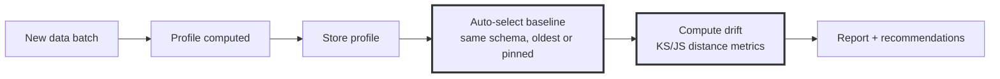

 # DataSummarizer

**Fast, local, deterministic data profiling with DuckDB + optional LLM narration.**

**LLM reasons over profiles; DuckDB computes.**

A .NET 10 CLI that turns any CSV/Excel/Parquet/JSON into a reproducible statistical profile. Built for **speed** (out-of-core analytics), **determinism** (computed facts, not guessed), and **privacy** (everything runs locally).

[](https://github.com/scottgal/mostlylucidweb/tree/main/Mostlylucid.DataSummarizer)
[](https://dotnet.microsoft.com/)
[](https://github.com/scottgal/mostlylucidweb/tree/main/Mostlylucid.DataSummarizer)
[](https://github.com/scottgal/mostlylucidweb/tree/main/Mostlylucid.DataSummarizer#privacy-safe-pii-handling)
[](https://github.com/scottgal/mostlylucidweb/tree/main/Mostlylucid.DataSummarizer#onnx-integration)

---

## Table of Contents

- [Quick Start](#quick-start)
- [Installation](#installation)
- [Core Concepts](#core-concepts)
- [Unified Pipeline Integration](#unified-pipeline-integration)
- [Commands Reference](#commands-reference)
- [Profile Store Management](#profile-store-management)
- [Automatic Drift Detection](#automatic-drift-detection)
- [Constraint Validation](#constraint-validation)
- [Segment Comparison](#segment-comparison)
- [Multi-File Registry](#multi-file-registry)
- [Plain English Q&A](#plain-english-qa)
- [Target-Aware Profiling](#target-aware-profiling)
- [Performance Options](#performance-options)
- [Trust Model](#trust-model)
- [LLM Integration (Latest)](#llm-integration-latest)
- [Output Formats](#output-formats)
- [CI/CD Integration](#cicd-integration)
- [Examples](#examples)

---

## Quick Start

```bash
# 1. Fastest deterministic profile (no LLM, pure stats)
datasummarizer -f data.csv --no-llm --fast

# 2. Q&A mode (LLM-powered insights)
datasummarizer -f data.csv --query "what drives churn?" --model qwen2.5-coder:7b

# 3. Production drift tracking (cron/pipeline)
datasummarizer tool -f /data/daily_export.csv --auto-drift --store
```

**305 tests passing** | See [Commands Reference](#commands-reference) for full options

**Sample output** (10,000 rows × 13 columns in ~1 second):

```
── Summary ─────────────────────────────────────────────────────────
10,000 rows × 13 columns (5 numeric, 6 categorical, 2 ID)

── Top Alerts ──────────────────────────────────────────────────────
⚠ EstimatedSalary: 100% unique (10,000 values) - possible leakage
ℹ Age: 359 outliers (3.6%) outside IQR bounds
ℹ NumOfProducts: Ordinal detected (4 levels) - consider ordered encoding

── Insights ────────────────────────────────────────────────────────
🎯 Exited Analysis (score 0.95)
   Target rate: 20.4%. Top drivers: NumOfProducts (Δ79.6%), Age (Δ7.4)

💡 Modeling Recommendations (score 0.70)
   ⚠ Exclude ID columns: CustomerId
   ℹ Good candidate for logistic regression or gradient boosting
```

---

## Installation

### Download Release (Recommended)

1. Go to [GitHub Releases](https://github.com/scottgal/mostlylucidweb/releases)
2. Download the latest `datasummarizer` release for your platform:
   - **Windows**: `datasummarizer-win-x64.zip`
   - **Linux**: `datasummarizer-linux-x64.tar.gz`
   - **macOS**: `datasummarizer-osx-x64.tar.gz`
3. Extract the archive
4. Run the tool:

```bash
# Windows
datasummarizer.exe -f data.csv --no-llm --fast

# Linux/macOS
./datasummarizer -f data.csv --no-llm --fast
```

### Build from Source (Alternative)

```bash
# Clone the repository
git clone https://github.com/scottgal/mostlylucidweb.git
cd mostlylucidweb/Mostlylucid.DataSummarizer

# Build Release
dotnet build -c Release

# Run it
./bin/Release/net10.0/datasummarizer -f data.csv --no-llm --fast
```

### Add to PATH (Optional)

```bash
# Linux/macOS
export PATH="$PATH:/full/path/to/Mostlylucid.DataSummarizer/bin/Release/net10.0"

# Windows (PowerShell - add to profile)
$env:PATH += ";C:\full\path\to\Mostlylucid.DataSummarizer\bin\Release\net10.0"
```

Then you can run `datasummarizer` from anywhere.

### Requirements

- **Release binaries**: Self-contained/portable, no runtime install needed
- **Build from source**: .NET 10 SDK (current)
- **Embedded**: DuckDB (via `DuckDB.NET.Data.Full` - no separate install needed)
- **Optional**: Ollama for LLM features (default model: `qwen2.5-coder:7b`)
- **Optional**: DuckDB `vss` extension (auto-fallback if missing)

### Supported Formats

| Format | Extensions | Notes |
|--------|------------|-------|
| **CSV/TSV** | `.csv`, `.tsv` | Auto-detected delimiter, header inference |
| **Excel** | `.xlsx`, `.xls` | Multi-sheet support (`--sheet` option) |
| **Parquet** | `.parquet` | Column-oriented, best for large files |
| **JSON** | `.json`, `.ndjson`, `.jsonl` | Line-delimited and nested |
| **SQLite** | `.sqlite`, `.db`, `.sqlite3` | All tables profiled |
| **Log Files** | `.log` | Apache/IIS logs (see below) |

#### Log File Support

DataSummarizer can profile web server logs by converting them to structured Parquet on-the-fly:

```bash
# Apache error log
datasummarizer -f /var/log/apache2/error.log --no-llm --fast

# Apache access/combined log
datasummarizer -f /var/log/apache2/access.log --no-llm --fast

# IIS W3C log
datasummarizer -f C:\inetpub\logs\LogFiles\W3SVC1\u_ex240101.log --no-llm --fast
```

**Supported log formats:**

| Format | Detection | Extracted Columns |
|--------|-----------|-------------------|
| **Apache Error** | `[date] [level]` pattern | `timestamp`, `level`, `client_ip`, `message` |
| **Apache Access/Combined** | IP + quoted request + status | `client_ip`, `timestamp`, `method`, `url`, `status`, `bytes`, `referer`, `user_agent` |
| **IIS W3C** | `#Fields:` directive | All fields from header (date, time, cs-uri-stem, sc-status, etc.) |

**Example output (Apache error log):**

```
── Summary ─────────────────────────────────────────────────────────
52,004 rows × 5 columns

│ Column        │ Type        │ Nulls │ Unique │ Stats                   │
├───────────────┼─────────────┼───────┼────────┼─────────────────────────┤
│ timestamp     │ DateTime    │ 0.0%  │ 17,514 │ 2005-06-09 → 2006-02-28 │
│ level         │ Categorical │ 0.0%  │ 3      │ top: error              │
│ client_ip     │ Text        │ 0.0%  │ 4,134  │ -                       │
│ message       │ Text        │ 0.0%  │ 9,663  │ -                       │

        level                                               
 error  ██████████████████████████████████████████████ 38081
notice  ████████████ 13755
  warn  168
```

---

## Core Concepts

### What is a Profile?

A **profile** is a deterministic statistical snapshot of your data:

| Category | Metrics |
|----------|---------|
| **Schema** | Row count, column count, inferred types (Numeric/Categorical/DateTime/Text/Id/Boolean) |
| **Data Quality** | Null %, unique %, constants, zero counts, outliers (IQR) |
| **Numeric Stats** | Min/max, mean/median, stddev, quantiles [Q25, Q50, Q75], skewness, kurtosis, MAD, CV, outlier count |
| **Categorical Stats** | Unique count, top values, mode, imbalance ratio, entropy, cardinality |
| **Relationships** | Pearson correlations (limited pairs), FK overlap hints, monotonic hints |
| **Patterns** | Text formats (email/URL/UUID/phone/novel), distribution labels (normal/skewed/uniform/bimodal), trends, time-series gaps, seasonality |
| **Alerts** | Leakage warnings, high nulls, extreme skew, ordinal hints, ID column detection |

**Why it matters**: A profile is *computed facts*, not LLM guesses. You can version it, diff it, and use it for data contracts.

**Profile schema (minimal):**
```json
{
  "RowCount": 10000,
  "ColumnCount": 13,
  "Columns": [
    {
      "Name": "Age",
      "InferredType": "Numeric",
      "NullPercent": 0.0,
      "UniquePercent": 8.2,
      "Mean": 38.9,
      "StdDev": 10.5
    }
  ],
  "Alerts": [
    {
      "Severity": "Warning",
      "Type": "Leakage",
      "Column": "CustomerId",
      "Message": "100% unique - possible identifier"
    }
  ]
}
```

### Fingerprint vs Signature (Drift Detection)

- **Fingerprint** (stable): Schema hash - column names + types. Survives new batches.
- **Signature** (changes): Per-column statistical properties. Detects drift.

When you profile data:
1. Fingerprint identifies the dataset family (same schema)
2. Signature detects distribution drift within that family
3. Distance metrics (KS/JS) quantify how much drift occurred

### Registry vs Store

**When to use which:**

- **Store** = drift + baselines + governance (production monitoring, CI/CD, data contracts)
- **Registry** = discovery + search + conversations (exploring many datasets, Q&A across data catalog)

**Storage:**
- **Registry** (`--vector-db`): Profiles + embeddings + conversation history (similarity index for semantic search)
- **Store** (`--store-path`): Profiles + metadata + baseline pins (optimized for drift tracking)

Both are DuckDB files. The Registry includes a vector similarity index for cross-dataset search.

### Two Layers of Memory

DataSummarizer remembers datasets and questions separately:

**1) Dataset Memory (Profile + Signature)**
- **Schema fingerprint** (stable): Column names + types hash → identifies the dataset family
- **Statistical signature** (changes): Per-column distributions → detects drift
- **Use cases**: Drift detection, baselines, cohort comparison, "what changed since last run"

**2) Question Memory (Question → SQL → Results)**
- **SQL is the durable artifact**: Stored query templates bound to schema fingerprint
- **Result summary** (optional): Cached for UX, but SQL is rerunnable
- **Binding key**: Schema fingerprint + query template + parameters

**Smart reuse:**
- **Exact match** (content hash) → reuse cached answer safely
- **Same schema, new data** → rerun SQL, detect answer drift
  - "Top product changed from X to Y"
  - "Conversion rate dropped 3.2pp"
  - "Null% doubled in column Z, KPI Q now unreliable"

**Cached queries include:**
- Profile ID/hash used at time of query
- Drift score at time of answer
- Whether results were sampled/limited

This enables: "Recomputed answer on 2025-12-20; drift vs baseline: 0.31 (significant)"

See [Plain English Q&A](#plain-english-qa) for query memory in action.

---

## Unified Pipeline Integration

DataSummarizer integrates with the LucidRAG unified pipeline architecture via `Mostlylucid.Summarizer.Core`:

```csharp
using Mostlylucid.Summarizer.Core.Pipeline;

// DataPipeline implements IPipeline
public class DataPipeline : PipelineBase
{
    public override string PipelineId => "data";
    public override string Name => "Data Pipeline";
    public override IReadOnlySet<string> SupportedExtensions =>
        new[] { ".csv", ".tsv", ".xlsx", ".xls", ".parquet", ".json", ".ndjson", ".jsonl" };
}
```

### Benefits

- **Auto-routing by extension**: Use `IPipelineRegistry.FindForFile()` for automatic pipeline selection
- **Standardized output**: Returns `ContentChunk` objects compatible with all LucidRAG pipelines
- **Unified hashing**: Uses XxHash64 via `ContentHasher` for fast, consistent content hashing
- **Cross-modal processing**: Works seamlessly alongside DocumentPipeline and ImagePipeline

### Service Registration

```csharp
using Mostlylucid.DocSummarizer.Data.Extensions;

services.AddDataSummarizer(opt =>
{
    // Configuration options
});

// Registers DataPipeline as IPipeline for unified pipeline registry
```

### XxHash64 Content Hashing

All content hashing uses the unified `ContentHasher` utility with XxHash64:

```csharp
using Mostlylucid.Summarizer.Core.Utilities;

var hash = ContentHasher.ComputeHash(content);      // String
var hash = ContentHasher.ComputeHash(stream);       // Stream
var hash = ContentHasher.ComputeHash(bytes);        // Byte array
var guid = ContentHasher.ComputeGuid(content);      // Stable GUID
```

**Benefits:**
- **Fast**: XxHash64 is 5-10× faster than SHA256
- **Consistent**: Same hash algorithm across all LucidRAG components
- **Deterministic**: Stable hashes for deduplication and caching

---

## Privacy-Safe PII Handling

**DataSummarizer hides PII by default** to prevent accidental exposure in console output, screenshots, or CI logs.

### Automatic PII Detection

Uses **ONNX-powered ensemble detection** (regex + machine learning) to identify:

| PII Type | Example | Default Display |
|----------|---------|-----------------|
| **SSN** | `123-45-6789` | `***-**-6789` |
| **Email** | `john@example.com` | `jo***@***.com` |
| **Phone** | `555-123-4567` | `***-***-4567` |
| **Credit Card** | `4111-1111-1111-1111` | `**** **** **** 1111` |
| **Names** | `John Doe` | `<NAME> Jo****oe` |
| **Addresses** | `123 Main St` | `<ADDR> 12*******St` |

### Redaction Examples

```bash
# Default: PII hidden (privacy-safe)
datasummarizer -f patients.csv --no-llm

# Output shows redacted values:
│ Email │ Categorical │ top: jo***@***.com              │
│ Phone │ Categorical │ top: ***-***-4567               │
│ SSN   │ Categorical │ top: ***-**-6789                │
```

### Show PII (Explicit Opt-In)

```bash
# WARNING: Shows actual PII values
datasummarizer -f data.csv --show-pii

# Show only specific types
datasummarizer -f data.csv --show-pii-type email,phone

# Hide type labels like <EMAIL>, <PHONE>
datasummarizer -f data.csv --hide-pii-labels
```

### Configuration

Control PII display via `appsettings.json`:

```json
{
  "DataSummarizer": {
    "PiiDisplay": {
      "ShowPiiValues": false,
      "ShowPiiTypeLabel": true,
      "RedactionChar": "*",
      "VisibleChars": 2,
      "TypeSettings": {
        "ShowEmail": false,
        "ShowPhone": false,
        "ShowSsn": false,
        "ShowCreditCard": false,
        "ShowPersonName": false,
        "ShowAddress": false
      }
    }
  }
}
```

### Privacy Guarantees

| Concern | Default Policy |
|---------|---------------|
| **Console output** | PII redacted (hidden by default) |
| **LLM context** | Profile-only (no row values) unless SQL-mode enabled |

✅ **Screenshot-safe** - Share profiling results without exposing PII  
✅ **CI/CD-safe** - Run in build pipelines without leaking sensitive data  
✅ **Demo-safe** - Show profiling capabilities on production-like data  
✅ **Compliance-friendly** - GDPR/HIPAA-aware output redaction  

**Note:** PII detection runs locally using ONNX models. No data leaves your machine.

---

## Commands Reference

### Default Command (Human-Friendly Report)

```bash
datasummarizer -f <file> [options]
```

**Options:**
- `-f, --file <path>`: CSV/Excel/Parquet/JSON file
- `-s, --sheet <name>`: Excel sheet name
- `-m, --model <ollama-model>`: Ollama model (default: `qwen2.5-coder:7b`)
- `--no-llm`: Skip LLM features (fastest, deterministic only)
- `--target <column>`: Target column for supervised analysis
- `--query, -q <text>`: Ask a question about the data
- `--interactive, -i`: Interactive Q&A mode
- `-v, --verbose`: Verbose logging
- `-o, --output <path>`: Save output to file

**Example:**
```bash
# Pretty report with LLM insights
datasummarizer -f sales.csv --model qwen2.5-coder:7b

# Stats only (no LLM, fastest)
datasummarizer -f sales.csv --no-llm --fast

# Ask a question
datasummarizer -f sales.csv --query "top selling products" --model qwen2.5-coder:7b
```

---

### `profile` - Save Profile as JSON

Profile files and output machine-readable JSON.

```bash
datasummarizer profile -f <file> [--output <path>] [options]
```

**Options:**
- `--output, -o <path>`: Output file (default: `<filename>.profile.json`)
- `--no-llm`: Skip LLM features
- `--model <model>`: Ollama model
- `--verbose`: Verbose logging

**Example:**
```bash
# Profile single file
datasummarizer profile -f Bank_Churn.csv --output bank.profile.json --no-llm

# Profile with LLM insights
datasummarizer profile -f Bank_Churn.csv --model qwen2.5-coder:7b
```

**Output:** JSON profile containing all stats, alerts, patterns, and insights.

---

### `synth` - Generate Synthetic Data

Generate synthetic data that matches a profile's statistical properties.

**What "statistically identical" means:** Matches per-column marginals (quantiles/top-k) and null/uniqueness rates. Does not preserve joint correlations unless explicitly enabled via conditional tables.

```bash
datasummarizer synth --profile <profile.json> --synthesize-to <output.csv> [--synthesize-rows N]
```

**Options:**
- `--profile <path>`: Input profile JSON (required)
- `--synthesize-to <path>`: Output CSV path (required)
- `--synthesize-rows <N>`: Number of rows to generate (default: 1000)
- `--verbose`: Verbose logging

**Example:**
```bash
# Generate 1000 synthetic rows
datasummarizer synth --profile bank.profile.json --synthesize-to synthetic.csv --synthesize-rows 1000

# Generate 10,000 rows
datasummarizer synth --profile bank.profile.json --synthesize-to synthetic_10k.csv --synthesize-rows 10000
```

**Use cases:**
- Testing data pipelines without real data
- Privacy-safe data sharing (no real PII)
- Synthetic training data generation

---

### `validate` - Compare Datasets or Validate Constraints

Compare two datasets statistically or validate against a constraint suite.

```bash
datasummarizer validate --source <file> --target <file> [options]
```

**Options:**
- `--source <path>`: Source/reference dataset (required)
- `--target <path>`: Target dataset to validate (required)
- `--constraints <path>`: Constraint suite JSON file
- `--generate-constraints`: Auto-generate constraints from source
- `--strict`: Exit with error code if constraints fail
- `--format <json|markdown|html>`: Output format (default: json)
- `--output, -o <path>`: Save output to file
- `--no-llm`: Skip LLM features
- `--model <model>`: Ollama model for LLM-based insights

**Example:**
```bash
# Basic drift comparison (statistical differences)
datasummarizer validate --source prod.csv --target new_batch.csv --no-llm

# Generate constraint suite from reference data
datasummarizer validate --source prod.csv --target prod.csv --generate-constraints --output prod-constraints.json --no-llm

# Validate against constraints (markdown report)
datasummarizer validate --source prod.csv --target new_batch.csv --constraints prod-constraints.json --format markdown

# Strict mode for CI/CD (exit code 1 on failure)
datasummarizer validate --source prod.csv --target new_batch.csv --constraints prod-constraints.json --strict
```

**Constraint types:**
- Row count range
- Column count exact
- Columns exist
- Column types
- Not null
- Value range (with tolerance)
- Values in set
- Uniqueness

See [Constraint Validation](#constraint-validation) for details.

---

### `segment` - Compare Two Segments

Compare two datasets or stored profiles to understand distributional differences.

```bash
datasummarizer segment --segment-a <path-or-id> --segment-b <path-or-id> [options]
```

**Options:**
- `--segment-a <path>`: First dataset (file path or profile ID) (required)
- `--segment-b <path>`: Second dataset (file path or profile ID) (required)
- `--name-a <name>`: Display name for segment A
- `--name-b <name>`: Display name for segment B
- `--format <json|markdown|html>`: Output format (default: json)
- `--output, -o <path>`: Save output to file
- `--store-path <path>`: Profile store path (if using profile IDs)

**Example:**
```bash
# Compare two files
datasummarizer segment --segment-a prod.csv --segment-b synthetic.csv --format markdown

# Compare with custom names
datasummarizer segment --segment-a q1.csv --segment-b q2.csv --name-a "Q1 2024" --name-b "Q2 2024"

# Compare stored profiles by ID
datasummarizer segment --segment-a a3f9e2c1b8d4 --segment-b 7c2e5f8a1b3d --store-path profiles.duckdb

# Save comparison report
datasummarizer segment --segment-a prod.csv --segment-b staging.csv --output comparison.md --format markdown
```

**Output includes:**
- Similarity score (0-1)
- Anomaly scores for each segment
- Column-by-column comparison (mean deltas, mode shifts, distribution distances)
- Auto-generated insights

See [Segment Comparison](#segment-comparison) for details.

---

### `tool` - JSON Output for Agents/Pipelines

Compact JSON output optimized for LLM tools, MCP servers, and data pipelines.

```bash
datasummarizer tool -f <file> [options]
```

**Options:**
- `-f, --file <path>`: Data file (required)
- `-s, --sheet <name>`: Excel sheet name
- `--target <column>`: Target column for supervised analysis
- `--columns <col1,col2,...>`: Only analyze specific columns
- `--exclude-columns <col1,col2,...>`: Exclude columns
- `--max-columns <N>`: Limit to N most interesting columns (default: 50, 0=unlimited)
- `--fast`: Skip expensive pattern detection
- `--skip-correlations`: Skip correlation matrix
- `--ignore-errors`: Ignore CSV parsing errors
- `--cache`: Use cached profile if file unchanged (xxHash64 check)
- `--store`: Store profile for drift tracking
- `--compare-to <profile-id>`: Compare against specific profile
- `--auto-drift`: Auto-detect baseline and show drift
- `--quick, -q`: Quick mode (basic stats only, fastest)
- `--compact`: Omit null fields and empty arrays
- `--store-path <path>`: Custom profile store directory
- `--format <json|markdown|html>`: Output format (default: json)

**Example:**
```bash
# Basic tool output (JSON)
datasummarizer tool -f data.csv --no-llm

# With drift detection
datasummarizer tool -f data.csv --auto-drift --store --no-llm

# Fast mode for quick checks
datasummarizer tool -f data.csv --fast --skip-correlations --compact --no-llm

# Target-aware analysis
datasummarizer tool -f data.csv --target Exited --no-llm
```

**Output structure:**
```json
{
  "Success": true,
  "Error": null,
  "Source": "data.csv",
  "Profile": {
    "RowCount": 10000,
    "ColumnCount": 13,
    "ExecutiveSummary": "...",
    "Columns": [...],
    "Alerts": [...],
    "Insights": [...],
    "Correlations": [...],
    "TargetAnalysis": {...}
  },
  "Drift": {
    "BaselineProfileId": "...",
    "DriftScore": 0.18,
    "HasSignificantDrift": false,
    "Summary": "..."
  },
  "Metadata": {
    "ProfileId": "a3f9e2c1b8d4",
    "ProcessingSeconds": 1.23,
    "ColumnsAnalyzed": 13,
    "RowsAnalyzed": 10000
  }
}
```

---

### `store` - Manage Profile Store

Interactive profile store management (list, view, delete, compare, pin, tag).

```bash
datasummarizer store [subcommand] [options]
```

**Subcommands:**
- `list`: List all stored profiles
- `clear`: Clear all stored profiles
- `prune`: Remove old profiles (keep N most recent per schema)
- `stats`: Show store statistics
- *(no subcommand)*: Interactive management menu

**Options:**
- `--store-path <path>`: Custom profile store directory
- `--id <profile-id>`: Profile ID to delete (for default command)
- `--keep, -k <N>`: Number of profiles to keep per schema (for `prune`, default: 5)

**Example:**
```bash
# Interactive menu (requires interactive terminal)
datasummarizer store

# List all profiles
datasummarizer store list

# Show store statistics
datasummarizer store stats

# Prune old profiles (keep 5 most recent per schema)
datasummarizer store prune --keep 5

# Clear all profiles (with confirmation)
datasummarizer store clear

# Delete specific profile
datasummarizer store --id a3f9e2c1b8d4

# Use custom store location
datasummarizer store list --store-path /path/to/profiles.duckdb
```

**Interactive menu features:**
- 📋 List all profiles (with flags: 📌 pinned, 🚫 excluded, 🏷️ tagged)
- 🔍 View detailed profile metadata
- ⚖️ Compare two profiles interactively
- 🗑️ Delete profile
- 📌 Pin as baseline (only one per schema)
- 🚫 Exclude from baseline selection
- 🏷️ Add tags and notes
- 🧹 Prune old profiles (respects pinned baselines)
- 📊 Show store statistics

See [Profile Store Management](#profile-store-management) for details.

---

## Profile Store Management

The **profile store** persists profiles for drift tracking, comparison, and metadata management.

### Store Location

Default: `~/.local/share/DataSummarizer/profiles/` (Linux/macOS) or `%LocalAppData%\DataSummarizer\profiles\` (Windows)

Custom: Use `--store-path <path>` on any command.

### Profile Metadata

Each stored profile includes:

| Field | Description |
|-------|-------------|
| **Id** | 12-character unique identifier |
| **SourcePath** | Original file path |
| **FileName** | File name |
| **StoredAt** | Timestamp (UTC) |
| **RowCount** | Number of rows profiled |
| **ColumnCount** | Number of columns |
| **ContentHash** | xxHash64 of file content (for exact match detection) |
| **FileSize** | File size in bytes |
| **SchemaHash** | Hash of column names + types (for schema matching) |
| **StatisticalSignature** | Per-column stats for drift detection |
| **ProfileTime** | Time taken to profile |
| **IsPinnedBaseline** | Pinned as baseline (only one per schema) |
| **ExcludeFromBaseline** | Excluded from auto-baseline selection |
| **Tags** | Comma-separated tags (e.g., "production,validated,Q4-2024") |
| **Notes** | User notes (e.g., "Known data quality issue") |

### Interactive Management

```bash
datasummarizer store
```

**Menu options:**

1. **List all profiles**: Shows all profiles with visual flags
   - 📌 = Pinned baseline
   - 🚫 = Excluded from baseline selection
   - 🏷️ = Has tags

2. **View profile details**: Shows full metadata + statistics

3. **Compare two profiles**: Interactive selection with drift visualization
   - Drift score
   - Per-column distances (KS/JS)
   - Schema changes
   - Recommendations

4. **Delete profile**: Remove profile from store

5. **Pin as baseline**: Mark profile as baseline for drift comparison
   - Only one profile per schema can be pinned
   - Auto-unpins other baselines with same schema

6. **Exclude from baseline**: Skip profile in auto-baseline selection
   - Useful for known-bad batches or outliers

7. **Add tags/notes**: Categorize and annotate profiles
   - Tags: `production`, `staging`, `Q1-2024`, `validated`
   - Notes: Free-form text for context

8. **Prune old profiles**: Keep N most recent per schema
   - Respects pinned baselines (never pruned)
   - Default: keep 5 per schema

9. **Show statistics**: Store-wide metrics
   - Total profiles
   - Unique schemas
   - Total rows profiled
   - Total disk usage (MB)
   - Oldest/newest profile timestamps

### Programmatic Access

```bash
# Store profile during profiling
datasummarizer tool -f data.csv --store --no-llm

# List profiles
datasummarizer store list

# Delete by ID
datasummarizer store --id a3f9e2c1b8d4

# Prune old profiles
datasummarizer store prune --keep 10

# Clear all
datasummarizer store clear
```

---

## Automatic Drift Detection

**The killer feature:** DataSummarizer automatically detects drift without manual baseline management.

### How It Works



Every profile gets a **statistical signature**:

- **Fingerprint** (stable): Schema hash (column names + types). Survives new batches.
- **Signature** (changes): Per-column stats (mean/median/stddev/quantiles for numeric; top-K distribution/entropy for categorical). Detects drift.

**Baseline selection logic:**
1. Find all profiles with matching schema (same fingerprint)
2. If any profile is pinned (`IsPinnedBaseline=true`), use it
3. Otherwise, use oldest profile with matching schema
4. Exclude profiles marked `ExcludeFromBaseline=true`

### Distance Metrics

**Numeric columns**: Approximate Kolmogorov-Smirnov
- Uses quantiles [Q25, Q50, Q75] instead of raw data
- IQR-normalized to prevent scale sensitivity
- Range: [0, 1], threshold: 0.1

**Categorical columns**: Jensen-Shannon Divergence
- Symmetric [0, 1] metric (no baseline vs target asymmetry)
- Handles missing categories gracefully (fills with zeros)
- Uses top-K value distributions
- Range: [0, 1], threshold: 0.1

**Overall drift score**: Weighted rollup
- Averages column-level distances
- Excludes ID columns automatically
- Range: [0, 1]
- Thresholds:
  - < 0.2: No significant drift
  - 0.2-0.3: Moderate drift
  - > 0.3: Significant drift (triggers constraint suggestions)

### Cron Job Pattern

```bash
# Daily cron job (no human intervention)
0 2 * * * datasummarizer tool -f /data/daily_export.csv --auto-drift --store > /logs/drift-$(date +\%Y\%m\%d).json
```

**What happens:**
1. Profile computed (row/column stats, alerts, patterns)
2. Content hash checked (skip if file unchanged)
3. Baseline auto-selected (oldest with same schema, or pinned)
4. Drift calculated (KS for numeric, JS for categorical)
5. Report emitted (JSON with drift score, column deltas, recommendations)
6. Profile stored for future comparisons

**If drift > 0.3:**
- Auto-generates `constraints.suggested.json`
- User reviews before enforcement (not automatic)

---

## Constraint Validation

Define **data contracts** that capture expected schema and statistical properties.

### Generate Constraints

```bash
# Auto-generate from reference data
datasummarizer validate --source prod.csv --target prod.csv \
  --generate-constraints --output prod-constraints.json --no-llm
```

**Generated constraints** (example from 10k row dataset):

```json
{
  "Name": "Auto-generated from prod.csv",
  "Description": "Generated at 2025-12-20 from profile with 10,000 rows",
  "Constraints": [
    {
      "Type": "RowCount",
      "Description": "Row count should be between 5,000 and 20,000",
      "MinValue": 5000,
      "MaxValue": 20000
    },
    {
      "Type": "ColumnCount",
      "Description": "Column count should be 13",
      "ExpectedValue": 13
    },
    {
      "Type": "ColumnsExist",
      "Description": "All expected columns should exist",
      "ExpectedColumns": ["CustomerId", "CreditScore", "Geography", "Age", ...]
    },
    {
      "Type": "NotNull",
      "ColumnName": "Age",
      "Description": "Column 'Age' should not have null values"
    },
    {
      "Type": "ColumnType",
      "ColumnName": "CreditScore",
      "Description": "Column 'CreditScore' should be of type Numeric",
      "ExpectedType": "Numeric"
    },
    {
      "Type": "ValueRange",
      "ColumnName": "CreditScore",
      "Description": "Column 'CreditScore' should be in range [350, 850] ±10%",
      "MinValue": 315,
      "MaxValue": 935
    },
    {
      "Type": "ValuesInSet",
      "ColumnName": "Geography",
      "Description": "Column 'Geography' values should be in the known set",
      "AllowedValues": ["France", "Germany", "Spain"]
    },
    {
      "Type": "Uniqueness",
      "ColumnName": "EstimatedSalary",
      "Description": "Column 'EstimatedSalary' should be 100% unique",
      "MinValue": 1.0
    }
  ]
}
```

**Important:** Auto-generated constraints are **advisory** - review before enforcing in CI. Constraints like "100% uniqueness" may be too strict for production data.

### Validate Against Constraints

```bash
# JSON output
datasummarizer validate --source prod.csv --target new_batch.csv \
  --constraints prod-constraints.json --no-llm

# Markdown report
datasummarizer validate --source prod.csv --target new_batch.csv \
  --constraints prod-constraints.json --format markdown

# Strict mode (exit code 1 on failure)
datasummarizer validate --source prod.csv --target new_batch.csv \
  --constraints prod-constraints.json --strict
```

**Markdown output example:**

```
── Constraint Validation: Auto-generated from prod.csv ─────────────
Pass Rate: 87.8% (36/41)

## Failed Constraints

- Row count should be between 5,000 and 20,000
  Actual: 100 rows

- Column 'NumOfProducts' should be of type Categorical
  Actual: Numeric

- Column 'HasCrCard' should be of type Categorical
  Actual: Numeric

- Column 'CreditScore' should be in range [350, 850] ±10%
  Actual: Min=200, Max=900 (outside bounds)

- Column 'Geography' values should be in the known set
  Found unknown values: Italy, UK
```

### Constraint Types

| Type | Description | Parameters |
|------|-------------|-----------|
| **RowCount** | Row count range | MinValue, MaxValue |
| **ColumnCount** | Exact column count | ExpectedValue |
| **ColumnsExist** | Expected columns present | ExpectedColumns |
| **NotNull** | Column has no nulls | ColumnName |
| **ColumnType** | Column type matches | ColumnName, ExpectedType |
| **ValueRange** | Numeric values in range (with tolerance) | ColumnName, MinValue, MaxValue |
| **ValuesInSet** | Categorical values in allowed set | ColumnName, AllowedValues |
| **Uniqueness** | Column uniqueness % | ColumnName, MinValue (0.0-1.0) |

### Use Cases

| Use Case | Command |
|----------|---------|
| **Synthetic data validation** | Compare generated vs source distribution |
| **Data pipeline testing** | Ensure transformed data matches expected schema |
| **Drift monitoring** | Track when new data violates expected bounds |
| **CI/CD integration** | Use `--strict` to fail builds on violations |
| **Data migration** | Verify old system vs new system data |

---

## Segment Comparison

Compare two datasets or cohorts to understand distributional differences.

### Basic Comparison

```bash
# Compare two files
datasummarizer segment --segment-a prod.csv --segment-b synthetic.csv --format markdown

# Compare with custom names
datasummarizer segment --segment-a q1.csv --segment-b q2.csv \
  --name-a "Q1 2024" --name-b "Q2 2024"

# Save to file
datasummarizer segment --segment-a prod.csv --segment-b staging.csv \
  --output comparison.md --format markdown
```

### Output Structure

```
── Segment Comparison ──────────────────────────────────────────────
Segment A: prod.csv (10,000 rows × 13 columns)
Segment B: synthetic.csv (100 rows × 13 columns)

Similarity: 94.6% (highly similar)
Anomaly Scores: A=0.086 (Excellent), B=0.250 (Fair)

Insights:
  - Segments are highly similar (>90% match)
  - Segment sizes differ by -99.0% (10,000 vs 100 rows)

Top Differences:
╭─────────────┬─────────┬──────────┬──────────┬──────────┬──────────╮
│ Column      │ Type    │ Distance │ A        │ B        │ Delta    │
├─────────────┼─────────┼──────────┼──────────┼──────────┼──────────┤
│ Age         │ Numeric │ 0.166    │ 38.92    │ 38.61    │ -0.3     │
│ Surname     │ Text    │ 0.154    │ -        │ -        │ -        │
│ CreditScore │ Numeric │ 0.115    │ 650.53   │ 641.84   │ -8.7     │
│ Tenure      │ Numeric │ 0.096    │ 5.01     │ 5.03     │ +0.0     │
│ Balance     │ Numeric │ 0.084    │ 76485.89 │ 86920.91 │ +10435.0 │
╰─────────────┴─────────┴──────────┴──────────┴──────────┴──────────╯
```

### Metrics Explained

| Metric | Description | Range | Interpretation |
|--------|-------------|-------|----------------|
| **Similarity** | Overall distributional similarity | 0-1 | >0.9 = highly similar, <0.5 = substantially different |
| **Anomaly Score** | Data quality/outlier measure | 0-1 | <0.1 = excellent, 0.1-0.2 = good, >0.3 = concerning |
| **Distance** | Per-column distribution distance | 0-1 | <0.1 = minimal drift, >0.2 = notable difference |

### Use Cases

| Use Case | Example |
|----------|---------|
| **Synthetic validation** | Compare generated data vs source |
| **Cohort analysis** | Compare customer segments, treatment vs control |
| **Temporal drift** | Track data evolution over time (Q1 vs Q2) |
| **A/B testing** | Compare metrics across variants |
| **Data migration** | Verify old system vs new system |

### Compare Stored Profiles

```bash
# Store profiles first
datasummarizer profile -f prod.csv --store-path profiles.duckdb
datasummarizer profile -f staging.csv --store-path profiles.duckdb

# List stored profiles to get IDs
datasummarizer store list --store-path profiles.duckdb

# Compare by ID
datasummarizer segment --segment-a <prod-id> --segment-b <staging-id> \
  --store-path profiles.duckdb --format markdown
```

---

## Multi-File Registry

Ingest and query across many datasets using a local similarity index.

### Ingest Files

```bash
# Ingest directory (recursive)
datasummarizer --ingest-dir sampledata/ --no-llm --vector-db registry.duckdb

# Ingest specific files/patterns
datasummarizer --ingest-files \
  "sampledata/Bank*.csv" \
  "sampledata/CO2*.csv" \
  --no-llm --vector-db registry.duckdb

# Ingest with LLM insights (slower but richer)
datasummarizer --ingest-dir sampledata/ --model qwen2.5-coder:7b --vector-db registry.duckdb
```

**What's stored:**
- Computed profile JSON
- Derived text embeddings (hash-based, 128d)
- Conversation turns (for session-aware Q&A)
- **Not stored**: Full tables (profiling reads original files in place)

### Query Registry

```bash
# Ask across ingested data
datasummarizer --registry-query "Which datasets have a churn target?" \
  --vector-db registry.duckdb --no-llm

# With LLM summarization
datasummarizer --registry-query "Key trends in emissions data?" \
  --vector-db registry.duckdb --model qwen2.5-coder:7b
```

### Registry vs Store

| Feature | Registry (`--vector-db`) | Store (`--store-path`) |
|---------|-------------------------|----------------------|
| **Purpose** | Cross-dataset search & Q&A | Profile persistence & drift tracking |
| **Contents** | Profiles + embeddings + conversations | Profiles + metadata + baseline pins |
| **Index** | Similarity index (VSS or in-process) | Schema hash + content hash |
| **Use case** | "Which dataset has X?" | "Has this data drifted since last week?" |

**Implementation note:** If DuckDB `vss` extension is available, registry uses it. Otherwise falls back to in-process cosine distance over hash-based embeddings.

---

## Plain English Q&A

Ask questions about your data using natural language.

### Two Modes

**1. Profile-only answers** (no SQL):
- For broad questions like "tell me about this data"
- LLM sees the computed profile and writes a narrative
- No row-level data exposure to LLM

**2. SQL-backed answers** (executes SQL locally):
- For specific questions like "top 5 products"
- LLM generates DuckDB SQL using profiled schema
- DuckDB executes SQL locally
- LLM summarizes up to 20 rows of results

### Single Question

```bash
# Profile-grounded overview
datasummarizer -f sales.csv --query "tell me about this data" --model qwen2.5-coder:7b

# Specific question (generates SQL)
datasummarizer -f sales.csv --query "top selling products" --model qwen2.5-coder:7b

# Statistical question
datasummarizer -f sales.csv --query "average order value by region" --model qwen2.5-coder:7b
```

---

### Interactive Mode

```bash
datasummarizer -f sales.csv --interactive --model qwen2.5-coder:7b
```

**Benefits:**
- Profile computed once, reused for all questions
- Faster follow-up questions (no re-profiling)
- Session context maintained across questions
- Type `exit` or `quit` to end session

### Session-Aware Q&A

```bash
# First question (creates session)
datasummarizer -f sales.csv --query "top products" --session-id sales-analysis --model qwen2.5-coder:7b

# Follow-up question (uses session context)
datasummarizer -f sales.csv --query "show their revenue" --session-id sales-analysis --model qwen2.5-coder:7b
```

**How it works:**
- Turns stored in Registry (`registry_conversations`)
- Retrieved by similarity on follow-up questions
- Provides conversational continuity
- Does not invent new columns or facts

### SQL Safety

Generated SQL is executed in a **read-only, constrained context**:

- **Forbidden**: COPY, ATTACH, INSTALL, EXPORT, CREATE, DROP, INSERT, UPDATE, DELETE
- **Limited results**: Max 20 rows returned
- **Schema-grounded**: LLM sees profile schema only, not raw data
- **Local execution**: DuckDB embedded, no network access

### Data Exposure

| Mode | LLM Sees |
|------|----------|
| `--no-llm` | Nothing (LLM disabled) |
| Profile-only Q&A | Profile stats (schema, alerts, patterns) |
| SQL-backed Q&A | Profile stats + query results (≤20 rows) |
| Interactive mode | Profile stats + query results per question |

---

## Target-Aware Profiling

Analyze feature effects on a target column **without training a model**.

### Usage

```bash
datasummarizer -f Bank_Churn.csv --target Exited --no-llm
```

### What You Get

**1. Class distribution:**
```
Target rate: 20.4% (2,037 churned, 7,963 retained)
Class balance: 79.6% vs 20.4% (moderate imbalance)
```

**2. Top drivers** (ranked by effect size):
```
Target driver: NumOfProducts (score 0.86)
NumOfProducts = 4 has 100% churn rate (Δ 79.6%)

Target driver: Age (score 0.82)
Average Age is 44.8 for 1 vs 37.4 for 0 (Δ 7.4 years)

Target driver: Balance (score 0.65)
Average Balance is $91,108 for 1 vs $72,745 for 0 (Δ +25.2%)
```

**3. Segment effects:**
- For categorical features: Rate delta per category
- For numeric features: Mean/median delta, Cohen's d

**4. Modeling recommendations:**
```
💡 Modeling Recommendations (score 0.70)
ℹ Good candidate for logistic regression or gradient boosting
⚠ Class imbalance (20.4%) - consider SMOTE or class weights
⚠ Exclude ID columns from features: CustomerId
ℹ High-cardinality categorical (Surname) - consider target encoding
```

### Metrics Used

| Metric | For | Interpretation |
|--------|-----|----------------|
| **Cohen's d** | Numeric features | Effect size (0.2=small, 0.5=medium, 0.8=large) |
| **Rate delta** | Categorical features | Percentage point difference from baseline |
| **Support** | All features | Fraction of data in segment |
| **Chi-square** | Categorical features | Independence test (p < 0.05 = significant) |

### Use Cases

- **Feature selection**: Identify most predictive features before modeling
- **Segment discovery**: Find high-risk/high-value cohorts
- **Bias detection**: Check for unexpected feature effects
- **EDA acceleration**: Skip manual cross-tabs and pivots

---

## Performance Options

For wide tables (hundreds of columns) or very large files.

### Column Selection

```bash
# Only analyze specific columns
datasummarizer -f wide.csv --columns Age,Balance,Exited --no-llm

# Exclude specific columns
datasummarizer -f wide.csv --exclude-columns Id,Timestamp,Internal_Flag --no-llm

# Limit to N most interesting columns (auto-selects based on entropy, nulls, uniqueness)
datasummarizer -f wide.csv --max-columns 50 --no-llm
```

### Speed Optimizations

```bash
# Fast mode: skip expensive patterns (trends, time-series, seasonality)
datasummarizer -f large.csv --fast --no-llm

# Skip correlations (faster for many numeric columns)
datasummarizer -f wide.csv --skip-correlations --no-llm

# Combine all speed options
datasummarizer -f large.csv --fast --skip-correlations --max-columns 30 --no-llm
```

### Error Handling

```bash
# Ignore CSV parsing errors (malformed rows)
datasummarizer -f messy.csv --ignore-errors --no-llm
```

### Benchmarks

**.NET 10, M1 Mac, DuckDB embedded:**

| Dataset | Rows | Columns | Command | Time |
|---------|------|---------|---------|------|
| Bank churn | 10,000 | 13 | `--fast --no-llm` | ~1s |
| Sales synthetic | 100,000 | 14 | `--fast --no-llm` | ~2s |
| Wide table | 50,000 | 200 | `--fast --no-llm --max-columns 50` | ~8s |
| Time-series | 1,000,000 | 8 | `--fast --no-llm --skip-correlations` | ~12s |

**Memory usage:** DuckDB uses out-of-core processing, so memory scales with result sets (aggregates), not raw data size.

---

## ONNX Integration

DataSummarizer uses ONNX models for enhanced PII detection and semantic search capabilities. ONNX models run locally with optional GPU acceleration, providing fast and privacy-preserving classification.

### PII Detection with ONNX Classifier

The PII detector uses a two-stage ensemble approach:
1. **Regex patterns** for structured PII (SSN, credit cards, emails, etc.) - fast and precise
2. **ONNX classifier** for semantic PII detection (names, addresses, etc.) - catches subtle cases

The ONNX classifier is **automatically enabled** when ONNX config is available in `appsettings.json`. It downloads a small model (~20-30MB) on first run and caches it locally.

**Benefits:**
- Improved detection of unstructured PII (person names, addresses)
- Semantic understanding beyond regex patterns
- Ensemble confidence scoring (regex + classifier agreement)
- Privacy-preserving (runs locally, no API calls)

### Configuration

#### Via appsettings.json

```json
{
  "DataSummarizer": {
    "Onnx": {
      "Enabled": true,
      "EmbeddingModel": "AllMiniLmL6V2",
      "UseQuantized": true,
      "ModelDirectory": "models",
      "ExecutionProvider": "Auto",
      "GpuDeviceId": 0
    }
  }
}
```

#### Via CLI Options

```bash
# Disable ONNX classifier
datasummarizer -f data.csv --onnx-enabled false --no-llm

# Force GPU acceleration
datasummarizer -f data.csv --onnx-gpu --no-llm

# Force CPU-only (for testing/compatibility)
datasummarizer -f data.csv --onnx-cpu --no-llm

# Use different embedding model
datasummarizer -f data.csv --onnx-model BgeSmallEnV15 --no-llm

# Custom model directory
datasummarizer -f data.csv --onnx-model-dir /path/to/models --no-llm
```

### Available Models

| Model | Size (Quantized) | Dimensions | Best For |
|-------|-----------------|------------|----------|
| **AllMiniLmL6V2** | ~23MB | 384 | General purpose (default) |
| **BgeSmallEnV15** | ~34MB | 384 | Semantic search |
| **GteSmall** | ~34MB | 384 | Diverse text types |
| **MultiQaMiniLm** | ~23MB | 384 | Q&A retrieval |
| **ParaphraseMiniLmL3** | ~17MB | 384 | Paraphrase detection (fastest) |

### GPU Acceleration

ONNX supports GPU acceleration via:
- **DirectML** (Windows - automatic)
- **CUDA** (NVIDIA GPUs - requires CUDA toolkit)
- **CPU** (fallback - always available)

The `ExecutionProvider: Auto` setting automatically detects and uses the best available accelerator:
1. DirectML (if on Windows with compatible GPU)
2. CUDA (if CUDA toolkit detected)
3. CPU (fallback)

### Model Download

Models are **auto-downloaded** from HuggingFace on first use and cached locally in the `models/` directory (or custom path via `--onnx-model-dir`).

**First run:**
```
[OnnxModelDownloader] Downloading all-MiniLM-L6-v2 (quantized) from HuggingFace...
[OnnxModelDownloader] Model cached: models/all-MiniLM-L6-v2-quantized.onnx
```

**Subsequent runs:** Instant (uses cached model)

### PII Detection Modes

```bash
# Default: Regex + ONNX classifier ensemble
datasummarizer -f data.csv --no-llm

# Regex-only (faster, less accurate for unstructured PII)
datasummarizer -f data.csv --onnx-enabled false --no-llm

# Fast mode skips PII detection entirely
datasummarizer -f data.csv --fast --no-llm
```

### Performance Impact

| Mode | Speed | PII Detection Quality |
|------|-------|----------------------|
| **Fast (no PII)** | 100% | N/A |
| **Regex only** | ~95% | Good for structured PII |
| **Regex + ONNX** | ~85% | Excellent for all PII types |

The ONNX classifier adds ~15% overhead but significantly improves detection of:
- Person names (FIRST, LAST, FULLNAME)
- Addresses (street addresses, locations)
- Unstructured sensitive text

### Example Output

```bash
datasummarizer -f patients.csv --no-llm --verbose
```

Output shows ensemble PII detection:
```
[TinyClassifier] Initialized with pre-computed label embeddings
[PiiDetector] Classifier enabled for ensemble detection
[DuckDbProfiler] ONNX classifier enabled for PII detection

── Alerts ──────────────────────────────────────────────────────
⚠ FIRST: Potential PersonName detected (92% confidence). Risk level: High
⚠ ADDRESS: Potential Address detected (88% confidence). Risk level: High
ℹ EMAIL: Email detected (100% regex match). Risk level: Medium
```

### Troubleshooting

**Model download fails:**
```bash
# Use different model directory with write permissions
datasummarizer -f data.csv --onnx-model-dir ~/models --no-llm
```

**GPU not detected:**
```bash
# Check execution provider in verbose mode
datasummarizer -f data.csv --verbose --no-llm
# Should show: [OnnxEmbedding] Using DirectML/CUDA execution provider
```

**Disable ONNX completely:**
```bash
# Via CLI
datasummarizer -f data.csv --onnx-enabled false --no-llm

# Or edit appsettings.json
"Onnx": { "Enabled": false }
```

---

## Trust Model

What's deterministic, heuristic, or LLM-generated?

### Deterministic (Computed Facts)

- **Profiling**: Row/column counts, null %, unique %, min/max, mean/median/stddev, quantiles, skewness, kurtosis, MAD, CV
- **Alerts**: Outliers (IQR), leakage flags (100% unique), high nulls (>50%), extreme skew (|skewness| > 2)
- **Target analysis**: Cohen's d, rate deltas, chi-square, segment effects
- **Constraint validation**: Schema checks, type checks, range validation, set membership
- **Drift detection**: KS distance (numeric), JS divergence (categorical), weighted rollup

### Heuristic (Fast Approximations)

Intentionally simple, documented thresholds (not formal statistical tests):

| Pattern | Detection Logic | Threshold |
|---------|----------------|-----------|
| **Text formats** | Regex match rate | ≥10% of non-null values |
| **Novel patterns** | Dominant char-class structure | ≥70% of distinct values |
| **Distribution labels** | Skewness + kurtosis | Normal: \|s\|<0.5, k≈3; Skewed: \|s\|>0.5; Bimodal: ≥2 peaks in 10-bin histogram |
| **FK overlap** | Value overlap | >90% between candidate columns |
| **Monotonic hint** | Transition consistency | >95% increase/decrease (first 10k rows) |
| **Seasonality** | Day-of-week variation | CV > 0.3 |
| **Trends** | Linear fit | R² > 0.7 |

**Why heuristics matter:** These are "check this" flags, not proofs. They're fast and good enough for a first pass.

### LLM-Generated (Optional)

- **Narrative summaries**: "This dataset shows..." (based on profile facts)
- **SQL generation**: SELECT queries for specific questions (read-only, ≤20 rows)
- **Result summarization**: "The top 5 products are..." (based on query results)

**What the LLM never sees** (unless you enable SQL mode):
- Raw row-level data
- Arbitrary file system access
- Network access

See [SQL Safety](#sql-safety) section for execution constraints.

---

## LLM Integration (Latest)

This section collects the newest LLM-related features and recommended usage patterns added recently. DataSummarizer aims to keep LLM usage powerful, local, and auditable.

- Backends: DataSummarizer integrates with a local Ollama server (default: `http://localhost:11434`). The CLI exposes `--model` to select any Ollama-compatible model (default `qwen2.5-coder:7b`). Use `--no-llm` to disable all LLM features.

- Two interaction modes:
  - **Profile-only narration** (default when asking broad questions): LLM is given the computed profile and writes a human-friendly narrative. No rows are shared.
  - **SQL-backed Q&A**: LLM generates DuckDB SQL grounded in the profiled schema. SQL is executed locally in a read-only sandbox and returns at most 20 rows which the LLM can then summarize.

- Session & Memory:
  - Use `--session-id <id>` to tie multiple questions together into a single conversational context. Conversation turns are stored in the Registry (when `--vector-db` is used) and retrieved by semantic similarity for follow-ups.
  - Registry conversation storage is optional and local; it enables session-aware answers across separate CLI invocations.

- Registry & Vector DB:
  - `--vector-db <path>` (default `.datasummarizer.vss.duckdb`) creates a local similarity index for cross-dataset search and conversation memory.
  - Use `--ingest-dir` or `--ingest-files` to populate a registry with profiles and embeddings. Small, local embeddings are used by default; if DuckDB `vss` is available it will be preferred for performance.
  - `--registry-query <text>` lets you ask across ingested datasets, e.g. `datasummarizer --registry-query "Which datasets have a churn target?" --vector-db registry.duckdb --model qwen2.5-coder:7b`.

- Tool mode for automation:
  - The `tool` command produces a compact JSON schema optimized for LLM tool integration. Metadata includes `Model`, `UsedLlm`, `SessionId`, `ProfileId`, and `Drift` info to help automation pipelines track provenance.

- Security & Trust:
  - LLMs never get raw table dumps. Profile-only mode passes only computed facts. SQL-backed mode returns a tiny, local, read-only result set (≤20 rows).
  - Execution is local (no outbound network) and forbidden SQL commands are blocked.
  - Use `--no-llm` in CI or sensitive contexts to enforce deterministic-only runs.

- Recommended setup (local development):
  1. Install Ollama (https://ollama.ai) and run the local service.
  2. Pull a model you trust locally, for example `qwen2.5-coder:7b`.
  3. Run `datasummarizer -f data.csv --model qwen2.5-coder:7b` or add your default model to appsettings.json.

- Troubleshooting:
  - If the CLI prints "LLM unavailable" or times out, check that the Ollama service is running at `http://localhost:11434` and that the chosen model is installed locally.
  - Use `--no-llm` to continue profiling without LLM features while debugging model availability.

---

## Output Formats

DataSummarizer supports three output formats for machine and human consumption.

### JSON (Default)

Machine-readable, compact, lossless.

```bash
datasummarizer tool -f data.csv --no-llm > profile.json
datasummarizer validate --source a.csv --target b.csv --format json > validation.json
```

**Use for:**
- CI/CD pipelines
- LLM tool integration (MCP servers)
- Data catalogs
- Programmatic parsing

### Markdown

Human-readable reports, shareable docs.

```bash
datasummarizer validate --source a.csv --target b.csv --format markdown > report.md
datasummarizer segment --segment-a a.csv --segment-b b.csv --format markdown > comparison.md
```

**Use for:**
- Documentation
- Email reports
- GitHub issues
- Team wikis

### HTML

Rich, styled reports with syntax highlighting.

```bash
datasummarizer validate --source a.csv --target b.csv --format html > report.html
datasummarizer segment --segment-a a.csv --segment-b b.csv --format html > comparison.html
```

**Use for:**
- Shareable dashboards
- Executive reports
- Web-based catalogs

---

## CI/CD Integration

### Drift Monitoring

```bash
# In your CI pipeline
datasummarizer tool -f /data/daily_export.csv --auto-drift --store > drift-report.json

# Parse JSON and fail if drift too high
drift_score=$(jq '.Drift.DriftScore // 0' drift-report.json)
if (( $(echo "$drift_score > 0.3" | bc -l) )); then
  echo "❌ Significant drift detected: $drift_score"
  exit 1
fi
```

### Constraint Validation

```bash
# Validate new data against constraints
datasummarizer validate \
  --source reference.csv \
  --target new_batch.csv \
  --constraints production.constraints.json \
  --strict

# Exit code 1 if constraints fail (strict mode)
```

### Synthetic Data Testing

```bash
# Generate synthetic data
datasummarizer synth --profile prod.profile.json --synthesize-to synthetic.csv --synthesize-rows 1000

# Validate synthetic matches source distribution
datasummarizer validate --source prod.csv --target synthetic.csv --format markdown > validation.md

# Check similarity
similarity=$(datasummarizer segment --segment-a prod.csv --segment-b synthetic.csv --format json | jq '.Similarity')
if (( $(echo "$similarity < 0.9" | bc -l) )); then
  echo "❌ Synthetic data too different from source: $similarity"
  exit 1
fi
```

### Example GitHub Actions Workflow

```yaml
name: Data Quality Checks

on:
  push:
    paths:
      - 'data/**/*.csv'

jobs:
  validate:
    runs-on: ubuntu-latest
    steps:
      - uses: actions/checkout@v3
      
      - name: Setup .NET 10
        uses: actions/setup-dotnet@v3
        with:
          dotnet-version: '10.0.x'
      
      - name: Build DataSummarizer
        run: dotnet build Mostlylucid.DataSummarizer/Mostlylucid.DataSummarizer.csproj -c Release
      
      - name: Profile new data
        run: Mostlylucid.DataSummarizer/bin/Release/net10.0/datasummarizer tool -f data/latest.csv --auto-drift --store > drift.json
      
      - name: Check drift score
        run: |
          drift=$(jq '.Drift.DriftScore // 0' drift.json)
          if (( $(echo "$drift > 0.3" | bc -l) )); then
            echo "❌ Drift score: $drift (threshold: 0.3)"
            exit 1
          fi
          echo "✅ Drift score: $drift"
      
      - name: Validate constraints
        run: |
          Mostlylucid.DataSummarizer/bin/Release/net10.0/datasummarizer validate \
            --source data/reference.csv \
            --target data/latest.csv \
            --constraints data/production.constraints.json \
            --strict \
            --format markdown > validation.md
      
      - name: Upload reports
        uses: actions/upload-artifact@v3
        with:
          name: data-quality-reports
          path: |
            drift.json
            validation.md
```

---

## Examples

### Example 1: Quick Profile

```bash
datasummarizer -f Bank_Churn.csv --no-llm --fast
```

**Output:**
```
── Summary ─────────────────────────────────────────────────────────
10,000 rows × 13 columns (5 numeric, 6 categorical, 2 ID)

── Top Alerts ──────────────────────────────────────────────────────
⚠ EstimatedSalary: 100% unique - possible leakage
ℹ Age: 359 outliers (3.6%)
```

---

### Example 2: Target-Aware Analysis

```bash
datasummarizer -f Bank_Churn.csv --target Exited --no-llm
```

**Output:**
```
🎯 Exited Analysis (score 0.95)
   Target rate: 20.4%. Top drivers: NumOfProducts, Age, Balance

Target driver: NumOfProducts (score 0.86)
NumOfProducts = 4 has 100% churn rate (Δ 79.6%)

Target driver: Age (score 0.82)
Average Age is 44.8 for churned vs 37.4 for retained (Δ 7.4)
```

---

### Example 3: Constraint Generation & Validation

```bash
# Generate constraints
datasummarizer validate --source prod.csv --target prod.csv \
  --generate-constraints --output prod-constraints.json --no-llm

# Validate new data
datasummarizer validate --source prod.csv --target new_batch.csv \
  --constraints prod-constraints.json --format markdown --strict
```

---

### Example 4: Drift Monitoring (Cron)

```bash
# Cron job (daily at 2am)
0 2 * * * cd /app && datasummarizer tool -f /data/daily_export.csv --auto-drift --store > /logs/drift-$(date +\%Y\%m\%d).json
```

---

### Example 5: Segment Comparison

```bash
datasummarizer segment --segment-a q1_2024.csv --segment-b q2_2024.csv \
  --name-a "Q1 2024" --name-b "Q2 2024" --format markdown
```

**Output:**
```
Similarity: 87.3%
Anomaly Scores: A=0.12, B=0.15

Top Differences:
- Revenue: $1.2M → $1.5M (+25%)
- CustomerCount: 450 → 520 (+15.6%)
```

---

### Example 6: Multi-File Registry

```bash
# Ingest directory
datasummarizer --ingest-dir sampledata/ --no-llm --vector-db registry.duckdb

# Query across datasets
datasummarizer --registry-query "datasets with churn target" \
  --vector-db registry.duckdb --no-llm
```

---

### Example 7: Interactive Q&A

```bash
datasummarizer -f sales.csv --interactive --model qwen2.5-coder:7b

# Session:
> top 5 products by revenue
> what's the average order value?
> show revenue by region
> exit
```

---

### Example 8: Profile Store Management

```bash
# Interactive menu
datasummarizer store

# List profiles
datasummarizer store list

# Pin baseline
datasummarizer store
# Select "Pin as baseline" → choose profile

# Prune old profiles
datasummarizer store prune --keep 10
```

---

## Requirements

- **.NET 10 SDK** (or use standalone binaries)
- **DuckDB**: Embedded via `DuckDB.NET.Data.Full` (no separate install needed)
- **Optional**: Ollama for LLM features (default model: `qwen2.5-coder:7b`)
- **Optional**: DuckDB `vss` extension (auto-fallback if missing)

---

## License

Part of [mostlylucidweb](https://github.com/scottgal/mostlylucidweb) repository. See LICENSE.

---

## Related Projects

- [DocSummarizer](https://github.com/scottgal/mostlylucidweb/tree/main/Mostlylucid.DocSummarizer) - Same philosophy for documents (markdown/PDF profiling + Q&A)
- [CSV analysis with local LLMs](https://www.mostlylucid.net/blog/analysing-large-csv-files-with-local-llms) - Foundational pattern (blog post)

---

## Support

- **Issues**: [GitHub Issues](https://github.com/scottgal/mostlylucidweb/issues)
- **Docs**: This README + [blog post](https://www.mostlylucid.net/blog/datasummarizer-how-it-works)
- **Code**: Start with `Services/DuckDbProfiler.cs` and `Services/DataSummarizerService.cs`
