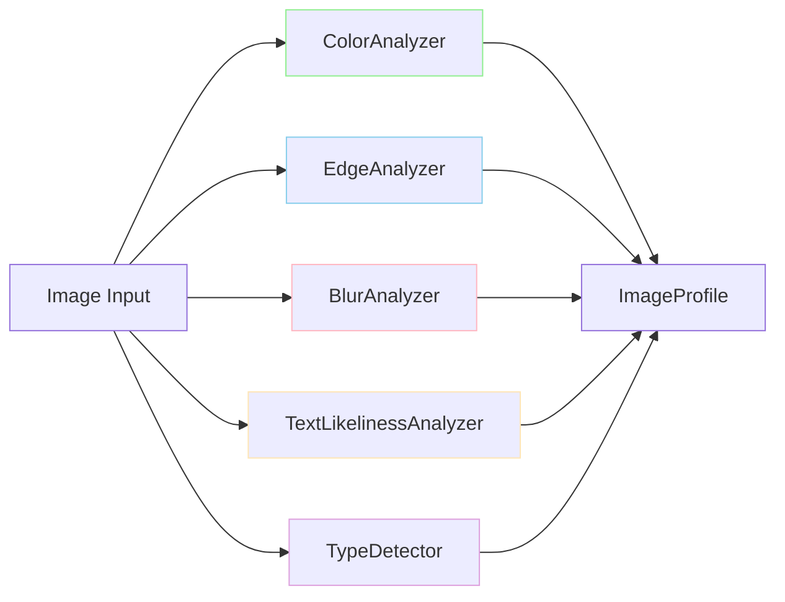
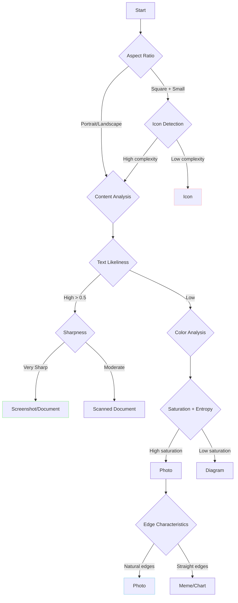

# Image Analyzers Reference

This document provides detailed technical information about each analyzer component in the Mostlylucid.DocSummarizer.Images library.

## Overview

The library uses a pipeline of specialized analyzers to extract different aspects of image characteristics:



All analyzers operate on **downscaled versions** of images (256-512px) for performance, making analysis fast and memory-efficient.

---

## ColorAnalyzer

Extracts color information using quantization-based sampling.

### Algorithm

**Quantized Bucket Sampling:**
1. Downsample image to 256x256 for performance
2. Quantize RGB channels to reduce color space (default: 4 bits per channel = 16 buckets)
3. Count pixel frequency in each quantized bucket
4. Select top N colors by frequency
5. Map quantized colors back to full RGB space
6. Generate human-readable color names using nearest CSS color

**Color Grid Generation:**
1. Resize image to NxN grid (default: 3x3 = 9 cells) using Lanczos3 resampling
2. For each cell, apply same quantization algorithm
3. Store dominant color and coverage percentage per cell
4. Creates a spatial color signature for perceptual hashing

### Capabilities

- **Dominant Colors** (up to 5): Most frequent colors with percentages
- **Color Grid** (3x3 by default): Spatial distribution of colors
- **Mean Saturation** (0.0-1.0): Average HSL saturation across all pixels
- **Grayscale Detection**: Boolean flag if saturation < 0.1 for >90% of pixels

### Configuration

```csharp
config.ColorGrid.Rows = 3;              // Grid rows (default: 3)
config.ColorGrid.Cols = 3;              // Grid columns (default: 3)
config.ColorGrid.TargetWidth = 384;     // Resize target for grid (default: 384)
config.ColorGrid.BucketBits = 4;        // Quantization bits (default: 4)
config.ColorGrid.SampleStep = 2;        // Pixel sampling step (default: 2)
```

### Output Signals

| Signal Key | Type | Confidence | Description |
|------------|------|------------|-------------|
| `color.dominant_color_names` | `List<string>` | 0.9 | Color names (e.g., "Navy", "White") |
| `color.dominant_color_hexes` | `List<string>` | 0.9 | Hex codes (e.g., "#000080") |
| `color.dominant_color_percentages` | `List<double>` | 0.9 | Coverage percentages |
| `color.mean_luminance` | `double` | 1.0 | Average brightness (0-255) |
| `color.mean_saturation` | `double` | 1.0 | Average saturation (0.0-1.0) |
| `color.is_mostly_grayscale` | `bool` | 1.0 | Grayscale detection flag |
| `color.grid` | `ColorGrid` | 0.9 | Spatial color distribution |

### Example Usage

```csharp
var profile = await analyzer.AnalyzeAsync("photo.jpg");

// Access dominant colors
foreach (var color in profile.DominantColors.Take(3))
{
    Console.WriteLine($"{color.Name} ({color.Hex}): {color.Percentage:F1}%");
}

// Access color grid
if (profile.ColorGrid != null)
{
    Console.WriteLine($"Grid: {profile.ColorGrid.Rows}x{profile.ColorGrid.Cols}");

    foreach (var cell in profile.ColorGrid.Cells)
    {
        Console.WriteLine($"  Cell [{cell.Row},{cell.Col}]: {cell.Hex} ({cell.Coverage:F1}%)");
    }
}

// Check grayscale
if (profile.IsMostlyGrayscale)
{
    Console.WriteLine("Image is mostly grayscale");
}
```

### Performance

- **Dominant Colors**: ~5-10ms per image
- **Color Grid**: ~15-20ms per image (includes Lanczos3 resampling)
- **Memory**: Works on 256x256 downsampled version (~200KB)

---

## EdgeAnalyzer

Measures visual complexity and structure using Sobel edge detection.

### Algorithm

**Sobel Edge Detection:**
1. Convert to grayscale luminance
2. Apply Sobel operators (horizontal and vertical gradient kernels)
3. Calculate gradient magnitude at each pixel: `sqrt(Gx² + Gy²)`
4. Threshold to binary edge map (gradient > threshold)
5. Calculate edge density as percentage of edge pixels

**Straight Edge Detection:**
1. Calculate gradient direction: `atan2(Gy, Gx)`
2. Classify edges as horizontal, vertical, or diagonal
3. Compute ratio of straight edges (horizontal + vertical) to total edges
4. High ratio indicates diagrams, charts, screenshots

**Luminance Entropy:**
1. Build histogram of luminance values (8 bins)
2. Calculate Shannon entropy: `-Σ(p * log₂(p))`
3. Range: 0.0 (uniform) to 8.0 (maximum complexity)

### Metrics

| Metric | Range | Interpretation |
|--------|-------|----------------|
| **Edge Density** | 0.0-1.0 | Proportion of pixels with high gradient |
| **Luminance Entropy** | 0.0-8.0 | Information content of brightness distribution |
| **Straight Edge Ratio** | 0.0-1.0 | Proportion of horizontal/vertical edges |

**Edge Density Interpretation:**
- **< 0.05**: Very smooth (solid colors, gradients)
- **0.05-0.15**: Low complexity (simple icons, logos)
- **0.15-0.30**: Medium complexity (typical photos)
- **> 0.30**: High complexity (text, detailed images, patterns)

**Straight Edge Ratio Interpretation:**
- **< 0.3**: Natural/organic content (photos, artwork)
- **0.3-0.6**: Mixed content
- **> 0.6**: Structured content (diagrams, screenshots, charts)

### Configuration

```csharp
config.EdgeDetection.SobelThreshold = 30;        // Gradient threshold (default: 30)
config.EdgeDetection.DownsampleSize = 512;       // Processing size (default: 512)
```

### Output Signals

| Signal Key | Type | Confidence | Description |
|------------|------|------------|-------------|
| `quality.edge_density` | `double` | 0.9 | Percentage of edge pixels (0.0-1.0) |
| `quality.luminance_entropy` | `double` | 0.9 | Shannon entropy (0.0-8.0) |
| `quality.straight_edge_ratio` | `double` | 0.8 | Proportion of straight edges (0.0-1.0) |

### Example Usage

```csharp
var profile = await analyzer.AnalyzeAsync("image.png");

// Classify complexity
var complexity = profile.EdgeDensity switch
{
    < 0.05 => "Very Smooth",
    < 0.15 => "Low Complexity",
    < 0.30 => "Medium Complexity",
    _ => "High Complexity"
};

Console.WriteLine($"Edge Density: {profile.EdgeDensity:F3} ({complexity})");
Console.WriteLine($"Entropy: {profile.LuminanceEntropy:F2} bits");
Console.WriteLine($"Straight Edges: {profile.StraightEdgeRatio:P0}");

// Detect diagrams
if (profile.StraightEdgeRatio > 0.6 && profile.EdgeDensity > 0.2)
{
    Console.WriteLine("Likely a diagram or chart");
}
```

### Use Cases

- **Photo vs. Diagram**: High straight edge ratio → diagram
- **Text Detection**: High edge density + high straight edge ratio → screenshot with text
- **Complexity Filtering**: Filter simple icons vs. complex photos
- **Quality Assessment**: Low entropy → compressed or simple image

### Performance

- **Edge Detection**: ~8-12ms per image (512x512 processing)
- **Memory**: ~1MB working memory for gradients
- **Optimization**: Downsamples large images automatically

---

## BlurAnalyzer

Detects sharpness and blur using Laplacian variance.

### Algorithm

**Laplacian Variance Method:**
1. Convert to grayscale luminance
2. Apply Laplacian operator (second derivative kernel):
   ```
   [ 0  1  0 ]
   [ 1 -4  1 ]
   [ 0  1  0 ]
   ```
3. Calculate variance of Laplacian response
4. Higher variance = sharper edges = sharper image
5. Lower variance = smooth edges = blurry image

**Why Laplacian Variance Works:**
- Sharp edges produce high Laplacian responses (large second derivative)
- Blurry edges produce low Laplacian responses (smooth gradients)
- Variance measures consistency of edge strength
- Single metric captures overall sharpness

### Sharpness Categories

| Laplacian Variance | Category | Description |
|-------------------|----------|-------------|
| **< 100** | Very Blurry | Severely out of focus, unusable |
| **100-300** | Blurry | Soft focus, low detail |
| **300-500** | Soft | Acceptable for most uses |
| **500-1000** | Sharp | Good focus, clear details |
| **1000-3000** | Very Sharp | Excellent focus, high detail |
| **> 3000** | Extremely Sharp | Professional quality, diagrams, text |

**Typical Values by Image Type:**
- **Photos (in focus)**: 800-2000
- **Photos (slightly soft)**: 300-800
- **Screenshots/Text**: 2000-5000+
- **Diagrams**: 3000-8000+
- **Blurry photos**: 50-300
- **Extremely blurry**: < 50

### Configuration

```csharp
config.BlurDetection.DownsampleSize = 512;       // Processing size (default: 512)
config.BlurDetection.BlurThreshold = 300;        // Blur/sharp boundary (default: 300)
```

### Output Signals

| Signal Key | Type | Confidence | Description |
|------------|------|------------|-------------|
| `quality.sharpness` | `double` | 0.8 | Laplacian variance (typical: 0-5000+) |
| `quality.is_blurry` | `bool` | 0.8 | True if sharpness < threshold |

### Example Usage

```csharp
var profile = await analyzer.AnalyzeAsync("photo.jpg");

// Categorize sharpness
var category = profile.LaplacianVariance switch
{
    < 100 => "Very Blurry",
    < 300 => "Blurry",
    < 500 => "Soft",
    < 1000 => "Sharp",
    < 3000 => "Very Sharp",
    _ => "Extremely Sharp"
};

Console.WriteLine($"Sharpness: {profile.LaplacianVariance:F1} ({category})");

// Filter low-quality images
if (profile.LaplacianVariance < 300)
{
    Console.WriteLine("WARNING: Image is blurry, consider retaking");
}

// Detect screenshot/diagram quality
if (profile.LaplacianVariance > 2000)
{
    Console.WriteLine("High sharpness detected - likely screenshot or diagram");
}
```

### Use Cases

- **Quality Control**: Filter blurry photos from datasets
- **Auto-Escalation**: Escalate blurry images to vision LLM for context
- **Type Detection**: Very high sharpness → screenshot/diagram
- **Photo Library**: Identify best shots from burst mode
- **OCR Optimization**: Only run OCR on sharp text images

### Performance

- **Analysis**: ~5-8ms per image (512x512 processing)
- **Memory**: ~1MB for Laplacian computation
- **Accuracy**: Excellent for general sharpness, may struggle with intentionally soft artistic photos

---

## TextLikelinessAnalyzer

Heuristic-based detection of text content **without running OCR**.

### Algorithm

**Multi-Factor Heuristic Scoring (weighted combination):**

#### 1. High-Frequency Edge Density (30% weight)
- Apply high-pass filter to detect fine details
- Text has high concentration of small edges (letters)
- Score: edge density in high-frequency range

#### 2. Bimodal Luminance Distribution (25% weight)
- Build luminance histogram
- Text typically has two peaks: background + foreground
- Measure histogram bimodality using valley depth
- Strong bimodality → likely text on background

#### 3. Horizontal Stroke Bias (20% weight)
- Calculate ratio of horizontal to vertical edges
- Text has slight horizontal bias (baselines, caps)
- Ratio near 1.0-1.2 indicates text presence

#### 4. Local Contrast Variation (25% weight)
- Measure standard deviation of local contrast
- Text regions have consistent high contrast
- Calculate variance of contrast across image regions

**Final Score:** Weighted average of all factors (0.0-1.0)

### Score Interpretation

| Score Range | Likelihood | Typical Content |
|-------------|-----------|-----------------|
| **< 0.2** | Low | Photos, artwork, natural images |
| **0.2-0.4** | Medium | Mixed content, some text |
| **0.4-0.6** | High | Screenshots, documents |
| **> 0.6** | Very High | Pure text, memes, slides |

**Typical Values by Image Type:**
- **Photos**: 0.05-0.15
- **Artwork**: 0.1-0.2
- **Mixed content**: 0.2-0.4
- **Screenshots**: 0.4-0.7
- **Documents/Memes**: 0.6-0.9
- **Pure text**: 0.8-1.0

### Configuration

```csharp
config.TextDetection.TextLikelinessThreshold = 0.4;  // OCR trigger (default: 0.4)
config.TextDetection.DownsampleSize = 512;           // Processing size (default: 512)
```

### Output Signals

| Signal Key | Type | Confidence | Description |
|------------|------|------------|-------------|
| `content.text_likeliness` | `double` | 0.7 | Probability of text content (0.0-1.0) |
| `content.has_text` | `bool` | 0.7 | True if score > threshold |
| `content.salient_regions` | `List<SaliencyRegion>` | 0.6 | Regions likely containing text |

### Example Usage

```csharp
var profile = await analyzer.AnalyzeAsync("screenshot.png");

// Decide whether to run OCR
if (profile.TextLikeliness > 0.4)
{
    Console.WriteLine($"High text content detected ({profile.TextLikeliness:P0})");
    Console.WriteLine("Running OCR...");

    // Run expensive OCR only when needed
    var text = await ocrService.ExtractTextAsync("screenshot.png");
}
else
{
    Console.WriteLine($"Low text content ({profile.TextLikeliness:P0}), skipping OCR");
}

// Classify content
var contentType = profile.TextLikeliness switch
{
    < 0.2 => "Visual content (photo/artwork)",
    < 0.4 => "Mixed content",
    < 0.6 => "Document/Screenshot",
    _ => "Text-heavy content"
};

Console.WriteLine($"Content Type: {contentType}");
```

### Use Cases

- **OCR Optimization**: Only run OCR on images with high text likeliness
- **Content Routing**: Route screenshots vs. photos to different pipelines
- **Auto-Escalation**: Escalate text-heavy images to vision LLM for caption
- **Meme Detection**: Combined with aspect ratio and color analysis
- **Document Classification**: Separate documents from photos in mixed collections

### Limitations

- **Heuristic-based**: Not 100% accurate (no ML model)
- **False positives**: Highly detailed textures may score high
- **False negatives**: Handwriting or artistic text may score low
- **Language-agnostic**: Works for any script (Latin, CJK, Arabic, etc.)

### Performance

- **Analysis**: ~10-15ms per image (512x512 processing)
- **Memory**: ~2MB for multiple feature maps
- **Accuracy**: ~85-90% for typical use cases

---

## TypeDetector

Classifies images into semantic categories using decision tree logic.

### Algorithm

**Rule-Based Decision Tree:**



### Detection Rules

#### Icon Detection
- **Size**: Width or height < 128px
- **Aspect Ratio**: Near square (0.8-1.2)
- **Complexity**: Low edge density (< 0.15)
- **Confidence**: 0.6-0.8

#### Screenshot Detection
- **Text Likeliness**: > 0.5
- **Sharpness**: > 1500 (very sharp)
- **Aspect Ratio**: Typical screen ratios (16:9, 16:10, 4:3)
- **Confidence**: 0.7-0.9

#### Photo Detection
- **Saturation**: > 0.3 (colorful)
- **Entropy**: > 5.0 (complex)
- **Edge Pattern**: Natural/organic (straight edge ratio < 0.4)
- **Size**: Larger dimensions
- **Confidence**: 0.6-0.9

#### Diagram Detection
- **Saturation**: Low (< 0.2, mostly grayscale)
- **Straight Edges**: High ratio (> 0.6)
- **Sharpness**: Very high (> 2000)
- **Confidence**: 0.5-0.8

#### Chart Detection
- **Similar to Diagram** but with color usage
- **Grid patterns**: Detected via edge analysis
- **Confidence**: 0.4-0.7

#### Scanned Document Detection
- **Text Likeliness**: High (> 0.5)
- **Sharpness**: Moderate (300-1500)
- **Compression Artifacts**: Present
- **Confidence**: 0.4-0.6

#### Meme Detection
- **Text Likeliness**: Moderate-High (0.3-0.6)
- **Aspect Ratio**: Vertical or square
- **Bright Colors**: High saturation
- **Impact font characteristics**: Via edge analysis
- **Confidence**: 0.3-0.6 (least confident)

#### Artwork Detection
- **Saturation**: Variable
- **Entropy**: High
- **Edge Pattern**: Artistic (not natural, not geometric)
- **Confidence**: 0.4-0.6

### Image Types

```csharp
public enum ImageType
{
    Unknown,           // Unable to classify
    Photo,             // Natural photos
    Screenshot,        // Screen captures
    Diagram,           // Technical diagrams
    ScannedDocument,   // Scanned paper
    Icon,              // Small icons/logos
    Chart,             // Charts and graphs
    Artwork,           // Digital art
    Meme               // Meme images
}
```

### Output Signals

| Signal Key | Type | Confidence | Description |
|------------|------|------------|-------------|
| `content.type` | `ImageType` | Variable | Detected image type |
| `content.type_confidence` | `double` | 0.3-0.9 | Confidence in classification |

### Example Usage

```csharp
var profile = await analyzer.AnalyzeAsync("image.png");

Console.WriteLine($"Type: {profile.DetectedType}");
Console.WriteLine($"Confidence: {profile.TypeConfidence:P0}");

// Route by type
switch (profile.DetectedType)
{
    case ImageType.Screenshot:
        // Run OCR for screenshots
        await ExtractTextAsync(imagePath);
        break;

    case ImageType.Photo:
        // Generate photo metadata
        await ExtractExifAsync(imagePath);
        break;

    case ImageType.Diagram:
    case ImageType.Chart:
        // Escalate to vision LLM for understanding
        await GenerateCaptionAsync(imagePath);
        break;

    case ImageType.Icon:
        // Skip detailed analysis
        break;
}

// Check confidence
if (profile.TypeConfidence < 0.5)
{
    Console.WriteLine("Low confidence, escalating to vision LLM");
    await visionLlm.AnalyzeAsync(imagePath);
}
```

### Use Cases

- **Content Routing**: Route different types to specialized pipelines
- **Auto-Escalation**: Escalate uncertain types to vision LLM
- **Photo Library**: Organize images by type
- **OCR Optimization**: Only run OCR on screenshots/documents
- **Quality Control**: Filter out unwanted types

### Confidence Factors

High confidence (0.7-0.9):
- Clear screenshots with sharp text
- Obvious photos with natural content
- Small, simple icons

Low confidence (0.3-0.5):
- Borderline cases (photo vs. artwork)
- Mixed content (diagram with photos)
- Unusual aspect ratios or sizes
- Memes (hardest to classify)

### Performance

- **Classification**: ~1-2ms (uses already-computed metrics)
- **Memory**: Minimal (decision tree logic)
- **Accuracy**: ~70-80% overall, varies by type

---

## Performance Summary

**Typical analysis timeline for 1920x1080 image on modern hardware:**

| Component | Time | Memory | Notes |
|-----------|------|--------|-------|
| Image Load | ~10ms | ~6MB | SixLabors.ImageSharp |
| Downsample | ~5ms | ~200KB | To 512x512 for processing |
| ColorAnalyzer | ~8ms | ~500KB | Includes grid generation |
| EdgeAnalyzer | ~12ms | ~1MB | Sobel + entropy |
| BlurAnalyzer | ~6ms | ~1MB | Laplacian variance |
| TextLikelinessAnalyzer | ~14ms | ~2MB | Multi-factor heuristic |
| TypeDetector | ~2ms | ~10KB | Decision tree |
| **Total** | **~50ms** | **~10MB** | Full pipeline |

**Optimization tips:**
- Process in parallel for batch operations
- Reuse `Image<>` objects when analyzing multiple times
- Cache results in SignalDatabase for repeated access
- Adjust downsample sizes based on accuracy needs

---

## References

### Academic Papers

1. **Laplacian Variance for Blur Detection**
   - Pech-Pacheco et al. (2000). "Diatom autofocusing in brightfield microscopy"
   - Method: Variance of Laplacian operator

2. **Sobel Edge Detection**
   - Sobel & Feldman (1968). "A 3x3 isotropic gradient operator"
   - Classic edge detection algorithm

3. **Shannon Entropy**
   - Shannon (1948). "A Mathematical Theory of Communication"
   - Information content measurement

### Implementation References

- **SixLabors.ImageSharp**: https://docs.sixlabors.com/
- **Color quantization**: Median cut algorithm
- **CSS color names**: W3C specification
- **Laplacian operator**: OpenCV documentation

---

## Extending Analyzers

### Adding Custom Analyzers

```csharp
public class CustomAnalyzer : IImageAnalyzer
{
    public async Task<ImageProfile> AnalyzeAsync(string imagePath, CancellationToken ct = default)
    {
        using var image = await Image.LoadAsync<Rgba32>(imagePath, ct);

        // Your custom analysis logic
        var customMetric = ComputeCustomMetric(image);

        return new ImageProfile
        {
            // ... set properties
        };
    }

    private double ComputeCustomMetric(Image<Rgba32> image)
    {
        // Your algorithm here
        return 0.0;
    }
}
```

### Contributing Analyzers

We welcome contributions! See [CONTRIBUTING.md](../../CONTRIBUTING.md) for guidelines on:
- Adding new analyzers
- Improving existing algorithms
- Performance optimizations
- Test coverage requirements

---

*Last updated: 2026-01-04*
