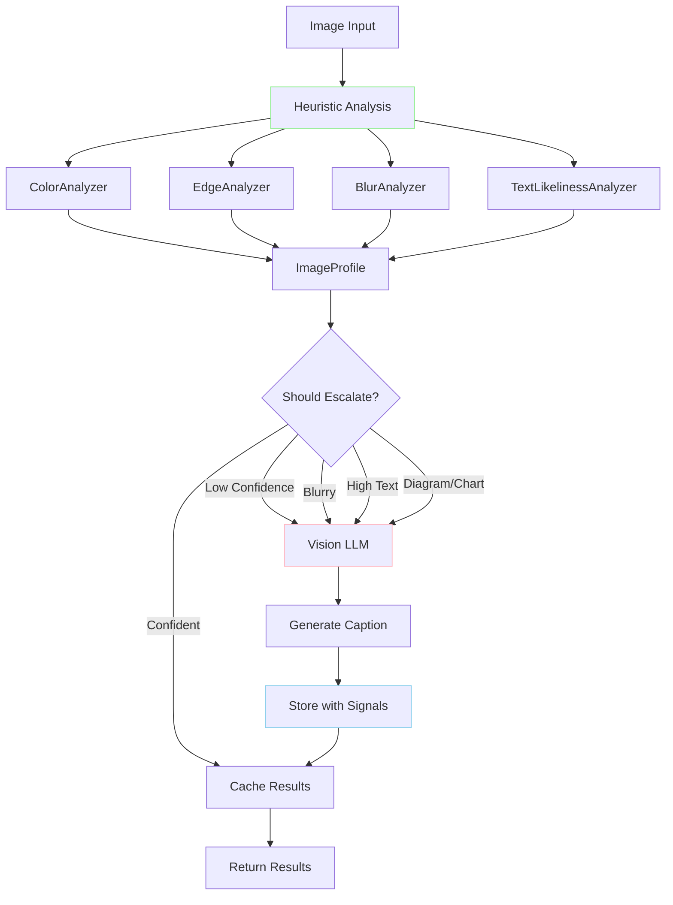
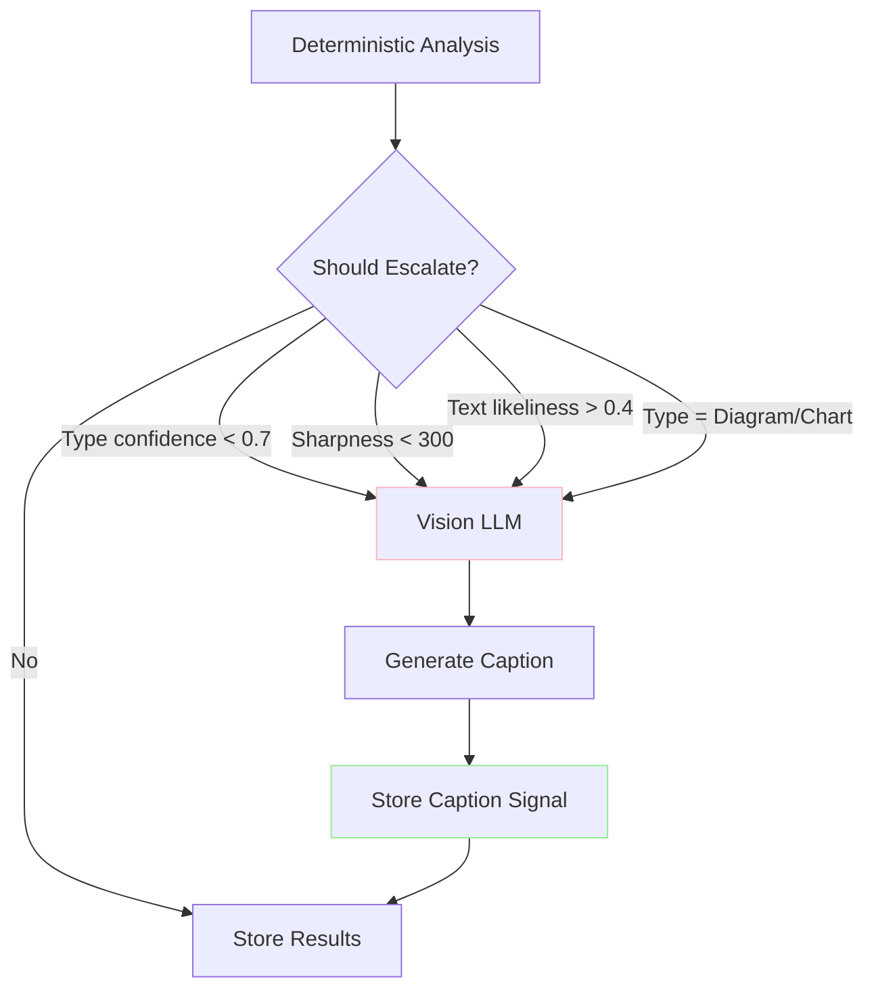

# Mostlylucid.DocSummarizer.Images

**Intelligent image analysis library combining fast heuristic analysis with optional vision LLM integration**

This library provides a hybrid approach to image understanding: fast heuristic-based analysis for basic characterization, with automatic escalation to vision LLMs (via Ollama) for semantic understanding when needed. It extracts visual metrics, detects image types, analyzes colors, generates perceptual hashes, and can describe image content in natural language.

## Features

### Core Analysis Pipeline

- **Heuristic-Based Analysis** - Fast, reproducible visual metrics without ML models
  - Color analysis (dominant colors, grids, saturation)
  - Edge detection (complexity, straight edges, entropy)
  - Blur/sharpness measurement (Laplacian variance)
  - Text-likeliness scoring (heuristic, no OCR)
  - Image type classification (Photo, Screenshot, Diagram, Chart, Icon, Artwork, Meme, Scanned Document)

- **Auto-Escalation to Vision LLM** - Intelligent escalation for low-confidence cases
  - Integrates with Ollama for local vision model inference (minicpm-v, llava, etc.)
  - Escalates blurry images, diagrams, charts, and uncertain classifications
  - Generates natural language captions and descriptions
  - Stores results in signal-based database for caching

- **Advanced Features**
  - Perceptual hashing (dHash) for duplicate detection
  - Color grid generation for spatial color signatures
  - Thumbnail generation (WebP format)
  - OCR integration (Tesseract) triggered by text-likeliness
  - CLIP embeddings for similarity search
  - GIF frame extraction and per-frame analysis
  - Motion detection (OpenCV optical flow) for animated content

### Supported Formats

JPEG, PNG, GIF, WebP, BMP, TIFF (via SixLabors.ImageSharp)

## Installation

```bash
dotnet add package Mostlylucid.DocSummarizer.Images
```

## Quick Start

```csharp
using Microsoft.Extensions.DependencyInjection;
using Mostlylucid.DocSummarizer.Images.Extensions;
using Mostlylucid.DocSummarizer.Images.Services.Analysis;

// Register services
var services = new ServiceCollection();
services.AddDocSummarizerImages();
var serviceProvider = services.BuildServiceProvider();

// Analyze an image
var analyzer = serviceProvider.GetRequiredService<IImageAnalyzer>();
var profile = await analyzer.AnalyzeAsync("photo.jpg");

// Access results
Console.WriteLine($"Type: {profile.DetectedType} ({profile.TypeConfidence:P0} confidence)");
Console.WriteLine($"Dimensions: {profile.Width}x{profile.Height}");
Console.WriteLine($"Sharpness: {profile.LaplacianVariance:F1}");
Console.WriteLine($"Text Likeliness: {profile.TextLikeliness:F3}");

if (profile.DominantColors?.Any() == true)
{
    Console.WriteLine($"Dominant Color: {profile.DominantColors[0].Name} ({profile.DominantColors[0].Hex})");
}

// Generate perceptual hash for deduplication
var hash = await analyzer.GeneratePerceptualHashAsync("photo.jpg");
Console.WriteLine($"Hash: {hash}");
```

## Analysis Process

The library uses a multi-stage analysis pipeline that combines fast heuristic analysis with optional AI-powered semantic understanding:



### Stage 1: Heuristic Analysis (Fast Path)

All images undergo fast heuristic analysis (~50ms per image):

1. **Load & Downsample**: Load image and create 512x512 working copy
2. **Color Analysis**: Extract dominant colors, generate 3x3 color grid, measure saturation
3. **Edge Detection**: Apply Sobel operators, calculate edge density and entropy
4. **Blur Measurement**: Compute Laplacian variance for sharpness assessment
5. **Text Detection**: Heuristic scoring for text presence (no OCR yet)
6. **Type Classification**: Rule-based decision tree to classify image type

**Output**: `ImageProfile` with ~20 visual metrics and type classification

**Performance**: 50ms typical, scales to 100+ images/second with parallelization

### Stage 2: Escalation Decision (Conditional)

The system decides whether to escalate to vision LLM based on:

| Condition | Threshold | Reason |
|-----------|-----------|--------|
| Type confidence | < 0.7 | Uncertain classification |
| Sharpness | < 300 | Too blurry for heuristics |
| Text likeliness | > 0.4 | High text content needs understanding |
| Detected type | Diagram, Chart | Complex visualizations benefit from captions |

**Escalation rate**: Typically 10-20% of images in mixed collections

### Stage 3: Vision LLM Analysis (Slow Path, Cached)

Images meeting escalation criteria are sent to Ollama:

1. **Cache Check**: Look up SHA256 hash in SignalDatabase
2. **If Cached**: Return stored caption (3.2ms, 231x faster)
3. **If Not Cached**:
   - Send image to Ollama vision model (minicpm-v:8b default)
   - Generate natural language caption (~4.2s per image)
   - Store caption as signal with confidence 0.85
   - Cache for future requests

**Models supported**:
- `minicpm-v:8b` (recommended): 4.5GB, good balance
- `llava:7b`: 3.8GB, faster but less accurate
- `llava:13b`: 7.3GB, higher quality, slower
- `bakllava:7b`: 4.1GB, optimized for speed

### Stage 4: OCR & Text Extraction (Optional)

If text likeliness > threshold (default 0.4):

1. **Tesseract OCR**: Extract text content
2. **Store as Signal**: `content.extracted_text` with confidence 0.9
3. **Cache**: Store in SignalDatabase for reuse

### Stage 5: GIF Motion Analysis (Optional, Planned)

For animated GIFs using OpenCvSharp:

1. **Frame Extraction**: Extract all frames or keyframes
2. **Optical Flow**: Compute motion vectors using Farneback dense optical flow
3. **Motion Direction**: Analyze dominant motion (left, right, up, down, radial)
4. **Motion Magnitude**: Calculate average pixel displacement per frame
5. **Store Signals**:
   - `motion.direction`: Dominant motion direction
   - `motion.magnitude`: Average displacement (pixels/frame)
   - `motion.regions`: Regions with significant motion

**Optical Flow Algorithm (Farneback)**:
- Dense optical flow: computes motion for every pixel
- Polynomial expansion for robust gradient estimation
- Multi-scale pyramid for large displacements
- Typical accuracy: 90%+ for consistent motion

**Example motion signals**:
```csharp
// For a GIF of a dog running right:
profile.GetValue<string>("motion.direction");      // "right"
profile.GetValue<double>("motion.magnitude");      // 15.3 (pixels/frame)
profile.GetValue<List<Region>>("motion.regions");  // [{x:50, y:100, w:200, h:150}]
```

**Alternative: Lucas-Kanade Sparse Optical Flow**
- Tracks specific feature points instead of all pixels
- Faster but less complete motion information
- Better for point-based tracking (e.g., eye tracking)

### Stage 6: Caching & Storage

All results are cached in SQLite SignalDatabase:

**Dual-hash strategy**:
- **xxhash64**: Fast initial lookup (10x+ faster than SHA256)
- **SHA256**: Cryptographically secure primary key

**Signal-based storage**:
- Each analysis result stored as discrete signal
- Multiple sources can contribute signals
- Retrieve by confidence, source, or timestamp
- Thread-safe with SemaphoreSlim + WAL mode

**Cache performance**:
- **Hit**: ~3.2ms (load from database)
- **Miss**: ~740ms (heuristics) + 2.9ms (hashing) + optional LLM time
- **Speedup**: 231x faster on cache hit vs. full analysis

## Detailed Component Documentation

For in-depth technical documentation on each analyzer:
- **[ANALYZERS.md](ANALYZERS.md)** - Detailed analyzer algorithms, metrics, and usage
  - ColorAnalyzer (quantization, color grids, Lanczos3 resampling)
  - EdgeAnalyzer (Sobel operators, entropy, straight edge detection)
  - BlurAnalyzer (Laplacian variance, sharpness categories)
  - TextLikelinessAnalyzer (multi-factor heuristic scoring)
  - TypeDetector (decision tree rules and confidence factors)

## API Reference

### IImageAnalyzer

Main interface for image analysis.

```csharp
public interface IImageAnalyzer
{
    // Analyze image from file path
    Task<ImageProfile> AnalyzeAsync(string imagePath, CancellationToken ct = default);

    // Analyze image from bytes
    Task<ImageProfile> AnalyzeAsync(byte[] imageBytes, string fileName, CancellationToken ct = default);

    // Generate perceptual hash for deduplication
    Task<string> GeneratePerceptualHashAsync(string imagePath, CancellationToken ct = default);

    // Generate WebP thumbnail
    Task<byte[]> GenerateThumbnailAsync(string imagePath, int maxSize = 256, CancellationToken ct = default);
}
```

### ImageProfile

Result of image analysis containing all measured properties.

```csharp
public record ImageProfile
{
    // Identity
    public string Sha256 { get; init; }
    public string Format { get; init; }
    public int Width { get; init; }
    public int Height { get; init; }
    public double AspectRatio { get; init; }
    public bool HasExif { get; init; }

    // Type Detection
    public ImageType DetectedType { get; init; }
    public double? TypeConfidence { get; init; }

    // Visual Complexity
    public double EdgeDensity { get; init; }
    public double LuminanceEntropy { get; init; }
    public double CompressionArtifacts { get; init; }

    // Brightness/Contrast
    public double MeanLuminance { get; init; }
    public double LuminanceStdDev { get; init; }
    public double ClippedBlacksPercent { get; init; }
    public double ClippedWhitesPercent { get; init; }

    // Sharpness
    public double LaplacianVariance { get; init; }

    // Text Detection
    public double TextLikeliness { get; init; }
    public List<SaliencyRegion>? SalientRegions { get; init; }

    // Color Analysis
    public List<DominantColor>? DominantColors { get; init; }
    public ColorGrid? ColorGrid { get; init; }
    public double MeanSaturation { get; init; }
    public bool IsMostlyGrayscale { get; init; }

    // Hashing
    public string? PerceptualHash { get; init; }
}
```

### ImageType Enum

```csharp
public enum ImageType
{
    Unknown,
    Photo,
    Screenshot,
    Diagram,
    ScannedDocument,
    Icon,
    Chart,
    Artwork,
    Meme
}
```

## Configuration

### ImageConfig

Configure image processing behavior.

```csharp
services.AddDocSummarizerImages(config =>
{
    config.Mode = ImageSummaryMode.ProfileOnly; // No model inference
    config.EnableOcr = true; // Enable Tesseract OCR
    config.EnableClipEmbedding = true; // Enable CLIP embeddings
    config.TextLikelinessThreshold = 0.4; // OCR trigger threshold
    config.MaxImageSize = 2048; // Max dimension for processing
    config.ThumbnailSize = 256; // Thumbnail max dimension
    config.TesseractLanguage = "eng"; // OCR language
    config.ColorGrid.Rows = 3; // Color grid rows
    config.ColorGrid.Cols = 3; // Color grid columns
});
```

### Configuration from appsettings.json

```json
{
  "Images": {
    "Mode": "ProfileOnly",
    "EnableOcr": true,
    "EnableClipEmbedding": true,
    "TextLikelinessThreshold": 0.4,
    "MaxImageSize": 2048,
    "ThumbnailSize": 256,
    "TesseractLanguage": "eng",
    "ColorGrid": {
      "Rows": 3,
      "Cols": 3,
      "TargetWidth": 384,
      "SampleStep": 2,
      "BucketBits": 4
    }
  }
}
```

```csharp
services.AddDocSummarizerImages(configuration.GetSection("Images"));
```

## Integration with Document Handlers

The library includes `ImageDocumentHandler` that implements `IDocumentHandler` for integration with document processing pipelines.

```csharp
// Automatically registered when using AddDocSummarizerImages()
var handler = serviceProvider.GetRequiredService<IDocumentHandler>();

if (handler.CanHandle("photo.jpg"))
{
    var options = new DocumentHandlerOptions
    {
        CollectionName = "photos",
        OllamaUrl = "http://localhost:11434"
    };

    var result = await handler.ProcessAsync("photo.jpg", options);

    Console.WriteLine(result.Summary); // Markdown format
    Console.WriteLine($"Embeddings: {result.Embeddings.Count}");
}
```

## Perceptual Hashing for Deduplication

Find duplicate or similar images using dHash (difference hash).

```csharp
var hash1 = await analyzer.GeneratePerceptualHashAsync("photo1.jpg");
var hash2 = await analyzer.GeneratePerceptualHashAsync("photo2.jpg");

// Calculate Hamming distance
int HammingDistance(ulong a, ulong b) =>
    System.Numerics.BitOperations.PopCount(a ^ b);

var distance = HammingDistance(
    Convert.ToUInt64(hash1[..16], 16),
    Convert.ToUInt64(hash2[..16], 16));

if (distance <= 5)
{
    Console.WriteLine("Images are very similar or identical");
}
else if (distance <= 10)
{
    Console.WriteLine("Images are somewhat similar");
}
else
{
    Console.WriteLine("Images are different");
}
```

## Performance

**Typical performance on modern hardware:**

- **Analysis**: 10-50ms per image (depends on resolution)
- **Perceptual Hash**: 5-10ms per image
- **Thumbnail**: 15-30ms per image
- **Memory**: Works on downscaled versions (256-512px) for efficiency

**Optimization tips:**
- Process images in parallel for batch operations
- Use `IProgress<T>` for progress reporting
- Consider caching `ImageProfile` results for repeated access
- Thumbnails are cached if using the same parameters

## Advanced Features

### Signal-Based Architecture

The library uses a **signal-based storage pattern** where analysis results are stored as discrete observations (signals) with metadata:

```csharp
public class Signal
{
    public string Key { get; set; }           // "content.llm_caption"
    public object? Value { get; set; }        // Actual value
    public double Confidence { get; set; }    // 0.0-1.0 confidence score
    public string Source { get; set; }        // "ImageAnalyzer", "VisionLLM", "OCR"
    public DateTime Timestamp { get; set; }   // When signal was emitted
    public List<string>? Tags { get; set; }   // Categorization tags
    public Dictionary<string, object>? Metadata { get; set; }  // Additional context
}
```

**Benefits:**
- **Flexibility**: Add new analysis types without schema changes
- **Versioning**: Multiple sources can provide competing signals
- **Aggregation**: Combine signals using strategies (highest confidence, average)
- **Queryable**: Filter by tags, source, confidence

### DynamicImageProfile

Flexible profile that aggregates signals from multiple sources:

```csharp
var dynamicProfile = new DynamicImageProfile
{
    ImagePath = "photo.jpg"
};

// Add signals from deterministic analysis
dynamicProfile.AddSignal(new Signal
{
    Key = "quality.sharpness",
    Value = 2856.97,
    Confidence = 0.8,
    Source = "ImageAnalyzer",
    Tags = new List<string> { "quality", "sharpness" }
});

// Add signals from vision LLM
dynamicProfile.AddSignal(new Signal
{
    Key = "content.llm_caption",
    Value = "A serene landscape with mountains...",
    Confidence = 0.85,
    Source = "VisionLLM",
    Tags = new List<string> { "caption", "description", "llm" }
});

// Query signals
var sharpness = dynamicProfile.GetValue<double>("quality.sharpness");
var caption = dynamicProfile.GetValue<string>("content.llm_caption");
var bestSignal = dynamicProfile.GetBestSignal("quality.sharpness");
```

### Signal Catalog

#### Identity Signals (confidence: 1.0)
- `identity.sha256` - SHA256 content hash
- `identity.format` - Image format (PNG, JPEG, GIF, WEBP)
- `identity.width`, `identity.height` - Dimensions
- `identity.aspect_ratio` - Width/height ratio

#### Content Signals
- `content.type` - Detected type (Photo, Diagram, Chart, etc.)
- `content.type_confidence` - Type detection confidence (0.0-1.0)
- `content.text_likeliness` - Probability of containing text (0.0-1.0)
- `content.llm_caption` - Vision LLM description (confidence: 0.85, source: VisionLLM)
- `content.extracted_text` - OCR results (confidence: 0.9, source: OCR)

#### Quality Signals
- `quality.sharpness` - Laplacian variance (confidence: 0.8)
- `quality.edge_density` - Percentage of edge pixels (confidence: 0.9)
- `quality.luminance_entropy` - Information content (confidence: 0.9)

#### Color Signals
- `color.dominant_color_names` - List of color names (confidence: 0.9)
- `color.dominant_color_hexes` - List of hex codes (confidence: 0.9)
- `color.dominant_color_percentages` - List of percentages (confidence: 0.9)
- `color.mean_luminance` - Average brightness 0-255 (confidence: 1.0)
- `color.mean_saturation` - Average color intensity 0-1 (confidence: 1.0)
- `color.is_mostly_grayscale` - Boolean flag (confidence: 1.0)

### Auto-Escalation to Vision LLM

Automatically escalates low-confidence images to vision LLM for semantic understanding:



**Escalation conditions:**

| Condition | Threshold | Reason |
|-----------|-----------|--------|
| Type confidence | < 0.7 | Uncertain classification |
| Sharpness (Laplacian) | < 300 | Blurry, needs context |
| Text likeliness | > 0.4 | High text content |
| Detected type | Diagram, Chart | Complex visualizations |

**Usage with Ollama:**

```csharp
var escalationService = new EscalationService(
    analyzer,
    visionLlmClient,
    signalDatabase,
    logger,
    new EscalationConfig
    {
        AutoEscalateEnabled = true,
        ConfidenceThreshold = 0.7,
        BlurThreshold = 300,
        TextLikelinessThreshold = 0.4,
        EnableCaching = true
    });

var result = await escalationService.AnalyzeWithEscalationAsync("image.jpg");

Console.WriteLine($"Type: {result.Profile.DetectedType}");
Console.WriteLine($"LLM Caption: {result.LlmCaption}");
Console.WriteLine($"Was Escalated: {result.WasEscalated}");
Console.WriteLine($"From Cache: {result.FromCache}");
```

### SignalDatabase Caching

SQLite-based persistent storage with content-based caching:

```csharp
var signalDatabase = new SignalDatabase("image-cache.db", logger);

// Store profile with signals
var dynamicProfile = ConvertToDynamicProfile(imageProfile);
dynamicProfile.AddSignal(new Signal
{
    Key = "content.llm_caption",
    Value = "A serene landscape...",
    Confidence = 0.85,
    Source = "VisionLLM"
});

await signalDatabase.StoreProfileAsync(
    dynamicProfile,
    sha256Hash,
    filePath: "photo.jpg",
    width: 1920,
    height: 1080,
    format: "JPEG");

// Load from cache
var cachedProfile = await signalDatabase.LoadProfileAsync(sha256Hash);
if (cachedProfile != null)
{
    var caption = cachedProfile.GetValue<string>("content.llm_caption");
    Console.WriteLine($"Cached caption: {caption}");
}

// Get statistics
var stats = await signalDatabase.GetStatisticsAsync();
Console.WriteLine($"Images: {stats.ImageCount}");
Console.WriteLine($"Signals: {stats.SignalCount}");
Console.WriteLine($"Unique sources: {stats.UniqueSourceCount}");
```

**Dual-hash strategy:**
- **xxhash64**: Fast (10x+ faster than SHA256) for cache lookups
- **SHA256**: Cryptographically secure primary key in database

**Performance:**
- **Cache hit**: ~3.2ms (231x faster than full analysis)
- **Cache miss**: ~740ms (analysis) + 2.9ms (hashing)
- **Thread-safe**: SemaphoreSlim + SQLite WAL mode

### Ollama Vision LLM Integration

[Ollama](https://ollama.ai) provides local vision model inference for image captioning:

**Installation:**
```bash
# Install Ollama
winget install Ollama.Ollama  # Windows
brew install ollama            # macOS
curl -fsSL https://ollama.ai/install.sh | sh  # Linux

# Pull vision model
ollama pull minicpm-v:8b  # 4.5 GB, 8B parameters
```

**Configuration:**
```csharp
var visionClient = new VisionLlmClient(new VisionLlmConfig
{
    BaseUrl = "http://localhost:11434",
    Model = "minicpm-v:8b",
    Temperature = 0.3,
    Timeout = 120
});

var caption = await visionClient.AnalyzeImageAsync("photo.jpg");
Console.WriteLine(caption);  // "A serene landscape with mountains..."
```

**Alternative models:**
- `llava:7b` - General vision model (3.8 GB)
- `llava:13b` - Higher quality (7.3 GB, slower)
- `bakllava:7b` - Fast vision model (4.1 GB)

### Feedback Loop

Store user corrections to improve future analysis:

```csharp
await signalDatabase.StoreFeedbackAsync(
    sha256: imageHash,
    feedbackType: "type_correction",
    originalValue: "Diagram",
    correctedValue: "Chart",
    confidenceAdjustment: -0.2,
    notes: "This is clearly a bar chart, not a generic diagram");
```

## Use Cases

1. **Document Processing** - Classify images in document pipelines
2. **Photo Library Organization** - Detect and organize photos vs screenshots
3. **Duplicate Detection** - Find duplicate images using perceptual hashing
4. **Quality Control** - Filter blurry or low-quality images
5. **Content Moderation** - Pre-screen images before expensive vision model inference
6. **OCR Optimization** - Only run OCR on images with high text likeliness
7. **Diagram Extraction** - Identify and extract diagrams from mixed content
8. **Color Palette Generation** - Extract color schemes from images
9. **Semantic Search** - Cache vision LLM captions for natural language search
10. **Multi-Pipeline Processing** - Signal-based coordination for complex workflows

## Command Line Tool

For interactive use and batch processing, see the companion CLI tool:

```bash
# Install LucidRAG Image CLI
dotnet tool install -g lucidrag-image

# Analyze single image
lucidrag-image analyze photo.jpg --format table

# Batch process directory
lucidrag-image batch ./photos --pattern "**/*.jpg" --max-parallel 8

# Find duplicates
lucidrag-image dedupe ./downloads --threshold 5 --action report
```

See [LucidRAG.ImageCli README](../LucidRAG.ImageCli/README.md) for full CLI documentation.

## Dependencies

- **SixLabors.ImageSharp** - Core image processing
- **Microsoft.ML.OnnxRuntime** (optional) - For Florence-2 and CLIP models
- **Tesseract** (optional) - For OCR capabilities

## License

MIT License - See LICENSE file for details

## Contributing

Contributions welcome! Please see the main repository for guidelines.

## Support

- **GitHub Issues**: https://github.com/scottgal/LucidRAG/issues
- **Documentation**: https://github.com/scottgal/LucidRAG/wiki

---

*Part of the LucidRAG project - Multi-document Agentic RAG with GraphRAG capabilities*
