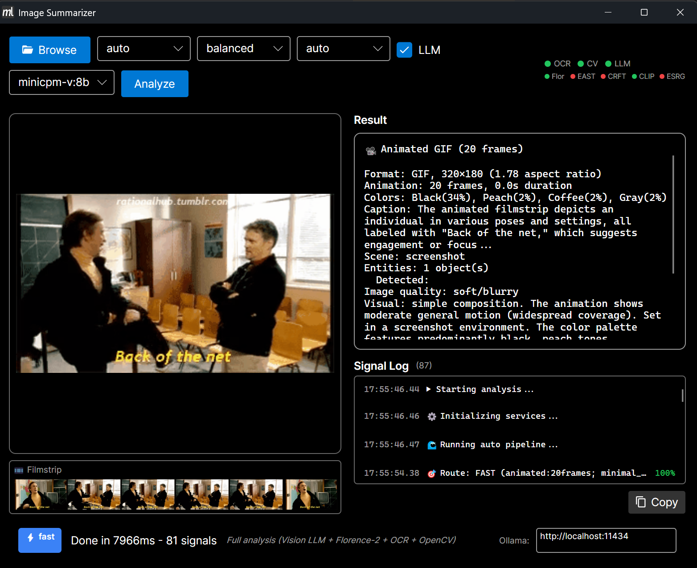

# Mostlylucid.DocSummarizer.Images

Deterministic image profiling with optional OCR, motion analysis, embeddings, and constrained vision captions.


*Caption: "A cat laying down with body stretched across white bench" • Motion: MODERATE*

## Demo Output

### Animated GIF with Subtitles


```
$ imagesummarizer demo-images/anchorman-not-even-mad.gif --pipeline auto
[FAST route: animated:93frames; minimal_text:0%; small_image]
"I'm not even mad."
Caption: The video shows an individual speaking with expressions suggesting disbelief...
Scene: meme
Motion: SUBTLE general motion
```

**Filmstrip mode**: 2-3 seconds instead of 27+ seconds!

## Mental Model

- **Waves emit signals** - typed, confidence-scored, with provenance
- **Deterministic gates** decide escalation (OCR → Florence-2 → Vision LLM)
- **Content-hash caching** - SQLite stores signals, cache hit ~2-10ms
- **Request only what you need** - dynamic pipelines select specific signals

## Install

```bash
dotnet add package Mostlylucid.DocSummarizer.Images
```

## Quick Start

```csharp
// Basic analysis
var analyzer = new ImageAnalyzer(config);
var profile = await analyzer.AnalyzeAsync("image.png");

Console.WriteLine($"Type: {profile.Identity.Type}");
Console.WriteLine($"Caption: {profile.Caption.Text}");
Console.WriteLine($"OCR: {profile.Ocr.Text}");
```

```csharp
// Request specific signals only
var result = await analyzer.AnalyzeBySignalsAsync(
    "image.gif",
    "@alttext");  // Or: "motion.*, color.dominant*"
```

## Pipelines

| Need | Use | Speed |
|------|-----|-------|
| Fast profile only | `ProfileOnly` | ~10ms |
| Captions for photos/screens | `florence2` | ~200ms |
| GIFs with subtitles | `auto` (filmstrip) | ~2-3s |
| Motion understanding | `motion` | ~300ms |
| Best effort caption | `florence2+llm` | ~1-5s |

## Filmstrip Optimization (NEW!)

For animated GIFs, the `auto` pipeline uses **filmstrip mode**:

1. **MlOcrWave** extracts frames + runs OpenCV detection (~100-200ms)
2. **Skip per-frame Florence-2 OCR** entirely (saves ~20 seconds!)
3. **VisionLlmWave** creates text-only strip + reads it in one call (~1-2s)

**Result**: 10-15x faster GIF processing

### Text-Only Strip Example


| Approach | Dimensions | Tokens | Time |
|----------|------------|--------|------|
| Full frames (10) | 3000×185 | ~1500 | ~27s |
| Text-only strip | 253×105 | ~50 | ~2-3s |

**30× token reduction** while preserving all subtitle text.

```bash
# Export text-only strip
imagesummarizer export-strip animation.gif --mode text-only

# Export motion keyframes
imagesummarizer export-strip animation.gif --mode motion
```

## Features

- Color/quality/type analysis (deterministic, no ML required)
- Multi-frame GIF analysis with text-only strip extraction
- Florence-2 ONNX for fast local OCR/captions
- Vision LLM escalation for complex images
- CLIP embeddings for semantic search
- Motion detection with optical flow

## Documentation

- [Architecture](docs/architecture.md) - Waves, signals, escalation, caching
- [Pipelines](docs/pipelines.md) - Auto, balanced, quality, florence2+llm
- [Vision OCR Integration](docs/vision-ocr-integration.md) - Routing, filmstrips, token economics
- [Motion Analysis](docs/motion.md) - GIF frame extraction, motion detection
- [Signals Reference](docs/signals.md) - Signal catalog, collections, wildcard syntax
- [API Reference](docs/api.md) - Interfaces, config, profile types

## CLI Tools

### Desktop GUI


- Drag & drop images for instant analysis
- Live signal log with confidence coloring
- Model status indicators (traffic lights)
- Animated GIF preview + filmstrip

### Command Line
```bash
# Analyze image
imagesummarizer image.gif --pipeline auto --output visual

# Process directory
imagesummarizer F:\Gifs\ --pipeline auto --output json

# Interactive mode
imagesummarizer  # starts interactive shell
```

## License

MIT
