# Mostlylucid.DocSummarizer.Images

**Complete Image Intelligence Pipeline** - Deterministic profiling, motion analysis, OCR, and Vision LLM escalation in a single unified library.

Core profiling is deterministic and offline; LLM/OCR/CLIP are optional stages controlled by thresholds and configuration.


*Caption: "A cat laying down with body stretched across white bench" • Scene: indoor • Motion: MODERATE object_motion*

## Mental Model

- Deterministic analyzers emit signals (quality/color/type/text-likeliness)
- Motion analysis extracts movement patterns from animated GIFs
- Escalation rules decide if OCR or Vision LLM is needed
- Results are stored as confidence-scored signals in SQLite
- Subsequent runs reuse cached signals by content hash

## Features

### Core Analysis Pipeline

 

*OCR: "I'm not even mad." + "That's amazing." • Caption: "man with mustache wearing grey sweater" • Scene: meme*

- **Deterministic profiling (fast path)** - no ML required
  - Color analysis (dominant colors, grids, saturation)
  - Edge detection (complexity, straight edges, entropy)
  - Blur/sharpness measurement (Laplacian variance)
  - Text-likeliness scoring (heuristic, no OCR)
  - Image type classification (Photo, Screenshot, Diagram, Chart, Icon, Artwork, Meme, Scanned Document)
  - `TypeConfidence` is a heuristic confidence score derived from rule agreement (not a calibrated probability)

- **Escalation to vision LLM (slow path)** - only when low-confidence
  - Rule-based escalation: deterministic and auditable (confidence thresholds + type triggers)
  - Integrates with Ollama for local vision model inference
  - Escalates low-confidence or low-quality cases, diagrams, charts
  - Vision model captions stored as confidence-scored signals

- **Signal storage + caching**
  - Results persisted as confidence-scored signals
  - Cache hit: ~2–10ms (SQLite, local disk)
  - Cache miss: heuristics ~10–50ms + optional LLM time

- **Advanced Features**
  - Perceptual hashing (dHash) for duplicate detection
  - Color grid generation for spatial color signatures
  - Thumbnail generation (WebP format)
  - OCR integration (Tesseract) triggered by text-likeliness
  - CLIP embeddings for similarity search
  - **GIF frame extraction and per-frame analysis**
  - **Motion detection with optical flow analysis**
  - **Frame strip technology for Vision LLM subtitle reading**

### Frame Strip Technology

For animated GIFs with subtitles, the library generates horizontal frame strips that capture unique text frames:

**OCR Mode Strip** (text changes only - 93 frames → 2 frames):


**Motion Mode Strip** (keyframes for motion inference):


This allows Vision LLMs to read all subtitle text in a single API call, dramatically improving accuracy for memes and captioned content.

### Supported Formats

JPEG, PNG, GIF, WebP, BMP, TIFF (via SixLabors.ImageSharp)

## Installation

```bash
dotnet add package Mostlylucid.DocSummarizer.Images
```

## Quick Start

```csharp
using Microsoft.Extensions.DependencyInjection;
using Mostlylucid.DocSummarizer.Images.Extensions;
using Mostlylucid.DocSummarizer.Images.Services.Analysis;

// Register services
var services = new ServiceCollection();
services.AddDocSummarizerImages();
var serviceProvider = services.BuildServiceProvider();

// Analyze an image
var analyzer = serviceProvider.GetRequiredService<IImageAnalyzer>();
var profile = await analyzer.AnalyzeAsync("photo.jpg");

// Access results
Console.WriteLine($"Type: {profile.DetectedType} ({profile.TypeConfidence:P0} confidence)");
Console.WriteLine($"Dimensions: {profile.Width}x{profile.Height}");
Console.WriteLine($"Sharpness: {profile.LaplacianVariance:F1}");
Console.WriteLine($"Text Likeliness: {profile.TextLikeliness:F3}");

if (profile.DominantColors?.Any() == true)
{
    Console.WriteLine($"Dominant Color: {profile.DominantColors[0].Name} ({profile.DominantColors[0].Hex})");
}

// Generate perceptual hash for deduplication
var hash = await analyzer.GeneratePerceptualHashAsync("photo.jpg");
Console.WriteLine($"Hash: {hash}");
```

## Analysis Process

The library uses a **Wave-based analysis architecture** where specialized analyzers (Waves) each contribute signals to a unified profile:


*Wave pipeline: ColorWave → MotionWave → VisionLlmWave • Each contributes signals to unified profile*

### Wave Architecture

| Wave | Priority | Purpose | Signals Emitted |
|------|----------|---------|-----------------|
| **IdentityWave** | 10 | Format, dimensions, hash | `identity.*` |
| **ColorWave** | 20 | Dominant colors, palette, saturation | `color.*` |
| **ForensicsWave** | 30 | Edges, sharpness, blur detection | `visual.*`, `quality.*` |
| **MotionWave** | 40 | GIF frame analysis, optical flow | `motion.*` |
| **AdvancedOcrWave** | 50 | Multi-frame OCR with voting | `ocr.*` |
| **Florence2Wave** | 55 | Fast local ONNX captioning + OCR | `florence2.*`, `vision.llm.caption` |
| **VisionLlmWave** | 80 | Vision LLM captions, scene classification | `vision.llm.*` |
| **ClipEmbeddingWave** | 90 | CLIP vector embeddings | `vision.clip.*` |
| **ContradictionWave** | 100 | Cross-wave validation | `validation.*` |

### Technology Stack

```mermaid
graph TB
    subgraph Input["📥 Input"]
        IMG[Image/GIF]
    end

    subgraph Core["🔧 Core Processing (ImageSharp)"]
        LOAD[Load & Decode]
        FRAME[Frame Extraction]
    end

    subgraph OpenCV["🎯 OpenCV Analysis"]
        MOTION[Optical Flow<br/>Farneback Dense]
        EDGE[Edge Detection<br/>Sobel + Canny]
        FACE[Face Detection<br/>DNN Classifier]
        COLOR[Color Analysis<br/>K-means Clustering]
    end

    subgraph ONNX["🧠 ONNX Models"]
        FLOR[Florence-2<br/>230M VL Model]
        CLIP[CLIP<br/>Embeddings]
    end

    subgraph LLM["☁️ Vision LLM (Optional)"]
        OLLAMA[Ollama/OpenAI/Anthropic]
    end

    subgraph Output["📤 Output"]
        SIGNALS[Signals Database]
    end

    IMG --> LOAD
    LOAD --> FRAME
    FRAME --> MOTION
    FRAME --> EDGE
    FRAME --> FACE
    FRAME --> COLOR
    FRAME --> FLOR
    FRAME --> CLIP

    MOTION --> SIGNALS
    EDGE --> SIGNALS
    FACE --> SIGNALS
    COLOR --> SIGNALS
    FLOR --> SIGNALS
    CLIP --> SIGNALS

    SIGNALS -->|Escalation| OLLAMA
    OLLAMA --> SIGNALS

    style OpenCV fill:#e1f5fe
    style ONNX fill:#fff3e0
    style LLM fill:#fce4ec
```



**Key Technologies:**
| Component | Technology | Purpose |
|-----------|------------|---------|
| **Image Processing** | SixLabors.ImageSharp | Decode, resize, frame extraction |
| **Motion Detection** | OpenCvSharp4 (Farneback) | Dense optical flow for GIF motion |
| **Edge Analysis** | OpenCvSharp4 (Sobel) | Complexity, sharpness detection |
| **Face Detection** | OpenCvSharp4 (DNN) | Face count and regions |
| **Fast Caption** | Florence-2 (ONNX) | Sub-second local captioning |
| **Embeddings** | CLIP (ONNX) | Semantic similarity search |
| **Vision LLM** | Ollama/OpenAI/Anthropic | Rich captions, scene understanding |

### Florence-2: Fast Local Captioning

**Florence-2** is Microsoft's 230M parameter vision-language model that runs locally via ONNX. It provides sub-second captioning and OCR without external services.

**When to Use Florence-2:**
- ✅ **Static images** - Excellent for photos, screenshots, diagrams
- ✅ **First-pass screening** - Quick triage before full analysis
- ⚠️ **GIFs** - Limited; produces generic descriptions like "animated image with general motion"
- 📌 **Recommendation**: Use `florence2+llm` pipeline for animated content

**Why ColorWave Compensation?**
Florence-2 has weak color detection - it often describes images without mentioning colors. The library solves this by:
1. Running ColorWave **before** Florence2Wave (priority 20 vs 55)
2. Florence2CaptionService reads ColorWave signals from the context
3. Enhances Florence-2's caption by prepending accurate color descriptions

**Example:**
- Florence-2 raw: "A dog playing on a deck with another puppy"
- With ColorWave: "A **brown beagle** dog with a **red collar** playing on a **wooden** deck with another **tan** puppy"

**Two-Stage Pipeline (florence2+llm):**
For best results with animations, use the hybrid pipeline that uses Florence-2 for quick screening and escalates to Vision LLM for complex content:
```
ColorWave → MotionWave → Florence2Wave → [conditional] VisionLlmWave
                              ↓
                    OpenCV Complexity Check
                              ↓
                    Escalate if edge_density > 0.3 OR GIF with motion
```

**Pipeline Selection Guide:**
| Content Type | Recommended Pipeline | Why |
|-------------|---------------------|-----|
| Static photo | `florence2` | Fast, accurate for static content |
| Screenshot | `florence2` | Good at reading UI elements |
| Animated GIF | `florence2+llm` or `caption` | Florence-2 limited for animations |
| GIF with subtitles | `caption` | Vision LLM reads text from frame strips |
| Diagram/chart | `florence2+llm` | May need LLM for complex visuals |

Florence-2 signals include:
- `florence2.caption` - Enhanced caption with color context
- `florence2.ocr_text` - OCR text (less accurate than Tesseract)
- `florence2.should_escalate` - Whether to escalate to Vision LLM
- `florence2.duration_ms` - Inference time


### Stage 1: Heuristic Analysis (Fast Path)

All images undergo fast heuristic analysis (~50ms per image):

1. **Load & Downsample**: Load image and create 512x512 working copy
2. **Color Analysis**: Extract dominant colors, generate 3x3 color grid, measure saturation
3. **Edge Detection**: Apply Sobel operators, calculate edge density and entropy
4. **Blur Measurement**: Compute Laplacian variance for sharpness assessment
5. **Text Detection**: Heuristic scoring for text presence (no OCR yet)
6. **Type Classification**: Rule-based decision tree to classify image type

**Output**: `ImageProfile` with ~20 visual metrics and type classification

**Performance**: 50ms typical, scales to 100+ images/second with parallelization

### Stage 2: Escalation Decision (Conditional)

The system decides whether to escalate to vision LLM based on:

| Condition | Threshold | Reason |
|-----------|-----------|--------|
| Type confidence | < 0.7 | Uncertain classification |
| Sharpness | < 300 | Too blurry for heuristics |
| Text likeliness | > 0.4 | High text content needs understanding |
| Detected type | Diagram, Chart | Complex visualizations benefit from captions |

**Escalation rate**: Typically 10-20% of images in mixed collections

### Stage 3: Vision LLM Analysis (Slow Path, Cached)

Images meeting escalation criteria are sent to Ollama:

1. **Cache Check**: Look up SHA256 hash in SignalDatabase
2. **If Cached**: Return stored caption (~2-10ms)
3. **If Not Cached**:
   - Send image to Ollama vision model (minicpm-v:8b default)
   - Generate natural language caption (typically 2-5s per image)
   - Store caption as signal with confidence score
   - Cache for future requests

**Example Ollama models:**
- `minicpm-v:8b` (recommended)
- `llava:7b` / `llava:13b`
- `bakllava:7b`

Any Ollama vision model can be configured.

### Stage 4: OCR & Text Extraction (Optional)

If text likeliness > threshold (default 0.4):

1. **Tesseract OCR**: Extract text content
2. **Store as Signal**: `content.extracted_text` with confidence 0.9
3. **Cache**: Store in SignalDatabase for reuse

### Stage 5: GIF Motion Analysis (OpenCV)


*MotionWave detects shoulder movement • 31 frames analyzed • Motion: SUBTLE general motion*

For animated GIFs, the MotionWave analyzer uses **OpenCV's Farneback dense optical flow**:

**OpenCV Integration:**
- **Library**: OpenCvSharp4 (C# bindings for OpenCV 4.11)
- **Algorithm**: Farneback dense optical flow (computes motion vectors for every pixel)
- **Multi-scale**: Pyramid analysis for robustness to large motions
- **No external install**: Native libraries bundled with NuGet package

For detailed technical documentation, see **[GIF-MOTION.md](GIF-MOTION.md)**.

**Motion Analysis Pipeline:**

1. **Frame Extraction**: Extract all frames or keyframes using subtitle-aware deduplication
2. **Optical Flow**: Compute motion vectors between consecutive frames
3. **Motion Direction**: Analyze dominant motion (left, right, up, down, radial)
4. **Motion Magnitude**: Calculate average pixel displacement per frame
5. **Store Signals**:
   - `motion.direction`: Dominant motion direction
   - `motion.magnitude`: Average displacement (pixels/frame)
   - `motion.regions`: Regions with significant motion
   - `motion.type`: Classification (camera_pan, camera_zoom, object_motion, general)
   - `motion.is_looping`: Whether animation loops seamlessly

**Subtitle-Aware Frame Deduplication**:
- Weights bottom 25% of frame at 40% (where subtitles appear)
- Weights bright pixels (white/yellow text) at 30% with 3x multiplier
- Main content only 30%
- This ensures text changes are captured even when main image is static


*OCR extracts "ARSE BISCUITS" • Vision LLM: "elderly man dressed as bishop...text reading arse biscuits"*

**Example motion signals** (from cat_wag.gif):
```csharp
// For a GIF with motion:
profile.GetValue<bool>("motion.has_motion");       // true
profile.GetValue<string>("motion.type");           // "object_motion"
profile.GetValue<string>("motion.direction");      // dominant direction
profile.GetValue<double>("motion.magnitude");      // intensity 0-1
profile.GetValue<double>("motion.activity");       // coverage percentage
profile.GetValue<double>("motion.temporal_consistency"); // consistency across frames
```

**Text output** (from CLI):
```
Caption: A cat is laying down with its body stretched out across a white bench...
Scene: indoor
Motion: MODERATE object_motion motion (partial coverage)
```

### Stage 6: Caching & Storage

All results are cached in SQLite SignalDatabase:

**Dual-hash strategy**:
- **xxhash64**: Fast initial lookup (10x+ faster than SHA256)
- **SHA256**: Cryptographically secure primary key

**Signal-based storage**:
- Each analysis result stored as discrete signal
- Multiple sources can contribute signals
- Retrieve by confidence, source, or timestamp
- Thread-safe with SemaphoreSlim + WAL mode

**Cache performance**:
- **Hit**: ~3.2ms (load from database)
- **Miss**: ~740ms (heuristics) + 2.9ms (hashing) + optional LLM time
- **Speedup**: 231x faster on cache hit vs. full analysis

## Detailed Component Documentation

For in-depth technical documentation:
- **[SIGNALS.md](SIGNALS.md)** - Signal architecture, catalog, dynamic pipelines, caching
- **[GIF-MOTION.md](GIF-MOTION.md)** - OpenCV optical flow, motion detection algorithms
- **[SIGNAL-ARCHITECTURE.md](SIGNAL-ARCHITECTURE.md)** - Design philosophy: Signals vs Captions
- **[ANALYZERS.md](ANALYZERS.md)** - Analyzer algorithms (Color, Edge, Blur, TextLikeliness)
- **[Pipelines/PIPELINES.md](Pipelines/PIPELINES.md)** - YAML pipeline configurations

## API Reference

### IImageAnalyzer

Main interface for image analysis.

```csharp
public interface IImageAnalyzer
{
    // Analyze image from file path
    Task<ImageProfile> AnalyzeAsync(string imagePath, CancellationToken ct = default);

    // Analyze image from bytes
    Task<ImageProfile> AnalyzeAsync(byte[] imageBytes, string fileName, CancellationToken ct = default);

    // Generate perceptual hash for deduplication
    Task<string> GeneratePerceptualHashAsync(string imagePath, CancellationToken ct = default);

    // Generate WebP thumbnail
    Task<byte[]> GenerateThumbnailAsync(string imagePath, int maxSize = 256, CancellationToken ct = default);
}
```

### ImageProfile

Result of image analysis containing all measured properties.

```csharp
public record ImageProfile
{
    // Identity
    public string Sha256 { get; init; }
    public string Format { get; init; }
    public int Width { get; init; }
    public int Height { get; init; }
    public double AspectRatio { get; init; }
    public bool HasExif { get; init; }

    // Type Detection
    public ImageType DetectedType { get; init; }
    public double? TypeConfidence { get; init; }

    // Visual Complexity
    public double EdgeDensity { get; init; }
    public double LuminanceEntropy { get; init; }
    public double CompressionArtifacts { get; init; }

    // Brightness/Contrast
    public double MeanLuminance { get; init; }
    public double LuminanceStdDev { get; init; }
    public double ClippedBlacksPercent { get; init; }
    public double ClippedWhitesPercent { get; init; }

    // Sharpness
    public double LaplacianVariance { get; init; }

    // Text Detection
    public double TextLikeliness { get; init; }
    public List<SaliencyRegion>? SalientRegions { get; init; }

    // Color Analysis
    public List<DominantColor>? DominantColors { get; init; }
    public ColorGrid? ColorGrid { get; init; }
    public double MeanSaturation { get; init; }
    public bool IsMostlyGrayscale { get; init; }

    // Hashing
    public string? PerceptualHash { get; init; }
}
```

### ImageType Enum

```csharp
public enum ImageType
{
    Unknown,
    Photo,
    Screenshot,
    Diagram,
    ScannedDocument,
    Icon,
    Chart,
    Artwork,
    Meme
}
```

## Configuration

### ImageConfig

Configure image processing behavior.

```csharp
services.AddDocSummarizerImages(config =>
{
    config.Mode = ImageSummaryMode.ProfileOnly; // No model inference
    config.EnableOcr = true; // Enable Tesseract OCR
    config.EnableClipEmbedding = true; // Enable CLIP embeddings
    config.TextLikelinessThreshold = 0.4; // OCR trigger threshold
    config.MaxImageSize = 2048; // Max dimension for processing
    config.ThumbnailSize = 256; // Thumbnail max dimension
    config.TesseractLanguage = "eng"; // OCR language
    config.ColorGrid.Rows = 3; // Color grid rows
    config.ColorGrid.Cols = 3; // Color grid columns
});
```

### Configuration from appsettings.json

```json
{
  "Images": {
    "Mode": "ProfileOnly",
    "EnableOcr": true,
    "EnableClipEmbedding": true,
    "TextLikelinessThreshold": 0.4,
    "MaxImageSize": 2048,
    "ThumbnailSize": 256,
    "TesseractLanguage": "eng",
    "ColorGrid": {
      "Rows": 3,
      "Cols": 3,
      "TargetWidth": 384,
      "SampleStep": 2,
      "BucketBits": 4
    }
  }
}
```

```csharp
services.AddDocSummarizerImages(configuration.GetSection("Images"));
```

## Integration with Document Handlers

The library includes `ImageDocumentHandler` that implements `IDocumentHandler` for integration with document processing pipelines.

```csharp
// Automatically registered when using AddDocSummarizerImages()
var handler = serviceProvider.GetRequiredService<IDocumentHandler>();

if (handler.CanHandle("photo.jpg"))
{
    var options = new DocumentHandlerOptions
    {
        CollectionName = "photos",
        OllamaUrl = "http://localhost:11434"
    };

    var result = await handler.ProcessAsync("photo.jpg", options);

    Console.WriteLine(result.Summary); // Markdown format
    Console.WriteLine($"Embeddings: {result.Embeddings.Count}");
}
```

## Perceptual Hashing for Deduplication

Find duplicate or similar images using dHash (difference hash).

```csharp
var hash1 = await analyzer.GeneratePerceptualHashAsync("photo1.jpg");
var hash2 = await analyzer.GeneratePerceptualHashAsync("photo2.jpg");

// Calculate Hamming distance
int HammingDistance(ulong a, ulong b) =>
    System.Numerics.BitOperations.PopCount(a ^ b);

var distance = HammingDistance(
    Convert.ToUInt64(hash1[..16], 16),
    Convert.ToUInt64(hash2[..16], 16));

if (distance <= 5)
{
    Console.WriteLine("Images are very similar or identical");
}
else if (distance <= 10)
{
    Console.WriteLine("Images are somewhat similar");
}
else
{
    Console.WriteLine("Images are different");
}
```

## Performance

**Typical performance on modern hardware:**

- **Analysis**: 10-50ms per image (depends on resolution)
- **Perceptual Hash**: 5-10ms per image
- **Thumbnail**: 15-30ms per image
- **Memory**: Works on downscaled versions (256-512px) for efficiency

**Optimization tips:**
- Process images in parallel for batch operations
- Use `IProgress<T>` for progress reporting
- Consider caching `ImageProfile` results for repeated access
- Thumbnails are cached if using the same parameters

## Advanced Features

### Signal-Based Architecture

The library uses a **signal-based storage pattern** where analysis results are stored as discrete observations with metadata (key, value, confidence, source, tags).

**Key Features:**
- Signal catalog with 50+ signals across identity, color, motion, quality, vision
- Dynamic pipeline selection - request signals, only required waves run
- Contradiction detection for cross-wave validation
- SQLite caching with dual-hash strategy (xxhash64 + SHA256)

📖 **Full documentation: [SIGNALS.md](SIGNALS.md)**

### Quick Signal Example

```csharp
// Request specific signals - only required waves run
var signals = await orchestrator.AnalyzeBySignalsAsync(imagePath, "motion.*,color.dominant*");

// Or use predefined collections
var altTextSignals = await orchestrator.AnalyzeBySignalsAsync(imagePath, "@alttext");
```

**Predefined Collections:** `@identity`, `@motion`, `@color`, `@text`, `@alttext`, `@tool`, `@all`

### Auto-Escalation to Vision LLM

Automatically escalates low-confidence images to vision LLM:

| Condition | Threshold | Action |
|-----------|-----------|--------|
| Type confidence | < 0.7 | Escalate |
| Sharpness | < 300 | Escalate |
| Text likeliness | > 0.4 | Escalate |
| Type = Diagram/Chart | Always | Escalate |

```csharp
var result = await escalationService.AnalyzeWithEscalationAsync("image.jpg");
Console.WriteLine($"Was Escalated: {result.WasEscalated}");
Console.WriteLine($"From Cache: {result.FromCache}");
```

### Ollama Vision LLM Integration

[Ollama](https://ollama.ai) provides local vision model inference for image captioning:

**Installation:**
```bash
# Install Ollama
winget install Ollama.Ollama  # Windows
brew install ollama            # macOS
curl -fsSL https://ollama.ai/install.sh | sh  # Linux

# Pull vision model
ollama pull minicpm-v:8b  # 4.5 GB, 8B parameters
```

**Configuration:**
```csharp
var visionClient = new VisionLlmClient(new VisionLlmConfig
{
    BaseUrl = "http://localhost:11434",
    Model = "minicpm-v:8b",
    Temperature = 0.3,
    Timeout = 120
});

var caption = await visionClient.AnalyzeImageAsync("photo.jpg");
Console.WriteLine(caption);  // "A serene landscape with mountains..."
```

**Alternative models:**
- `llava:7b` - General vision model (3.8 GB)
- `llava:13b` - Higher quality (7.3 GB, slower)
- `bakllava:7b` - Fast vision model (4.1 GB)

### Feedback Loop

Store user corrections to improve future analysis:

```csharp
await signalDatabase.StoreFeedbackAsync(
    sha256: imageHash,
    feedbackType: "type_correction",
    originalValue: "Diagram",
    correctedValue: "Chart",
    confidenceAdjustment: -0.2,
    notes: "This is clearly a bar chart, not a generic diagram");
```

## Use Cases


1. **Document Processing** - Classify images in document pipelines
2. **Photo Library Organization** - Detect and organize photos vs screenshots
3. **Duplicate Detection** - Find duplicate images using perceptual hashing
4. **Quality Control** - Filter blurry or low-quality images
5. **Content Moderation** - Pre-screen images before expensive vision model inference
6. **OCR Optimization** - Only run OCR on images with high text likeliness
7. **Diagram Extraction** - Identify and extract diagrams from mixed content
8. **Color Palette Generation** - Extract color schemes from images
9. **Semantic Search** - Cache vision LLM captions for natural language search
10. **Multi-Pipeline Processing** - Signal-based coordination for complex workflows
11. **Meme Text Extraction** - Extract subtitle text from animated memes
12. **GIF Captioning** - Generate natural language descriptions of animations
13. **Motion Classification** - Detect and classify movement patterns

## Command Line Tool

For interactive use, batch processing, and MCP server integration, see:

**[ImageSummarizer CLI](../Mostlylucid.ImageSummarizer.Cli/README.md)** - Full-featured CLI with Vision LLM integration


```bash
# Download from releases
# https://github.com/scottgal/lucidrag/releases

# Analyze single image with visual output
imagesummarizer demo-images/anchorman-not-even-mad.gif --pipeline caption --output visual

# Extract text from animated meme
imagesummarizer demo-images/anchorman-not-even-mad.gif --output text
# Output:
# "I'm not even i mmad."
# "That's amazing."
# Caption: A man with a mustache is wearing grey high neck sweater...
# Scene: meme
# Motion: SUBTLE general motion (localized coverage)

# Generate OCR frame strip (text changes only)
imagesummarizer export-strip demo-images/anchorman-not-even-mad.gif --mode ocr
# Deduplicating 93 frames (OCR mode - text changes only)...
#   Reduced to 2 unique text frames
# ✓ Saved ocr strip to: anchorman-not-even-mad_ocr_strip.png
#   Dimensions: 600x185 (2 frames)

# Generate motion keyframe strip
imagesummarizer export-strip demo-images/cat_wag.gif --mode motion --max-frames 6
# Extracting 6 keyframes from 9 frames (motion mode)...
#   Extracted 6 keyframes for motion inference
# ✓ Saved motion strip to: cat_wag_motion_strip.png
#   Dimensions: 3000x280 (6 frames)

# Batch process directory
imagesummarizer ./photos --output json
```

## Dependencies

- **SixLabors.ImageSharp** - Core image processing and GIF frame extraction
- **OpenCvSharp4** - Motion detection, optical flow, edge analysis, face detection
- **Microsoft.ML.OnnxRuntime** - CLIP embeddings and Florence-2 vision model
- **Florence2** - Fast local captioning and OCR (ONNX model)
- **Tesseract** (optional) - For advanced OCR capabilities

## License

Unlicense - See LICENSE file for details

## Contributing

Contributions welcome! Please see the main repository for guidelines.

## Support

- **GitHub Issues**: https://github.com/scottgal/LucidRAG/issues
- **Documentation**: https://github.com/scottgal/LucidRAG/wiki

---

*Part of the LucidRAG project - Multi-document Agentic RAG with GraphRAG capabilities*
