# DocSummarizer

> **Turn documents or URLs into evidence-grounded summaries or structured JSON — usable by humans or AI agents — without sending anything to the cloud.**

Every claim is traceable. Every fact cites its source. Runs entirely on your machine.

---

## Quick Start

### What You Need

```mermaid
flowchart LR
    subgraph inputs["📄 Input Formats"]
        MD["Markdown/TXT/HTML"]
        RICH["PDF/DOCX/PPTX/XLSX"]
        MEDIA["Images/AsciiDoc"]
    end
    
    subgraph deps["🔧 Dependencies"]
        ONNX["ONNX Models<br/><i>auto-downloads</i>"]
        Ollama["Ollama + LLM"]
        Docling["Docling<br/><i>Docker</i>"]
    end
    
    subgraph modes["⚡ Modes"]
        Bert["<b>Bert</b><br/>~3s, extractive"]
        BertRag["<b>BertRag</b><br/>~10s, synthesized"]
    end
    
    MD --> ONNX --> Bert
    MD --> ONNX & Ollama --> BertRag
    RICH --> Docling --> ONNX --> Bert
    RICH --> Docling --> ONNX & Ollama --> BertRag
    MEDIA --> Docling --> ONNX --> Bert
    
    style Bert stroke:#90EE90,stroke-width:2px
    style BertRag stroke:#87CEEB,stroke-width:2px
    style ONNX stroke:#DDA0DD,stroke-width:2px
    style Ollama stroke:#FFB347,stroke-width:2px
    style Docling stroke:#F0E68C,stroke-width:2px
```



| Format | No Dependencies | With Docling |
|--------|:---------------:|:------------:|
| Markdown, TXT, HTML | ✅ | ✅ |
| PDF, DOCX | ❌ | ✅ |
| PPTX, XLSX | ❌ | ✅ |
| Images (PNG, JPG, TIFF) | ❌ | ✅ (OCR) |
| AsciiDoc, VTT | ❌ | ✅ |

> **Note**: For tabular data analysis (CSV, Excel with data), use [CsvLlm](../Mostlylucid.CsvLlm/) which provides SQL-based statistical summarization via DuckDB.

### Fastest: Pure Extractive (No LLM, ~1-3 seconds)

```bash
# Zero setup - just run! ONNX models auto-download on first use.
docsummarizer -f document.md -m Bert
```

**Bert mode** uses local ONNX embeddings only. No LLM, no network (after first model download). This is mechanical extraction — it finds and ranks the most important sentences using semantic similarity, not AI generation.

### With LLM Synthesis (~5-10 seconds)

```bash
# 1. Install Ollama from https://ollama.ai, then:
ollama pull llama3.2:3b && ollama serve

# 2. Run with LLM-powered synthesis
docsummarizer -f document.md
```

ONNX embeddings auto-download. For PDF/DOCX files, you'll also need Docling (see Prerequisites).

---

## Three Ways to Use DocSummarizer

### For Humans: Readable Summaries

```bash
# Auto-mode: smart selection (default)
docsummarizer -f report.pdf

# Fast extractive summary (no LLM, ~3-5s)
docsummarizer -f document.pdf -m Bert

# Production-grade with validated citations
docsummarizer -f report.pdf -m BertRag

# Quick bullets for scanning
docsummarizer -f manual.pdf -t bullets

# Executive summary for leadership
docsummarizer -f quarterly.pdf -t executive -m BertRag

# Book report with themes
docsummarizer -f novel.pdf -t bookreport
```

### For AI Agents: Structured JSON

```bash
# Clean JSON output for LLM pipelines
docsummarizer tool -f contract.pdf

# Summarize a URL for your agent
docsummarizer tool -u "https://docs.example.com"

# Focus on specific topics
docsummarizer tool -f spec.pdf -q "security requirements"
```

Output includes `keyFacts` with confidence levels, `evidence` IDs, and `entities` — ready for downstream processing.

### For Developers: Batch & Integration

```bash
# Process entire directories with BertRag
docsummarizer -d ./documents -m BertRag -o Markdown --output-dir ./summaries

# Fast offline batch processing (no LLM)
docsummarizer -d ./documents -m Bert -o Json --output-dir ./summaries

# Compare models
docsummarizer benchmark -f doc.pdf -m "qwen2.5:1.5b,llama3.2:3b"

# Focused retrieval with production pipeline
docsummarizer -f large-manual.pdf -m BertRag --focus "security requirements"
```

---

## Why This Exists

Most summarizers give you text. This gives you *evidence*.

- Every claim includes `[chunk-N]` citations back to source
- Confidence levels (high/medium/low) based on supporting evidence
- Structured JSON output for agent integration, CI pipelines, or MCP servers
- Quality metrics catch hallucinations before they escape

If you need to *trust* a summary — or feed it to another system — that's the difference.

## Features

| Category | What You Get |
|----------|--------------|
| **Grounded Output** | Citations, confidence levels, evidence IDs |
| **Multiple Modes** | Auto, BertRag, Bert, BertHybrid, MapReduce, Rag, Iterative |
| **Tool Mode** | Clean JSON for LLM agents, MCP, CI checks |
| **14 Templates** | default, prose, brief, oneliner, bullets, executive, detailed, technical, academic, citations, bookreport, meeting, strict |
| **Web Fetching** | Security-hardened (SSRF protection, HTML sanitization) |
| **Playwright Mode** | Headless browser for JavaScript-rendered pages |
| **ONNX Embeddings** | Zero-config local embeddings, no Ollama embedding model needed |
| **Large Docs** | Hierarchical reduction handles 500+ pages |
| **Quality Analysis** | Hallucination detection, entity extraction |
| **Local Only** | Nothing leaves your machine |

## Quick Start

### Prerequisites

**For Bert mode (offline, no LLM):** Nothing required! Just run:
```bash
docsummarizer -f document.md -m Bert
```
ONNX models auto-download on first use (~23MB).

---

**For LLM-powered modes (Auto, BertRag, BertHybrid, MapReduce):** Ollama

```bash
# Install from https://ollama.ai
ollama pull llama3.2:3b        # Default model - good balance of speed/quality
ollama serve
```

> **Note**: Embedding models are handled automatically via ONNX. No need to pull `mxbai-embed-large` or any other embedding model unless you specifically want to use Ollama embeddings with `--embedding-backend Ollama`.

> **Speed tip**: For faster LLM summaries (~3s vs ~15s), use `--model qwen2.5:1.5b`

---

**For PDF/DOCX files:** Docling (optional - Markdown works without it)

```bash
docker run -d -p 5001:5001 quay.io/docling-project/docling-serve
```

**For legacy RAG mode:** Qdrant (optional - BertRag doesn't need it)

```bash
docker run -d -p 6333:6333 qdrant/qdrant
```

### Verify Setup

```bash
docsummarizer check --verbose
```

## Embedding Options

DocSummarizer supports two embedding backends for RAG mode:

### ONNX Embeddings (Default)

Zero-config local embeddings using ONNX Runtime. Models auto-download on first use.

| Model | Size | Dims | Max Seq | Best For |
|-------|------|------|---------|----------|
| `BgeBaseEnV15` | ~110MB | 768 | 512 | **Default** - best quality/speed balance |
| `BgeLargeEnV15` | ~335MB | 1024 | 512 | Maximum quality |
| `GteLarge` | ~335MB | 1024 | 512 | Top-tier quality |
| `GteBase` | ~110MB | 768 | 512 | Strong MTEB performer |
| `JinaEmbeddingsV2BaseEn` | ~137MB | 768 | 8192 | Long context specialist |
| `SnowflakeArcticEmbedM` | ~110MB | 768 | 512 | Top MTEB retrieval |
| `NomicEmbedTextV15` | ~137MB | 768 | 8192 | Long context + Matryoshka |
| `BgeSmallEnV15` | ~34MB | 384 | 512 | Best quality for size |
| `AllMiniLmL6V2` | ~23MB | 384 | 256 | Fast, general-purpose (legacy default) |
| `GteSmall` | ~34MB | 384 | 512 | Good all-around |
| `MultiQaMiniLm` | ~23MB | 384 | 512 | QA-optimized |
| `ParaphraseMiniLmL3` | ~17MB | 384 | 128 | Smallest/fastest |

```bash
# Use default ONNX embedding (BgeBaseEnV15 - 768d)
docsummarizer -f doc.pdf -m BertRag

# Use a different ONNX model for maximum quality
docsummarizer -f doc.pdf -m BertRag --embedding-model BgeLargeEnV15

# Use long-context model for huge documents
docsummarizer -f doc.pdf -m BertRag --embedding-model JinaEmbeddingsV2BaseEn
```

### Ollama Embeddings (Optional)

If you prefer Ollama embeddings:

```bash
# Pull an embedding model
ollama pull mxbai-embed-large

# Use Ollama for embeddings
docsummarizer -f doc.pdf -m Rag --embedding-backend Ollama
```

## Usage

### Basic Summarization

```bash
# Summarize README.md in current directory (default)
docsummarizer

# Summarize a specific file
docsummarizer -f document.pdf

# Summarize a Project Gutenberg ZIP archive
docsummarizer -f pg1234.zip

# Use BertRag mode with focus query
docsummarizer -f contract.pdf -m BertRag --focus "payment terms"

# Verbose progress
docsummarizer -f document.pdf -v
```

### Project Gutenberg ZIP Archives

DocSummarizer has special support for Project Gutenberg book archives:

```bash
# Download and summarize a Gutenberg book
curl -O https://www.gutenberg.org/cache/epub/1342/pg1342.zip
docsummarizer -f pg1342.zip -t bookreport

# Or use a URL directly
docsummarizer --url "https://www.gutenberg.org/cache/epub/1342/pg1342.zip" --web-enabled -t bookreport
```

**Features:**
- **Auto-detection**: Recognizes Gutenberg ZIP structure (pg####.html, pg####-images.html)
- **Smart extraction**: Prefers HTML > Markdown > TXT (HTML has better structure)
- **Boilerplate removal**: Strips Project Gutenberg headers, footers, and license text
- **HTML conversion**: Converts Gutenberg HTML to clean Markdown
- **Works with any ZIP**: Not limited to Gutenberg - works with any ZIP containing text files

### Web URL Fetching (Security-Hardened)

```bash
# Summarize a web page (simple HTTP fetch)
docsummarizer --url "https://example.com/article.html" --web-enabled

# Summarize a JavaScript-rendered page (Playwright)
docsummarizer --url "https://react-app.com" --web-enabled --web-mode Playwright

# Summarize a remote PDF
docsummarizer --url "https://example.com/doc.pdf" --web-enabled
```

**Security features:**
- SSRF protection (blocks private IPs, cloud metadata endpoints)
- DNS rebinding protection (re-validates after redirects)
- Content-type gating (only allows safe document types)
- Decompression bomb protection
- HTML sanitization (removes scripts, event handlers, dangerous URLs)
- Image guardrails (size limits, count limits, hash deduplication)

**Web Fetch Modes:**

| Mode | Description | Use Case |
|------|-------------|----------|
| `Simple` | Fast HTTP client (default) | Static HTML pages, PDFs |
| `Playwright` | Headless Chromium browser | SPAs, React/Vue/Angular apps, JS-rendered content |

When using Playwright mode for the first time, Chromium will be automatically downloaded (~150MB).

### LLM Tool Mode

For AI agent integration, use the `tool` command to get structured JSON output:

```bash
# Summarize a URL and return JSON
docsummarizer tool --url "https://example.com/docs.html"

# Summarize a file with focus query
docsummarizer tool -f document.pdf -q "security requirements"

# Pipe to other tools
docsummarizer tool -f doc.pdf | jq '.summary.keyFacts'
```

**Tool output structure:**

```json
{
  "success": true,
  "source": "https://example.com/docs.html",
  "contentType": "text/html",
  "summary": {
    "executive": "Brief summary of the document.",
    "keyFacts": [
      {
        "claim": "The system supports 10,000 TPS.",
        "confidence": "high",
        "evidence": ["chunk-3", "chunk-7"],
        "type": "fact"
      }
    ],
    "topics": [
      {
        "name": "Architecture",
        "summary": "The system uses microservices...",
        "evidence": ["chunk-1", "chunk-2"]
      }
    ],
    "entities": {
      "people": ["John Smith"],
      "organizations": ["Acme Corp"],
      "concepts": ["OAuth 2.0", "REST API"]
    },
    "openQuestions": ["What is the disaster recovery plan?"]
  },
  "metadata": {
    "processingSeconds": 12.5,
    "chunksProcessed": 15,
    "model": "qwen2.5:1.5b",
    "mode": "MapReduce",
    "coverageScore": 0.95,
    "citationRate": 1.2,
    "fetchedAt": "2025-01-15T10:30:00Z"
  }
}
```

**Key design principles:**
- Every claim includes evidence IDs for traceability
- Confidence levels (high/medium/low) based on supporting evidence
- Clean executive summary (no citation markers) for display
- Metadata for debugging and quality assessment

### Structured Mode

Extract machine-readable JSON for programmatic processing:

```bash
docsummarizer -f document.pdf --structured -o Json
```

Extracts: entities, functions, key flows, facts with confidence, uncertainties, quotable passages.

### Batch Processing

```bash
# Process all files in a directory
docsummarizer -d ./documents -v

# Only PDFs, recursively
docsummarizer -d ./documents -e .pdf --recursive

# Output to Markdown files
docsummarizer -d ./documents -o Markdown --output-dir ./summaries
```

### Templates

```bash
# Use a template
docsummarizer -f doc.pdf --template executive
docsummarizer -f doc.pdf -t bullets

# Specify custom word count with template:wordcount syntax
docsummarizer -f doc.pdf -t bookreport:500
docsummarizer -f doc.pdf -t executive:100

# Or use --words to override any template's default
docsummarizer -f doc.pdf -t detailed --words 300
```

| Template | Words | Best For |
|----------|-------|----------|
| `default` | ~500 | General purpose |
| `prose` | ~400 | Clean multi-paragraph prose (no metadata) |
| `brief` | ~50 | Quick scanning |
| `oneliner` | ~25 | Single sentence |
| `bullets` | auto | Key takeaways |
| `executive` | ~150 | C-suite reports |
| `detailed` | ~1000 | Comprehensive analysis |
| `technical` | ~300 | Tech documentation |
| `academic` | ~250 | Research papers |
| `citations` | auto | Key quotes with sources |
| `bookreport` | ~800 | Book report style |
| `meeting` | ~200 | Meeting notes with actions |
| `strict` | ~60 | Ultra-concise, no fluff |

### Custom Templates

You can create custom templates by extending the configuration file. Templates control how summaries are generated, including prompts, word counts, and output style.

#### Template Properties

| Property | Type | Description |
|----------|------|-------------|
| `Name` | string | Template identifier |
| `Description` | string | Human-readable description |
| `TargetWords` | int | Target word count (0 = no limit) |
| `MaxBullets` | int | Maximum bullet points for bullet-style output |
| `Paragraphs` | int | Number of paragraphs (0 = auto) |
| `OutputStyle` | enum | `Prose`, `Bullets`, `Mixed`, or `CitationsOnly` |
| `Tone` | enum | `Professional`, `Casual`, `Academic`, or `Technical` |
| `Audience` | enum | `General`, `Executive`, or `Technical` |
| `IncludeTopics` | bool | Include topic breakdowns |
| `IncludeCitations` | bool | Include source citations [chunk-N] |
| `IncludeQuestions` | bool | Include open questions |
| `IncludeCoverageMetadata` | bool | Include coverage disclaimer/footer |
| `ExecutivePrompt` | string | Custom prompt for executive summary |
| `TopicPrompt` | string | Custom prompt for topic synthesis |
| `ChunkPrompt` | string | Custom prompt for chunk summarization |

#### Custom Prompts with Placeholders

Custom prompts support these placeholders:

| Placeholder | Used In | Description |
|-------------|---------|-------------|
| `{topics}` | ExecutivePrompt | The topic summaries extracted from chunks |
| `{focus}` | ExecutivePrompt, TopicPrompt | The focus query (if provided) |
| `{topic}` | TopicPrompt | The current topic name |
| `{context}` | TopicPrompt | Source content for the topic |
| `{heading}` | ChunkPrompt | The section heading |
| `{content}` | ChunkPrompt | The chunk content |

#### Example: Custom Template in Config

```json
{
  "customTemplates": [
    {
      "name": "legal",
      "description": "Legal document summary with obligations and risks",
      "targetWords": 400,
      "outputStyle": "Mixed",
      "tone": "Professional",
      "audience": "Executive",
      "includeTopics": true,
      "includeCitations": true,
      "executivePrompt": "{topics}\n\nSummarize this legal document:\n\n**Key Obligations**:\n- List binding obligations\n\n**Risks & Liabilities**:\n- List potential risks\n\n**Important Dates**:\n- List deadlines and milestones\n\nCite [chunk-N] for each point."
    }
  ]
}
```

#### Programmatic Custom Templates

```csharp
var myTemplate = new SummaryTemplate
{
    Name = "security-review",
    Description = "Security-focused summary for code review",
    TargetWords = 300,
    OutputStyle = OutputStyle.Bullets,
    Tone = SummaryTone.Technical,
    Audience = AudienceLevel.Technical,
    IncludeCitations = true,
    ExecutivePrompt = """
        {topics}
        
        Security Analysis:
        
        **Vulnerabilities**:
        - List any security issues found
        
        **Authentication/Authorization**:
        - Describe auth mechanisms
        
        **Data Handling**:
        - How is sensitive data processed?
        
        Cite [chunk-N] for each finding.
        """
};

summarizer.SetTemplate(myTemplate);
```

### Benchmarking

Compare models on the same document using the `benchmark` subcommand:

```bash
docsummarizer benchmark -f doc.pdf -m "qwen2.5:1.5b,llama3.2:3b,ministral-3:3b"
```

The benchmark parses the document once, then tests each model on the same chunks for fair comparison. Shows timing, word count, and words/second.

### Query Mode

Ask questions about a document instead of summarizing:

```bash
docsummarizer -f manual.pdf --query "How do I install the software?"
docsummarizer -f contract.pdf -q "What are the payment terms?"
```

For small documents, sends full text to LLM. For larger documents, uses semantic search to find relevant chunks first.

## Command Reference

### Main Command

| Option | Short | Description | Default |
|--------|-------|-------------|---------|
| `--file` | `-f` | Document path | - |
| `--directory` | `-d` | Batch directory | - |
| `--url` | `-u` | Web URL to fetch | - |
| `--web-enabled` | | Enable web fetching | `false` |
| `--web-mode` | | Simple or Playwright | `Simple` |
| `--mode` | `-m` | Auto, BertRag, Bert, BertHybrid, MapReduce, Rag, Iterative | `Auto` |
| `--focus` | | Focus query for RAG | - |
| `--query` | `-q` | Query mode | - |
| `--model` | | Ollama model | `llama3.2:3b` |
| `--embedding-backend` | | Onnx or Ollama | `Onnx` |
| `--embedding-model` | | ONNX model name | `BgeBaseEnV15` |
| `--verbose` | `-v` | Show progress | `false` |
| `--template` | `-t` | Summary template | `default` |
| `--output-format` | `-o` | Console, Text, Markdown, Json | `Console` |


### Tool Command (LLM Integration)

```bash
docsummarizer tool [options]
```

| Option | Short | Description |
|--------|-------|-------------|
| `--url` | `-u` | URL to fetch and summarize |
| `--file` | `-f` | File to summarize |
| `--query` | `-q` | Optional focus query |
| `--mode` | `-m` | Summarization mode |
| `--model` | | Ollama model |
| `--config` | `-c` | Configuration file |

### Other Commands

```bash
docsummarizer check [--verbose]                    # Verify dependencies
docsummarizer config [-o file]                     # Generate config file
docsummarizer templates                            # List available templates
docsummarizer benchmark -f file -m "model1,model2" # Compare models
docsummarizer benchmark-templates -f file -t "brief,prose,bookreport" # Compare templates
```

### Benchmark Templates Command

Compare multiple summary templates on the same document efficiently. Extraction and retrieval are performed once and reused across all templates.

```bash
# Compare specific templates
docsummarizer benchmark-templates -f document.pdf -t "brief,prose,executive" -v

# Compare all templates
docsummarizer benchmark-templates -f novel.docx -t all -o ./results

# Compare templates on a Gutenberg book
docsummarizer benchmark-templates -f pg1234.zip -t "bookreport,prose" -v
```

**Options:**
| Option | Short | Description |
|--------|-------|-------------|
| `--file` | `-f` | Document to summarize (required) |
| `--templates` | `-t` | Comma-separated templates or "all" |
| `--focus` | `-q` | Focus query for retrieval |
| `--output-dir` | `-o` | Output directory for summaries |
| `--verbose` | `-v` | Show detailed progress |
| `--config` | `-c` | Configuration file |

**Output:**
- Individual summary files: `{docname}_{template}_summary.md`
- Benchmark report: `{docname}_benchmark_report.md`
- Results table showing target vs actual word counts and timing

## Summarization Modes

DocSummarizer includes a production-grade BERT-based pipeline alongside the original modes.

### Auto (Default - Smart Selection)

Let the tool pick the best mode based on document size, query presence, and LLM availability.

```bash
docsummarizer -f document.pdf
```

The Auto mode intelligently selects:
- **BertRag** for large documents or when embeddings are available
- **MapReduce** when offline or for comprehensive coverage
- **Iterative** for small documents that fit in context

### BertRag (Production Pipeline) ⭐ Recommended

The production-grade pipeline combining BERT extraction with LLM synthesis:

1. **Extract**: Parse document into segments with embeddings and salience scores
2. **Retrieve**: Dual-score ranking (semantic similarity + content salience)  
3. **Synthesize**: LLM generates fluent summary from top segments

```bash
docsummarizer -f document.pdf -m BertRag
docsummarizer -f large-manual.pdf -m BertRag --focus "security requirements"
```

**Properties:**
- Perfect citation grounding (every claim traceable to source)
- Deterministic extraction (reproducible, debuggable)
- LLM only at synthesis (cost-optimal: cheap CPU work first)
- Scales to any document size
- Best quality/traceability balance

### Bert (Fast, No LLM Required) ⚡

Pure extractive summarization using local ONNX models. **No Ollama or any LLM needed.**

```bash
# Basic usage - works completely offline
docsummarizer -f document.pdf -m Bert

# Batch processing without LLM
docsummarizer -d ./documents -m Bert -o Json --output-dir ./summaries

# With templates (still no LLM)
docsummarizer -f report.pdf -m Bert -t bullets
```

**How it works:**
1. Parses document into sentences using ONNX tokenizer
2. Generates sentence embeddings locally (ONNX Runtime)
3. Ranks sentences using MMR (Maximal Marginal Relevance) for diversity
4. Extracts top sentences based on relevance + position weighting
5. Groups by topic headings for structured output

**Properties:**
- ⚡ **~3-5 seconds** for most documents
- 🔒 **100% offline** - no network calls after first model download
- 🎯 **Deterministic** - same input = same output every time
- 💾 **~23MB model** - auto-downloads on first use from HuggingFace
- 📊 **No hallucination** - only extracts actual sentences from the document

**Use when:**
- No Ollama/LLM installed or available
- Air-gapped or offline environments
- Need instant summaries for triage
- CI/CD pipelines where speed matters
- Want reproducible, auditable results
- Processing large batches where LLM cost/time is prohibitive

### BertHybrid (Best of Both)

BERT extracts key sentences, LLM polishes into fluent prose.

```bash
docsummarizer -f document.pdf -m BertHybrid
```

Combines extraction grounding (no hallucination) with LLM fluency.

### MapReduce (Legacy - Comprehensive)

Parallel chunk summarization with hierarchical reduction. Handles any document size.

```bash
docsummarizer -f huge-document.pdf -m MapReduce
```

**When to use:** Full coverage needed, every section matters (contracts, legal docs).

### Rag (Legacy - Focused Queries)

Vector search + focused summarization. Use when you need specific information.

```bash
docsummarizer -f manual.pdf -m Rag --focus "installation steps"
```

### Iterative (Small Documents)

Sequential chunk processing. Best for documents <10 pages.

```bash
docsummarizer -f short-report.pdf -m Iterative
```

### Mode Selection Guide

| Scenario | Recommended Mode | Why |
|----------|-----------------|-----|
| **Just getting started** | `Auto` | Smart selection, works everywhere |
| **Production system** | `BertRag` | Best quality + traceability |
| **Need speed, offline** | `Bert` | No LLM needed, ~3-5s |
| **Large doc, full coverage** | `BertRag` or `MapReduce` | BertRag for quality, MapReduce for 100% coverage |
| **Specific question** | `BertRag --focus "query"` | Focused retrieval + synthesis |
| **Legal/compliance** | `MapReduce` | Every clause matters |
| **Quick summary** | `Bert` | Instant, deterministic |

## Configuration

Generate default config:

```bash
docsummarizer config --output docsummarizer.json
```

Auto-discovery order:
1. `--config` option
2. `docsummarizer.json` in current directory
3. `.docsummarizer.json`
4. `~/.docsummarizer.json`

### Complete Configuration Reference

```json
{
  "embeddingBackend": "Onnx",
  "onnx": {
    "embeddingModel": "BgeBaseEnV15",
    "useQuantized": true,
    "maxEmbeddingSequenceLength": 512
  },
  "ollama": {
    "model": "llama3.2:3b",
    "embedModel": "mxbai-embed-large",
    "classifierModel": "tinyllama",
    "baseUrl": "http://localhost:11434",
    "temperature": 0.3,
    "timeoutSeconds": 1200
  },
  "bert": {
    "lambda": 0.7,
    "extractionRatio": 0.15,
    "minSentences": 3,
    "maxSentences": 30,
    "usePositionWeighting": true
  },
  "extraction": {
    "extractionRatio": 0.15,
    "minSegments": 10,
    "maxSegments": 100,
    "maxSegmentsToEmbed": 200,
    "mmrLambda": 0.7
  },
  "retrieval": {
    "topK": 25,
    "fallbackCount": 5,
    "useRRF": true,
    "useHybridSearch": true,
    "useReranking": true
  },
  "adaptiveRetrieval": {
    "enabled": true,
    "minCoveragePercent": 5.0,
    "minTopK": 15,
    "maxTopK": 100,
    "narrativeBoost": 1.5
  },
  "docling": {
    "baseUrl": "http://localhost:5001",
    "timeoutSeconds": 1200,
    "pdfBackend": "pypdfium2",
    "pagesPerChunk": 10,
    "maxConcurrentChunks": 4,
    "enableSplitProcessing": true
  },
  "qdrant": {
    "host": "localhost",
    "port": 6333,
    "collectionName": "documents",
    "vectorSize": 384,
    "deleteCollectionAfterSummarization": true
  },
  "processing": {
    "maxHeadingLevel": 2,
    "targetChunkTokens": 1500,
    "minChunkTokens": 200,
    "maxLlmParallelism": 2,
    "memory": {
      "enableDiskStorage": true,
      "diskStorageThreshold": 100,
      "streamingThresholdBytes": 5242880,
      "embeddingBatchSize": 10,
      "gcIntervalChunks": 50,
      "maxMemoryMB": 0
    }
  },
  "output": {
    "format": "Console",
    "verbose": false,
    "includeTrace": false,
    "includeTopics": true,
    "includeOpenQuestions": false
  },
  "webFetch": {
    "enabled": false,
    "mode": "Simple",
    "timeoutSeconds": 30,
    "userAgent": "Mozilla/5.0 DocSummarizer/3.0"
  },
  "batch": {
    "fileExtensions": [".pdf", ".docx", ".md", ".txt", ".html", ".zip"],
    "recursive": false,
    "maxConcurrentFiles": 4,
    "continueOnError": true
  },
  "embedding": {
    "requestsPerSecond": 2.0,
    "maxRetries": 5,
    "initialRetryDelayMs": 1000,
    "maxRetryDelayMs": 30000,
    "delayBetweenRequestsMs": 100,
    "enableCircuitBreaker": true,
    "circuitBreakerThreshold": 3,
    "circuitBreakerDurationSeconds": 30
  },
  "bertRag": {
    "vectorStore": 0,
    "collectionName": "docsummarizer",
    "persistVectors": true,
    "reuseExistingEmbeddings": true
  }
}
```

### Configuration Options Explained

#### Embedding Settings

| Option | Default | Description |
|--------|---------|-------------|
| `embeddingBackend` | `Onnx` | Embedding backend: `Onnx` (local, zero-config) or `Ollama` |
| `onnx.embeddingModel` | `BgeBaseEnV15` | ONNX model to use (768d, best quality/speed balance) |
| `onnx.useQuantized` | `true` | Use quantized models (smaller, faster) |
| `onnx.maxEmbeddingSequenceLength` | `512` | Max tokens per embedding (8192 for Jina/Nomic) |

#### Ollama Settings

| Option | Default | Description |
|--------|---------|-------------|
| `model` | `llama3.2:3b` | LLM model for summarization |
| `embedModel` | `mxbai-embed-large` | Embedding model (only used if `embeddingBackend` is `Ollama`) |
| `baseUrl` | `http://localhost:11434` | Ollama API endpoint |
| `temperature` | `0.3` | Lower = more deterministic |
| `timeoutSeconds` | `1200` | Timeout for LLM requests |

#### Processing Settings

| Option | Default | Description |
|--------|---------|-------------|
| `maxLlmParallelism` | `2` | Concurrent LLM requests (Ollama queues internally) |
| `maxHeadingLevel` | `2` | Split on H1/H2. Set to 3 for finer chunks |
| `targetChunkTokens` | `0` (auto) | Target chunk size. 0 = ~25% of context window |
| `minChunkTokens` | `0` (auto) | Minimum before merging. 0 = 1/8 of target |

#### Docling Settings

| Option | Default | Description |
|--------|---------|-------------|
| `baseUrl` | `http://localhost:5001` | Docling service URL |
| `pdfBackend` | `pypdfium2` | PDF parsing backend |
| `pagesPerChunk` | `10` | Pages per processing chunk for large PDFs |
| `enableSplitProcessing` | `true` | Split large PDFs for parallel processing |

#### Web Fetch Settings

| Option | Default | Description |
|--------|---------|-------------|
| `enabled` | `false` | Must be true for `--url` to work |
| `mode` | `Simple` | `Simple` (HTTP) or `Playwright` (headless browser) |
| `timeoutSeconds` | `30` | HTTP/browser request timeout |
| `userAgent` | `Mozilla/5.0...` | User agent for web requests |

#### BERT Extraction Settings (Legacy)

| Option | Default | Description |
|--------|---------|-------------|
| `lambda` | `0.7` | Balance between relevance (1.0) and diversity (0.0) |
| `extractionRatio` | `0.15` | Target ~15% of sentences for extraction |
| `minSentences` | `3` | Minimum sentences to extract |
| `maxSentences` | `30` | Maximum sentences to extract |
| `usePositionWeighting` | `true` | Weight sentences by position (intro/conclusion bias) |

#### Extraction Settings (BertRag Pipeline)

| Option | Default | Description |
|--------|---------|-------------|
| `extraction.extractionRatio` | `0.15` | Fraction of segments to keep in salience ranking |
| `extraction.minSegments` | `10` | Minimum segments to extract |
| `extraction.maxSegments` | `100` | Maximum segments to extract |
| `extraction.maxSegmentsToEmbed` | `200` | Max segments to embed (pre-filter if more) |
| `extraction.mmrLambda` | `0.7` | MMR lambda: 0=diversity, 1=relevance |

#### Retrieval Settings (BertRag Pipeline)

| Option | Default | Description |
|--------|---------|-------------|
| `retrieval.topK` | `25` | Base number of segments to retrieve for synthesis |
| `retrieval.fallbackCount` | `5` | Always include top-N salient segments |
| `retrieval.useRRF` | `true` | Use Reciprocal Rank Fusion for scoring |
| `retrieval.useHybridSearch` | `true` | Use hybrid BM25 + dense + salience search |
| `retrieval.useReranking` | `true` | Cross-encoder reranking for precision boost |

#### Adaptive Retrieval Settings

Automatically scales retrieval based on document size and content type.

| Option | Default | Description |
|--------|---------|-------------|
| `adaptiveRetrieval.enabled` | `true` | Enable adaptive TopK scaling |
| `adaptiveRetrieval.minCoveragePercent` | `5.0` | Target ~5% of segments for retrieval |
| `adaptiveRetrieval.minTopK` | `15` | Minimum segments regardless of document size |
| `adaptiveRetrieval.maxTopK` | `100` | Maximum segments (LLM context limit) |
| `adaptiveRetrieval.narrativeBoost` | `1.5` | Retrieve 50% more for fiction/narrative content |

**Advanced: Adaptive Sampling Thresholds**

Coverage scales inversely with document size. These thresholds define the segment count boundaries:

| Option | Default | Description |
|--------|---------|-------------|
| `adaptiveRetrieval.verySmallDocThreshold` | `50` | Docs ≤50 segments get 40-50% coverage |
| `adaptiveRetrieval.smallDocThreshold` | `150` | Docs ≤150 segments get 20-40% coverage |
| `adaptiveRetrieval.mediumDocThreshold` | `400` | Docs ≤400 segments get 10-20% coverage |
| `adaptiveRetrieval.largeDocThreshold` | `1000` | Docs ≤1000 segments get 5-10% coverage |
| `adaptiveRetrieval.maxCoveragePercent` | `50.0` | Maximum coverage for tiny documents |
| `adaptiveRetrieval.smallDocCoverage` | `40.0` | Coverage at small/very-small boundary |
| `adaptiveRetrieval.mediumDocCoverage` | `20.0` | Coverage at medium/small boundary |
| `adaptiveRetrieval.largeDocCoverage` | `10.0` | Coverage at large/medium boundary |

#### Hierarchical Encoder Settings (Advanced)

Section-aware document encoding. All values have sensible defaults tuned for academic/technical documents.

| Option | Default | Description |
|--------|---------|-------------|
| `hierarchical.sectionContextWeight` | `0.15` | Blend 15% section context into segment embeddings |
| `hierarchical.introductionBoost` | `1.3` | Boost for intro/abstract sections |
| `hierarchical.conclusionBoost` | `1.25` | Boost for conclusion/summary sections |
| `hierarchical.resultsBoost` | `1.2` | Boost for results/findings sections |
| `hierarchical.methodsBoost` | `1.1` | Boost for methods/approach sections |
| `hierarchical.backgroundBoost` | `0.9` | Slight reduction for related work/background |
| `hierarchical.firstSentenceBoost` | `1.2` | Boost for topic sentences (first in section) |
| `hierarchical.lastSentenceBoost` | `1.1` | Boost for section conclusions |
| `hierarchical.h1Boost` | `1.15` | Boost for H1 level headings |
| `hierarchical.h2Boost` | `1.1` | Boost for H2 level headings |

#### Cross-Encoder Reranker Settings (Advanced)

Precision boost via multi-signal reranking. Used when `retrieval.useReranking` is true.

| Option | Default | Description |
|--------|---------|-------------|
| `reranker.termOverlapWeight` | `3.0` | Weight for term overlap (BM25-like) |
| `reranker.exactPhraseBonus` | `5.0` | Bonus for exact query phrase matches |
| `reranker.headingMatchBonus` | `2.0` | Bonus for headings matching query |
| `reranker.embeddingSimilarityWeight` | `2.0` | Weight for pre-computed similarity |
| `reranker.earlyMatchBonus` | `0.1` | Bonus per early term occurrence |
| `reranker.maxDensityScore` | `2.0` | Cap on query term density score |
| `reranker.sectionTermWeight` | `0.5` | Weight per section title term match |
| `reranker.positionWeight` | `0.5` | Weight for intro/conclusion boost |
| `reranker.maxLengthBonus` | `0.3` | Max bonus for segment length |
| `reranker.optimalLength` | `200` | Characters for "optimal" length |

**Content-Type Aware Weighting:**

The extraction phase automatically adjusts segment importance based on content type:

**For Technical/Academic Documents:**
- **Upweighted:** Abstract (2.5x), Introduction/Conclusion (1.8x), Results (1.3x)
- **Downweighted:** Code blocks (0.2x), References (0.1x), Appendices (0.2x)

**For Narrative/Fiction:**
- **Upweighted:** Action scenes (1.3x), Character introductions (1.4x), Long descriptions (1.2x)
- **Downweighted:** Short dialogue ("Yes", "No") (0.2x)

#### Memory Management Settings

| Option | Default | Description |
|--------|---------|-------------|
| `enableDiskStorage` | `true` | Spill embeddings to disk for large documents |
| `diskStorageThreshold` | `100` | Chunks before spilling to disk |
| `streamingThresholdBytes` | `5242880` | 5MB threshold for streaming mode |
| `embeddingBatchSize` | `10` | Batch size for embedding generation |
| `gcIntervalChunks` | `50` | Force GC every N chunks |
| `maxMemoryMB` | `0` | Memory limit (0 = unlimited) |

#### Chunk Cache Settings (Docling output)

| Option | Default | Description |
|--------|---------|-------------|
| `enableChunkCache` | `true` | Persist Docling-converted chunks to skip reconversion |
| `cacheDirectory` | `~/.docsummarizer/chunks` | Where chunk cache files are stored |
| `retentionDays` | `14` | Delete cached chunks older than N days (`0` = keep) |
| `versionToken` | `v1` | Bump to invalidate old cache layout/content |

When enabled, Docling conversion is skipped if the file hash and version match, reusing cached chunks and reducing repeat runs to milliseconds.

#### Embedding Resilience Settings

| Option | Default | Description |
|--------|---------|-------------|
| `requestsPerSecond` | `2.0` | Rate limit for embedding requests |
| `maxRetries` | `5` | Maximum retry attempts |
| `initialRetryDelayMs` | `1000` | Initial retry delay |
| `maxRetryDelayMs` | `30000` | Maximum retry delay |
| `enableCircuitBreaker` | `true` | Enable circuit breaker for failures |
| `circuitBreakerThreshold` | `3` | Failures before circuit opens |
| `circuitBreakerDurationSeconds` | `30` | Duration circuit stays open |

#### BertRag Persistence Settings (Learning Summarizer)

| Option | Default | Description |
|--------|---------|-------------|
| `vectorStore` | `0` (InMemory) | `0` = InMemory (no persistence), `1` = Qdrant (persistent) |
| `collectionName` | `docsummarizer` | Name of vector collection for segments |
| `persistVectors` | `true` | Keep vectors between runs (Qdrant only) |
| `reuseExistingEmbeddings` | `true` | Skip re-embedding unchanged segments |

When using Qdrant persistence (`vectorStore: 1`):
- First run embeds all segments (~15-20s)
- Subsequent runs load from cache (~0.5s for segment lookup)
- Changed content is detected and re-embedded
- Requires Qdrant server on port 6334 (gRPC)

See [LEARNING_SUMMARIZER.md](LEARNING_SUMMARIZER.md) for detailed architecture documentation.

## Model Recommendations

| Model | Size | Speed | Quality | Use Case |
|-------|------|-------|---------|----------|
| `qwen2.5:1.5b` | 986MB | ~3s | Good | Speed-optimized |
| `llama3.2:3b` | 2GB | ~15s | Very Good | **Default** - good balance |
| `ministral-3:3b` | 2.9GB | ~20s | Very Good | Quality-focused |
| `llama3.1:8b` | 4.7GB | ~45s | Excellent | Critical documents |

## Installation

### Pre-built Binaries

Download from [GitHub Releases](https://github.com/scottgal/mostlylucidweb/releases?q=docsummarizer):

| Platform | Download |
|----------|----------|
| Windows x64 | `docsummarizer-win-x64.zip` |
| Linux x64 | `docsummarizer-linux-x64.tar.gz` |
| macOS ARM64 | `docsummarizer-osx-arm64.tar.gz` |

### Build from Source

```bash
cd Mostlylucid.DocSummarizer
dotnet build
dotnet run -- --help
```

### Publish (Production)

```bash
dotnet publish -c Release -r win-x64 --self-contained
# Output: bin/Release/net10.0/win-x64/publish/
```

## Architecture

### Components

| Component | Purpose |
|-----------|---------|
| `DocumentSummarizer` | Main orchestrator |
| `UIService` | Unified terminal UI (Spectre.Console with fallbacks) |
| `WebFetcher` | Security-hardened URL fetching (Simple + Playwright modes) |
| `MapReduceSummarizer` | Parallel chunk processing with hierarchical reduction |
| `RagSummarizer` | Vector-based retrieval and synthesis |
| `OnnxEmbeddingService` | Local ONNX-based embeddings (default) |
| `HuggingFaceTokenizer` | Universal tokenizer (WordPiece, BPE, Unigram) |
| `OllamaEmbeddingService` | Ollama-based embeddings (optional) |
| `OllamaService` | LLM client with Polly resilience |
| `QdrantHttpClient` | Vector search client |
| `DoclingClient` | Document conversion |
| `QualityAnalyzer` | Hallucination detection, entity extraction |

### Embedding Architecture

```
Text -> IEmbeddingService -> float[]
              |
              +-- OnnxEmbeddingService (default, zero-config)
              |       |
              |       +-- Auto-downloads model from HuggingFace
              |       +-- HuggingFaceTokenizer (universal format)
              |       |       +-- WordPiece (BERT models)
              |       |       +-- BPE (GPT/RoBERTa models)  
              |       |       +-- Unigram (T5/XLNet models)
              |       +-- ONNX Runtime for inference
              |
              +-- OllamaEmbeddingService (optional)
                      |
                      +-- Requires Ollama server
                      +-- Polly resilience for reliability
```

### Universal Tokenizer

The `HuggingFaceTokenizer` supports all major tokenizer formats by parsing `tokenizer.json`:

| Format | Models | Description |
|--------|--------|-------------|
| **WordPiece** | BERT, MiniLM, BGE, GTE | Greedy longest-match subword tokenization |
| **BPE** | GPT-2, RoBERTa, MPNet | Byte-pair encoding with learned merges |
| **Unigram** | T5, XLNet, SentencePiece | Probabilistic subword tokenization |

Features:
- Auto-detects tokenizer type from `tokenizer.json`
- Falls back to `vocab.txt` for legacy BERT models
- Supports pre-tokenizers: Whitespace, BERT, Metaspace, ByteLevel
- Supports normalizers: BERT, Lowercase, NFC, NFKC

### LLM Resilience

The `OllamaService` uses Polly v8 for robust LLM operations:

| Feature | Implementation |
|---------|----------------|
| **Retry Policy** | Exponential backoff with decorrelated jitter |
| **Circuit Breaker** | Opens after repeated failures, auto-recovers |
| **Long Text Handling** | Splits into 1000-char chunks, averages vectors |
| **Connection Recovery** | Fresh connections per request (Windows wsarecv fix) |
| **Rate Limiting** | Jittered delays between requests |

### OpenTelemetry Observability

DocSummarizer includes built-in OpenTelemetry instrumentation for distributed tracing and metrics.

#### CLI Telemetry Options

```bash
# Enable telemetry with console output
docsummarizer -f doc.pdf --telemetry-console

# Send telemetry to Jaeger/Grafana via OTLP
docsummarizer -f doc.pdf --telemetry-otlp http://localhost:4317

# Enable both
docsummarizer -f doc.pdf --telemetry --telemetry-console --telemetry-otlp http://jaeger:4317
```

| Option | Description |
|--------|-------------|
| `--telemetry` | Enable OpenTelemetry instrumentation |
| `--telemetry-console` | Export traces and metrics to console (auto-enables telemetry) |
| `--telemetry-otlp <endpoint>` | Export to OTLP endpoint (auto-enables telemetry) |

#### Activity Sources (Tracing)

| Source Name | Activities | Description |
|-------------|------------|-------------|
| `Mostlylucid.DocSummarizer` | Summarize, Query | Main summarization operations |
| `Mostlylucid.DocSummarizer.Ollama` | Generate, Embed | LLM API calls |
| `Mostlylucid.DocSummarizer.WebFetcher` | WebFetch | Web content fetching |

#### Metrics Exposed

**DocumentSummarizer:**
- `docsummarizer.summarizations` - Total summarization requests
- `docsummarizer.queries` - Total query requests  
- `docsummarizer.summarization.duration` - Duration in milliseconds
- `docsummarizer.document.size` - Document sizes in bytes
- `docsummarizer.errors` - Errors by type

**OllamaService:**
- `docsummarizer.ollama.generate.requests` - LLM generation count
- `docsummarizer.ollama.embed.requests` - Embedding count
- `docsummarizer.ollama.generate.duration` - Generation duration
- `docsummarizer.ollama.embed.duration` - Embedding duration
- `docsummarizer.ollama.prompt.tokens` - Prompt token counts
- `docsummarizer.ollama.response.tokens` - Response token counts
- `docsummarizer.ollama.errors` - LLM errors
- `docsummarizer.ollama.circuit_breaker` - Circuit breaker state changes

**WebFetcher:**
- `docsummarizer.webfetch.requests` - Web fetch count
- `docsummarizer.webfetch.duration` - Fetch duration
- `docsummarizer.webfetch.errors` - Fetch errors by type
- `docsummarizer.webfetch.retries` - Retry attempts
- `docsummarizer.webfetch.ratelimits` - HTTP 429 hits
- `docsummarizer.webfetch.circuit_breaker` - Circuit breaker state changes

#### Example: Send to Jaeger

```bash
# Start Jaeger
docker run -d --name jaeger \
  -p 16686:16686 \
  -p 4317:4317 \
  jaegertracing/jaeger:latest

# Run with OTLP export
docsummarizer -f document.pdf --telemetry-otlp http://localhost:4317

# View traces at http://localhost:16686
```

### Web Fetch Security

The `WebFetcher` implements comprehensive security controls:

| Protection | Implementation |
|------------|----------------|
| **SSRF** | Blocks private IPs (10.x, 172.16.x, 192.168.x, localhost, link-local) |
| **Cloud Metadata** | Blocks 169.254.169.254 and other metadata endpoints |
| **DNS Rebinding** | Re-validates IPs after redirects |
| **Redirects** | Max 5, blocks HTTPS->HTTP downgrade |
| **Content-Type** | Allowlist: HTML, PDF, Markdown, images, Office docs |
| **Size Limits** | 10MB response, 5MB HTML |
| **Decompression** | Max 20x expansion ratio |
| **HTML** | Removes scripts, event handlers, dangerous URLs |
| **Images** | Max 50 per doc, 1920px, 4K pixel area, hash dedup |

## Troubleshooting

| Issue | Solution |
|-------|----------|
| "Could not connect to Ollama" | Run `ollama serve` |
| "Docling unavailable" | Only needed for PDF/DOCX, not Markdown |
| "Qdrant connection failed" | Only needed for RAG mode |
| "Security blocked: private IP" | URL resolved to internal address (SSRF protection) |
| "Circuit breaker is open" | Ollama is overloaded/crashed - wait 30s or restart Ollama |
| "wsarecv" connection errors | Windows-specific issue - the tool auto-retries with backoff |
| Repetitive summaries | Use `--model llama3.2:3b` for better quality |
| Missing citations | Larger models follow citation instructions better |
| Playwright not working | First run downloads Chromium (~150MB) - ensure internet access |

## Credits

- [Ollama](https://ollama.ai/) - Local LLM inference
- [ONNX Runtime](https://onnxruntime.ai/) - Local ML inference for embeddings
- [Playwright](https://playwright.dev/) - Headless browser automation
- [Polly](https://github.com/App-vNext/Polly) - .NET resilience and transient-fault-handling
- [Docling](https://github.com/docling-project/docling) - Document conversion
- [Qdrant](https://qdrant.tech/) - Vector database
- [Spectre.Console](https://spectreconsole.net/) - Terminal UI
- [AngleSharp](https://anglesharp.github.io/) - HTML parsing
- [SixLabors.ImageSharp](https://sixlabors.com/products/imagesharp/) - Image processing
