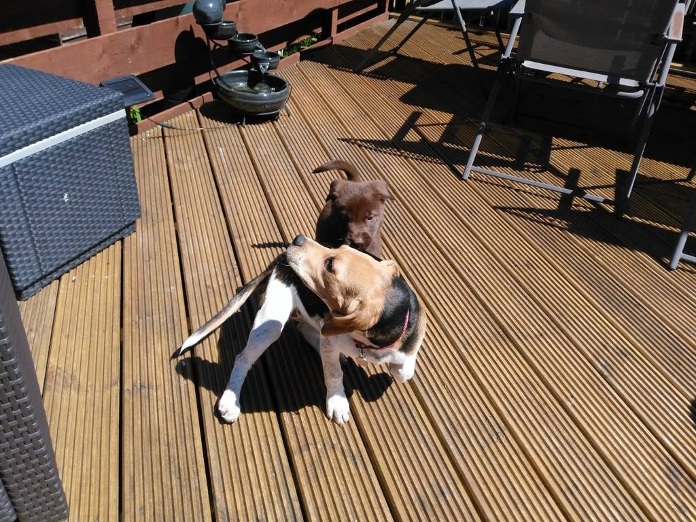
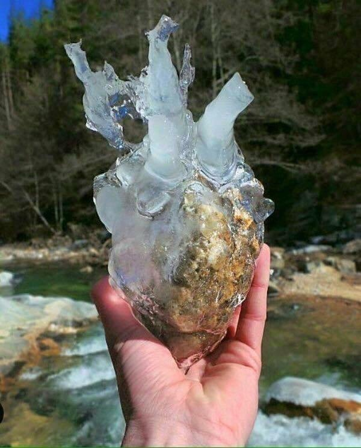

# ImageSummarizer - Complete Image Intelligence Pipeline

[](http://unlicense.org/)
[](https://github.com/scottgal/lucidrag/releases)
[](https://github.com/scottgal/lucidrag/actions)
[](https://dotnet.microsoft.com/)

A complete image understanding and analysis pipeline that extracts **everything** from images and GIFs: text, captions, entities, motion, colors, scene classification, quality metrics, and embeddings. Built for RAG ingestion, accessibility, and intelligent image search.

## What It Does

- **Complete Visual Understanding**: Motion detection, scene classification, entity extraction, color analysis, quality assessment
- **Intelligent Text Extraction**: Multi-strategy OCR with spell-checking, quality scoring, and Vision LLM fallback
- **Animation Analysis**: Frame deduplication, motion tracking, subtitle extraction, looping detection
- **Multi-Provider Vision**: Ollama (local), OpenAI (GPT-4o), Anthropic (Claude) - switch providers on the fly
- **Web Capture**: Fetch images from URLs or capture web page screenshots with Puppeteer
- **RAG-Ready Output**: Structured JSON with confidence scores, embeddings ready for vector search
- **MCP Server**: Integrate with Claude Desktop for AI-assisted workflows

## What This Is Not

- Not just an OCR tool - it's a complete image intelligence platform
- Not a single-model vision API client
- Not a "CLIP-only" image search tool
- Not a black-box caption generator

ImageSummarizer prioritizes deterministic signals, confidence scoring, and auditability.
Vision LLMs enhance analysis but are never the sole source of truth.

## Demo: What It Can Do

### Motion Detection & Animation Analysis


```bash
$ imagesummarizer demo-images/cat_wag.gif --pipeline caption --output text
Caption: A cat is sitting on a white couch.
Scene: indoor
Motion: MODERATE object_motion motion (partial coverage)
```

### Meme & Subtitle Extraction


```bash
$ imagesummarizer demo-images/anchorman-not-even-mad.gif --pipeline caption --output text
"I'm not even mad."
"That's amazing."
Caption: A person wearing grey turtleneck sweater showing an emotionless expression
Scene: meme
Motion: SUBTLE general motion (localized coverage)
```

Subtitle-aware frame deduplication detects text changes in the bottom 25% of frames, weighting bright pixels (white/yellow text) more heavily.

### Pet & Object Detection


```bash
$ imagesummarizer demo-images/StyloAndBella.jpg --pipeline vision --output text
Caption: Two dogs, a brown dog with black patches sitting down while another is jumping over its head.
Scene: outdoor
```

## Key Capabilities

### Complete Visual Understanding
- **Motion Detection**: Optical flow analysis, motion type classification (camera pan, object motion, static)
- **Scene Classification**: indoor, outdoor, food, nature, urban, document, screenshot, meme, art
- **Entity Extraction**: People, animals, objects, text - with confidence scores
- **Color Analysis**: Dominant colors with RGB values, contrast ratios, palette extraction
- **Quality Metrics**: Sharpness, blur, noise, compression artifacts

### Text Extraction (Optional)
- **OCR**: Multi-frame temporal voting for animated images
- **Vision LLM Fallback**: For stylized fonts and memes
- **Graceful Degradation**: Works without Tesseract using Vision LLM only

### Animation Analysis
- **Subtitle-Aware Deduplication**: Detects text changes in bottom region, weights bright pixels
- **Motion Tracking**: Identify what's moving and how
- **Subtitle Extraction**: Frame strip technology for movie memes
- **Loop Detection**: Identify seamlessly looping animations

### Intelligent Escalation
The agentic pipeline starts fast and escalates intelligently:
1. **ColorWave** (instant): Visual analysis, text-likeliness detection
2. **MotionWave** (~1s): Optical flow analysis for animated images
3. **OcrWave** (optional, <1s): Fast Tesseract OCR
4. **VisionLlmWave** (~3-5s): Captions, entities, scene classification

Each wave emits structured signals with confidence scores.

## Key Features

### Frame Strip Technology
Creates horizontal film strips from animated GIFs for Vision LLM analysis. The LLM sees all key frames at once, enabling subtitle reading and motion inference:


```bash
# Export a frame strip from any GIF
$ imagesummarizer export-strip demo-images/anchorman-not-even-mad.gif --max-frames 8
✓ Saved frame strip to: anchorman-not-even-mad_strip.png

# Frame strips help Vision LLMs read subtitles and infer motion
$ imagesummarizer demo-images/anchorman-not-even-mad.gif --pipeline caption
I'm not even mad.
Caption: A man with a disappointed expression
Scene: meme
```

### Multiple Output Formats
Get exactly what you need:

| Format | Use Case |
|--------|----------|
| `text` | Scripts, piping to other tools |
| `json` | API integration, structured data |
| `visual` | Rich terminal display with colors |
| `markdown` | Documentation generation |
| `signals` | Debugging, full analysis details |

### Auto-Download Resources
Dictionaries and tessdata download on first use - zero configuration required.

**Pipeline rule of thumb**:
- `vision` → no Tesseract needed, Vision LLM only
- `motion` → fast animation analysis
- `caption` → stylized text, memes, subtitles
- `advancedocr` → document text extraction
- `alttext` → accessibility descriptions

## Installation

### Download Pre-Built Binaries (Recommended)

Download the latest release for your platform from [GitHub Releases](https://github.com/scottgal/lucidrag/releases):

| Platform | Download |
|----------|----------|
| Windows x64 | `imagesummarizer-win-x64.zip` |
| Windows ARM64 | `imagesummarizer-win-arm64.zip` |
| Linux x64 | `imagesummarizer-linux-x64.tar.gz` |
| Linux ARM64 | `imagesummarizer-linux-arm64.tar.gz` |
| macOS x64 | `imagesummarizer-osx-x64.tar.gz` |
| macOS ARM64 (Apple Silicon) | `imagesummarizer-osx-arm64.tar.gz` |

Extract and add to your PATH:
```bash
# Windows (PowerShell)
Expand-Archive imagesummarizer-win-x64.zip -DestinationPath C:\tools\imagesummarizer
$env:PATH += ";C:\tools\imagesummarizer"

# Linux/macOS
tar -xzf imagesummarizer-linux-x64.tar.gz -C ~/.local/bin
chmod +x ~/.local/bin/imagesummarizer
```

### Build from Source

```bash
# Clone the repository
git clone https://github.com/scottgal/lucidrag.git
cd lucidrag

# Build
dotnet build src/Mostlylucid.ImageSummarizer.Cli/Mostlylucid.ImageSummarizer.Cli.csproj -c Release

# Or install as global tool
dotnet pack src/Mostlylucid.ImageSummarizer.Cli/Mostlylucid.ImageSummarizer.Cli.csproj -c Release
dotnet tool install --global --add-source ./nupkg Mostlylucid.ImageSummarizer.Cli
```

## Usage

### Basic Text Extraction
```bash
# Extract text only (automatically escalates to Vision LLM for stylized text)
imagesummarizer image.gif

# Or with dotnet run
dotnet run --project src/Mostlylucid.ImageSummarizer.Cli/Mostlylucid.ImageSummarizer.Cli.csproj -- image.gif
```

### Interactive Mode
```bash
# Start interactive mode (no image argument)
imagesummarizer

# In interactive mode, commands available:
# /help     - Show available commands
# /pipeline - Change OCR pipeline
# /output   - Change output format
# /llm      - Toggle Vision LLM on/off
# /model    - Change Vision LLM model
# /ollama   - Change Ollama server URL
# /models   - List available Ollama models
# /quit     - Exit
```

### Directory Processing
```bash
# Process all images in a directory
imagesummarizer F:\Gifs\ --pipeline caption --output visual
```

### Vision LLM Options
```bash
# Enable Vision LLM explicitly
imagesummarizer image.gif --llm true

# Use a specific Vision model
imagesummarizer image.gif --model llava:13b

# Use a different Ollama server
imagesummarizer image.gif --ollama http://my-server:11434
```

### Caption Pipeline (Best for Movie Subtitles)
```bash
# Uses Vision LLM with frame strip for animated GIFs
imagesummarizer movie-meme.gif --pipeline caption --output text
```

Example output (Princess Bride meme):
```
You keep using that word.
I do not think it means what you think it means.
```

### JSON Output (for scripts/tools)
```bash
imagesummarizer image.gif --output json
```

Output:
```json
{
  "image": "image.gif",
  "duration_ms": 1838,
  "waves": ["ColorWave", "OcrWave", "AdvancedOcrWave", "VisionLlmWave"],
  "text": "You keep using that word.\nI do not think it means what you think it means.",
  "confidence": 0.95,
  "caption": "Three men stand together in a rocky landscape...",
  "quality": {
    "spell_check_score": 0.82,
    "is_garbled": false,
    "text_likeliness": 0.45
  },
  "metadata": {
    "frames_processed": 4,
    "stabilization_quality": 0.89,
    "frame_agreement": 1.0
  }
}
```

### Visual Output (with color swatches)
```bash
imagesummarizer image.gif --output visual
```

Shows rich terminal output with:
- Image dimensions and format
- Actual RGB color swatches for dominant colors
- OCR text and confidence
- Motion analysis for animated images

### Quality Metrics Only
```bash
imagesummarizer image.gif --output metrics
```

### All Signals (detailed diagnostics)
```bash
imagesummarizer image.gif --output signals
```

## Pipelines

Choose the right pipeline for your use case. All pipelines degrade gracefully if dependencies aren't available.

### Quick Reference

| Pipeline | Speed | OCR Required | LLM Required | Best For |
|----------|-------|--------------|--------------|----------|
| `caption` | ~5s | Optional | Yes | Memes, subtitles, stylized text |
| `vision` | ~4s | No | Yes | Full analysis without Tesseract |
| `motion` | ~1s | No | No | Motion detection only |
| `advancedocr` | ~3s | Yes | No | Document text extraction |
| `stats` | <1s | No | No | Quick metrics only |
| `alttext` | ~4s | Optional | Yes | Accessibility descriptions |

### List Available Pipelines

```bash
imagesummarizer list-pipelines
```

### Caption Pipeline (Default)
- **Speed**: ~5s per GIF
- **Features**: Vision LLM with frame strip, OCR fallback, color analysis
- **Use Case**: Movie memes, subtitled GIFs, stylized text

```bash
imagesummarizer movie-meme.gif --pipeline caption
```

### Vision Pipeline (No OCR Dependencies)
- **Speed**: ~4s per image
- **Features**: Vision LLM captions, entity extraction, scene classification
- **Use Case**: When Tesseract isn't installed or for pure LLM analysis
- **Requires**: Ollama with vision model

```bash
# Works without Tesseract installed
imagesummarizer image.jpg --pipeline vision
```

### Motion Pipeline (Fast, No Dependencies)
- **Speed**: ~1s per GIF
- **Features**: Optical flow analysis, motion type detection, moving object identification
- **Use Case**: Quick animation analysis, motion filtering
- **Requires**: Nothing - pure image processing

```bash
imagesummarizer animation.gif --pipeline motion
```

### Advanced OCR
- **Speed**: 2-3s per GIF
- **Accuracy**: +25% vs simple OCR
- **Features**: Stabilization, temporal median, voting, spell-check

```bash
imagesummarizer image.gif --pipeline advancedocr
```

### Stats Pipeline (Fastest)
- **Speed**: < 1s
- **Features**: Dimensions, colors, basic visual metrics
- **Use Case**: Quick filtering, sorting by color/size

```bash
imagesummarizer image.gif --pipeline stats
```

### Alt Text Generation
- **Speed**: ~4s per image
- **Features**: Motion-aware descriptions, OCR + vision analysis
- **Use Case**: WCAG accessibility compliance

```bash
imagesummarizer image.gif --pipeline alttext
```

## Vision LLM Integration

The tool automatically escalates to Vision LLM when OCR quality is poor (garbled text, stylized fonts).

### Ollama Setup (Required for Vision LLM)

Ollama provides local Vision LLM inference. **Setup once, use everywhere.**

#### 1. Install Ollama

**Windows:**
```powershell
# Download installer from https://ollama.com/download
# Or use winget:
winget install Ollama.Ollama
```

**macOS:**
```bash
brew install ollama
# Or download from https://ollama.com/download
```

**Linux:**
```bash
curl -fsSL https://ollama.com/install.sh | sh
```

**Docker:**
```bash
docker run -d --name ollama -p 11434:11434 \
  -v ollama_data:/root/.ollama \
  -v /path/to/images:/images:ro \
  ollama/ollama
```

#### 2. Pull Vision Models

```bash
# Start Ollama service (if not running)
ollama serve

# Pull recommended vision model (best balance of speed/quality)
ollama pull minicpm-v:8b

# Alternative models:
ollama pull llava:7b           # Lighter, faster
ollama pull llava:13b          # Higher quality, slower
ollama pull llama3.2-vision:11b # Good quality, latest
```

#### 3. Verify Installation

```bash
# Test that Ollama is running
curl http://localhost:11434/api/tags

# Test vision capability
imagesummarizer --models
```

### Directory Mapping (Docker)

When running Ollama in Docker and processing images outside the container:

```bash
# Mount your image directories as read-only volumes
docker run -d --name ollama \
  -p 11434:11434 \
  -v ollama_data:/root/.ollama \
  -v /home/user/pictures:/images:ro \
  -v /home/user/gifs:/gifs:ro \
  ollama/ollama

# Then reference images via mounted paths
imagesummarizer /images/photo.jpg --ollama http://localhost:11434
```

**GPU Support (NVIDIA):**
```bash
docker run -d --name ollama \
  --gpus all \
  -p 11434:11434 \
  -v ollama_data:/root/.ollama \
  ollama/ollama
```

### Environment Variables

| Variable | Default | Description |
|----------|---------|-------------|
| `OLLAMA_BASE_URL` | `http://localhost:11434` | Ollama API endpoint |
| `VISION_MODEL` | `minicpm-v:8b` | Default vision model |
| `OLLAMA_TIMEOUT` | `30000` | Request timeout (ms) |

**Example setup:**
```bash
# Add to ~/.bashrc or ~/.zshrc
export OLLAMA_BASE_URL=http://localhost:11434
export VISION_MODEL=minicpm-v:8b

# Windows (System Environment Variables or PowerShell profile)
$env:OLLAMA_BASE_URL = "http://localhost:11434"
$env:VISION_MODEL = "minicpm-v:8b"
```

### Recommended Models by Use Case

| Use Case | Model | Pull Command |
|----------|-------|--------------|
| **Default/Balanced** | minicpm-v:8b | `ollama pull minicpm-v:8b` |
| **Fast processing** | llava:7b | `ollama pull llava:7b` |
| **Maximum quality** | llava:13b | `ollama pull llava:13b` |
| **Subtitles/Memes** | minicpm-v:8b | `ollama pull minicpm-v:8b` |
| **Low VRAM (<8GB)** | llava:7b | `ollama pull llava:7b` |

### Frame Strip Technology

For animated GIFs with subtitles, the tool creates a horizontal strip of all unique frames:
- Preserves temporal order (subtitles read left-to-right)
- Uses model-specific max dimensions (2048px for MiniCPM-V)
- Never upscales beyond source resolution
- Deduplicates repeated subtitle lines

### Supported Vision Models

| Model | Size | Quality | Speed |
|-------|------|---------|-------|
| minicpm-v:8b | 8B | Excellent | Fast |
| llava:7b | 7B | Good | Fast |
| llava:13b | 13B | Very Good | Medium |
| llama3.2-vision:11b | 11B | Very Good | Medium |

### Configuration

Via environment variables:
```bash
export VISION_MODEL=minicpm-v:8b
export OLLAMA_BASE_URL=http://localhost:11434
```

Or via CLI options:
```bash
imagesummarizer image.gif --model minicpm-v:8b --ollama http://localhost:11434
```

## MCP Server Integration

### Running MCP Server Mode

```bash
# Start MCP server (listens on stdio for MCP protocol)
imagesummarizer --mcp
```

### Claude Desktop Setup

Add to `claude_desktop_config.json`:

```json
{
  "mcpServers": {
    "image-ocr": {
      "command": "imagesummarizer",
      "args": ["--mcp"],
      "env": {
        "OCR_PIPELINE": "caption",
        "OCR_LANGUAGE": "en_US",
        "VISION_MODEL": "minicpm-v:8b"
      }
    }
  }
}
```

### Available MCP Tools

#### Core OCR Tools
- **`extract_text_from_image`**: Extract text with configurable pipeline and Vision LLM fallback
- **`analyze_image_quality`**: Fast quality metrics without full OCR
- **`list_ocr_pipelines`**: List all available pipelines with performance details
- **`batch_extract_text`**: Process multiple images in a directory

#### Content Generation Tools
- **`summarize_animated_gif`**: Generate motion-aware summaries with subtitle extraction
- **`generate_caption`**: Create accessibility-optimized captions
- **`generate_detailed_description`**: Comprehensive image analysis

#### Template System Tools
- **`analyze_with_template`**: Format analysis using predefined templates
- **`list_output_templates`**: List all available output templates

## Output Formats

| Format | Use Case | Example |
|--------|----------|---------|
| `text` | Simple scripts, piping | `imagesummarizer image.gif \| grep "error"` |
| `json` | MCP servers, APIs | Parse with `jq '.text'` |
| `visual` | Terminal display | Color swatches, formatted output |
| `markdown` | Documentation | Formatted markdown report |
| `caption` | Accessibility | Short, descriptive caption |
| `alttext` | WCAG compliance | Alt text for images |
| `metrics` | Monitoring | Track OCR accuracy over time |
| `signals` | Debugging | See all wave emissions |

## Quality Signals

The tool automatically assesses quality and escalates intelligently:



```bash
$ imagesummarizer demo-images/Frozen_Heart.jpg --output metrics
{
  "quality": { "sharpness": 450, "blur": 0.1 },
  "colors": { "dominant": "Blue (45%)", "is_grayscale": false },
  "text": { "detected": false, "confidence": 0 }
}
```

### Key Quality Metrics
- **spell_check_score**: 0.0-1.0 (percentage of correctly spelled words)
- **is_garbled**: true if < 50% correct words (triggers Vision LLM escalation)
- **text_likeliness**: Pre-OCR estimate of text presence
- **sharpness**: Edge definition score (higher = sharper)
- **motion.type**: camera_pan, object_motion, static

## Zero-Setup Auto-Download

On first run, the tool automatically downloads required resources. **No manual setup required.**

### What Gets Downloaded

| Resource | Size | Purpose |
|----------|------|---------|
| Tesseract English Data | ~4MB | OCR engine language models |
| English Dictionary | ~500KB | Spell-check for OCR quality scoring |

### Storage Locations by Platform

| Platform | Data Directory |
|----------|----------------|
| **Windows** | `%LOCALAPPDATA%\LucidRAG\models\` |
| **macOS** | `~/Library/Application Support/LucidRAG/models/` |
| **Linux** | `~/.local/share/LucidRAG/models/` |

**Directory structure:**
```
LucidRAG/models/
├── tessdata/
│   └── eng.traineddata    # OCR language data
└── dictionaries/
    └── en_US.dic          # Spell-check dictionary
```

### Permission Requirements

The tool needs write access to the data directory for first-run downloads:

**Windows**: No special permissions needed (LocalAppData is user-writable)

**macOS/Linux**:
```bash
# If using a shared installation, ensure the data directory is writable:
mkdir -p ~/.local/share/LucidRAG/models
chmod 755 ~/.local/share/LucidRAG/models
```

### Custom Data Directory

Override the default location via environment variable:
```bash
# Windows
set LUCIDRAG_MODELS_DIR=C:\custom\path
imagesummarizer image.gif

# Linux/macOS
export LUCIDRAG_MODELS_DIR=/custom/path
imagesummarizer image.gif
```

### Supported Languages

OCR: en_US (default), en_GB, es_ES, fr_FR, de_DE, it_IT, pt_BR, ru_RU, zh_CN, ja_JP

```bash
imagesummarizer image.gif --language es_ES
```

## Performance

| Pipeline | Speed | Accuracy | Use Case |
|----------|-------|----------|----------|
| Simple | <1s | Baseline | Quick extraction |
| Advanced | 2-3s | +20-30% | Default, best balance |
| Quality | 10-15s | +35-45% | High accuracy needed |
| Caption | ~5s | +50% (with LLM) | Stylized text, subtitles |

## Examples

### Extract text from movie meme GIF
```bash
$ imagesummarizer princess-bride.gif --pipeline caption
You keep using that word.
I do not think it means what you think it means.
```

### Interactive session
```bash
$ imagesummarizer
ImageSummarizer Interactive Mode
Pipeline: advancedocr | Output: auto | LLM: auto
Commands: /help, /pipeline, /output, /llm, /model, /ollama, /models, /quit

Enter image path (or drag & drop): F:\Gifs\meme.gif
Processing...
I'm not even mad. That's amazing.

Enter image path: /llm true
Vision LLM: enabled

Enter image path: /model minicpm-v:8b
Vision model: minicpm-v:8b
```

### Batch process directory
```bash
$ imagesummarizer F:\Gifs\ --pipeline caption --output json > results.jsonl
```

### Use in Python
```python
import subprocess
import json

result = subprocess.run([
    "imagesummarizer", "image.gif",
    "--pipeline", "caption",
    "--output", "json"
], capture_output=True, text=True)

data = json.loads(result.stdout)
print(f"Text: {data['text']}")
print(f"Confidence: {data['confidence']}")
```

## Troubleshooting

### "Failed to download" on first run
Check internet connection. The tool downloads ~5MB on first use. If behind a proxy:
```bash
# Windows
set HTTP_PROXY=http://proxy:port
set HTTPS_PROXY=http://proxy:port

# Linux/macOS
export HTTP_PROXY=http://proxy:port
export HTTPS_PROXY=http://proxy:port
```

### "Permission denied" errors
Ensure write access to the data directory (see Storage Locations above):
```bash
# Linux/macOS - fix permissions
chmod -R 755 ~/.local/share/LucidRAG

# Or use a custom writable location
export LUCIDRAG_MODELS_DIR=/tmp/lucidrag-models
```

### Low OCR quality on stylized text
Use the caption pipeline which automatically uses Vision LLM:
```bash
imagesummarizer image.gif --pipeline caption
```

### Vision LLM not responding
Ensure Ollama is running:
```bash
ollama serve
ollama pull minicpm-v:8b
```

### Offline installation
Pre-download models on a connected machine:
```bash
# On connected machine
imagesummarizer --help  # Triggers download
# Copy the data directory to the offline machine
```

### List available models
```bash
# In interactive mode
imagesummarizer
/models
```

## Architecture

The tool uses a wave-based signal architecture where each wave analyzes a specific aspect of the image:

### Visual Analysis Waves (No Dependencies)
| Wave | Priority | Function |
|------|----------|----------|
| **IdentityWave** | 100 | Format, dimensions, frame count |
| **ColorWave** | 100 | Dominant colors, saturation, grayscale detection |
| **MotionWave** | 95 | Optical flow, motion type, moving objects |

### Text Extraction Waves (Require Tesseract)
| Wave | Priority | Function |
|------|----------|----------|
| **OcrWave** | 60 | Baseline Tesseract OCR with bounding boxes |
| **AdvancedOcrWave** | 59 | Multi-frame temporal voting, stabilization |
| **OcrQualityWave** | 58 | Spell-check, garbled text detection |

### ML/AI Waves (Require Ollama or API)
| Wave | Priority | Function |
|------|----------|----------|
| **VisionLlmWave** | 50 | Captions, entities, scene, LLM text reading |
| **ClipEmbeddingWave** | 45 | Semantic embeddings for similarity search |

Each wave emits structured **signals** with:
- Unique key (e.g., `motion.type`, `color.dominant`)
- Value (the detected feature)
- Confidence score (0.0 - 1.0)
- Source wave name
- Tags for filtering

### Frame Strip Processing (for animated GIFs)

When processing animated GIFs with subtitles:

1. Extract unique frames via SSIM deduplication
2. Create horizontal strip preserving temporal order
3. Size to model's max resolution (no upscaling)
4. Send to Vision LLM with subtitle-aware prompt
5. Deduplicate repeated subtitle lines in response

This approach correctly extracts movie subtitles like:
```
"You keep using that word."
"I do not think it means what you think it means."
```
