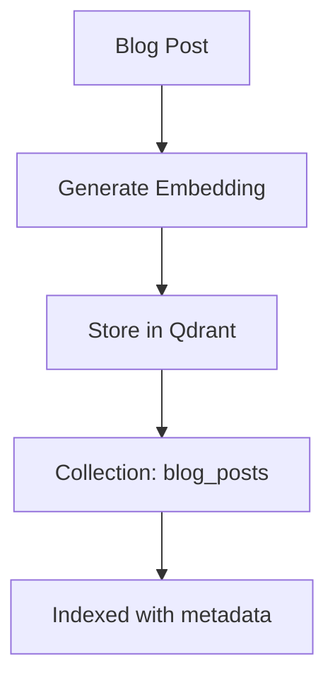
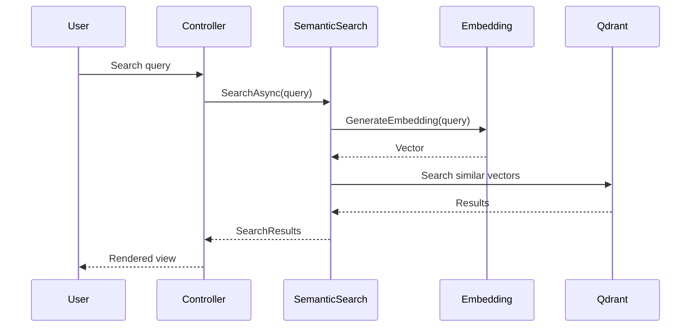

# Mostlylucid Semantic Search

CPU-friendly semantic search for blog posts using ONNX embeddings and Qdrant vector database.

## Overview

This library provides semantic search capabilities for the Mostlylucid blog platform. It uses:

- **ONNX Runtime** for CPU-efficient text embeddings
- **all-MiniLM-L6-v2** model (384-dimensional embeddings)
- **Qdrant** vector database for similarity search
- Automatic blog post indexing on import
- Related posts suggestions based on content similarity

## Features

- ✅ CPU-friendly embeddings (no GPU required)
- ✅ Automatic content indexing
- ✅ Incremental updates via content hashing
- ✅ Related posts discovery
- ✅ Natural language search
- ✅ Configurable similarity thresholds
- ✅ Read/Write API key separation for security

## Setup

### 1. Download Embedding Models

The semantic search requires the all-MiniLM-L6-v2 ONNX model. Download it using the provided script:

```bash
# From the Mostlylucid.SemanticSearch directory
./download-models.sh
```

Or manually:
```bash
mkdir -p ../Mostlylucid/models
cd ../Mostlylucid/models

# Download model
curl -L https://huggingface.co/sentence-transformers/all-MiniLM-L6-v2/resolve/main/onnx/model.onnx \
  -o all-MiniLM-L6-v2.onnx

# Download vocabulary
curl -L https://huggingface.co/sentence-transformers/all-MiniLM-L6-v2/resolve/main/vocab.txt \
  -o vocab.txt
```

### 2. Start Qdrant

Use the provided docker-compose file:

```bash
docker-compose -f semantic-search-docker-compose.yml up -d
```

Or use the full docker-compose with all services:

```bash
docker-compose up -d
```

### 3. Configuration

Update `appsettings.json`:

```json
{
  "SemanticSearch": {
    "Enabled": true,
    "QdrantUrl": "http://localhost:6333",
    "ReadApiKey": "your-read-only-api-key",
    "WriteApiKey": "your-read-write-api-key",
    "CollectionName": "blog_posts",
    "EmbeddingModelPath": "models/all-MiniLM-L6-v2.onnx",
    "VocabPath": "models/vocab.txt",
    "VectorSize": 384,
    "RelatedPostsCount": 5,
    "MinimumSimilarityScore": 0.5,
    "SearchResultsCount": 10
  }
}
```

## Usage

### Indexing Blog Posts

Posts are automatically indexed when imported via the markdown pipeline. Manual indexing:

```csharp
var semanticSearch = services.GetRequiredService<ISemanticSearchService>();

var document = new BlogPostDocument
{
    Id = $"{slug}_{language}",
    Slug = slug,
    Title = title,
    Content = plainTextContent,
    Language = language,
    Categories = categories,
    PublishedDate = publishedDate
};

await semanticSearch.IndexPostAsync(document);
```

### Searching

```csharp
// Natural language search
var results = await semanticSearch.SearchAsync(
    "how to implement semantic search in C#",
    limit: 10
);

// Find related posts
var relatedPosts = await semanticSearch.GetRelatedPostsAsync(
    slug: "semantic-search-with-qdrant",
    language: "en",
    limit: 5
);
```

### HTTP Endpoints

```bash
# Semantic search
GET /search/semantic?query=vector+search&limit=10

# Related posts
GET /search/related/{slug}/{language}?limit=5
```

## Architecture

### Embedding Service

The `OnnxEmbeddingService` uses Microsoft.ML.OnnxRuntime for CPU-based inference:


### Vector Store Service

The `QdrantVectorStoreService` manages the vector database:



### Search Flow



## Performance

- **Embedding Generation**: ~50-100ms on CPU
- **Vector Search**: <10ms with proper indexing
- **Memory Usage**: ~200MB for model + embeddings
- **Disk Space**: ~100MB for model files

## Security

### API Keys

Qdrant supports API key authentication. Configure separate keys for read and write operations:

- **ReadApiKey**: Used for search operations (public endpoints)
- **WriteApiKey**: Used for indexing operations (admin only)

### Configuration Example

```json
{
  "SemanticSearch": {
    "ReadApiKey": "public-read-only-key-12345",
    "WriteApiKey": "admin-write-key-secret-67890"
  }
}
```

## Troubleshooting

### Model not found

Ensure the ONNX model files are in the correct location:
```bash
ls -la Mostlylucid/models/
# Should show:
# all-MiniLM-L6-v2.onnx
# vocab.txt
```

### Qdrant connection failed

Check Qdrant is running:
```bash
curl http://localhost:6333/health
```

### Low similarity scores

Adjust the minimum similarity threshold in configuration:
```json
{
  "MinimumSimilarityScore": 0.3  // Lower threshold for more results
}
```

## Development

### Running Tests

```bash
dotnet test Mostlylucid.Test/Mostlylucid.Test.csproj
```

### Adding Custom Embedding Models

Replace the model files and update configuration:
1. Convert your model to ONNX format
2. Update `VectorSize` to match model output dimensions
3. Provide compatible tokenizer vocabulary

## License

Part of the Mostlylucid project. See main repository for license information.

## Resources

- [all-MiniLM-L6-v2 Model](https://huggingface.co/sentence-transformers/all-MiniLM-L6-v2)
- [Qdrant Documentation](https://qdrant.tech/documentation/)
- [ONNX Runtime](https://onnxruntime.ai/)
- [Sentence Transformers](https://www.sbert.net/)
